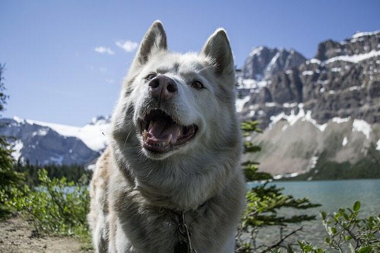
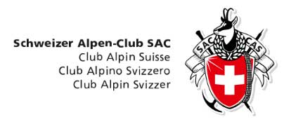

# The Alpine unions

## The general information

The Alpine unions name the tourist incorporations (organization) existing in a number of the European countries. Membership in these organizations probably and for foreign participants. Membership in them paid also gives to participants a number of advantages:

* Discounts for cost of residing in mountain huts;
* The insurance which is capable to defray all expenses in case of emergency situation occurrence;
* Free using topographic maps;
* Discounts for hire hire of climbing equipment;
* Access to training courses, the methodical literature, maps and so forth;

Membership cost differs depending on the concrete union and concrete regional branch.

The expediency of the introduction (with payment of membership dues) in the Alpine union for foreign participants - a question disputable also dares everyone individually.

 [Image by M. Maggs from Pixabay](https://pixabay.com/photos/highway-mountain-trees-forest-2498002/)

However anyway acquaintance to activity of the Alpine unions is useful for hikers. Web sites of these organisation (the information on which is in an easy approach for all comers, and not just for members of the unions) are the present well of the actual information "first-hand". On them it is possible to find:

* Tourist maps of regions;
* The information on mountain huts;
* The information by tourist safety rules;
* The actual information on weather and permeability of routes;
* Last tourist news, etc.

## The German Alpine Union. Deutscher Alpenverein (DAV)

> The German Alpine Club (German: Deutscher Alpenverein, DAV) is the world's largest climbing association, and the eighth-largest sports union in Germany. The Club is a member of the German Olympic Sports Confederation, and the responsible body for sport and competition climbing, hiking, mountaineering, hill walking, ice climbing, mountain expeditions, as well as ski mountaineering.
> [https://en.wikipedia.org/wiki/German\_Alpine\_Club](https://en.wikipedia.org/wiki/German_Alpine_Club)

The insurance (ASS) operates in territory of all Europe. At additional surcharge insurance action extends worldwide.  
Membership dues differ from section to section, depending on their size and offers. For the adult membership costs from 45 to 90 euros for a calendar year.

Official site: [https://www.alpenverein.de/](https://www.alpenverein.de/)

Some interesting pages:

* The map of mountain huts [https://www.alpenverein.de/DAV-Services/Huettensuche/](https://www.alpenverein.de/DAV-Services/Huettensuche/)
* Responses about mountain huts [https://www.alpenverein.de/Huetten-Wege-Touren/Huettentest/](https://www.alpenverein.de/Huetten-Wege-Touren/Huettentest/)
* Statistics of incidents [https://www.alpenverein.de/Bergsport/Sicherheit/Unfallstatistik/](https://www.alpenverein.de/Bergsport/Sicherheit/Unfallstatistik/)

## The Austrian Alpine Union. Österreichischer Alpenverein (ÖAV)

Official site: [http://www.alpenverein.at](http://www.alpenverein.at/portal/index.php)

On a site it is possible to look at news and events of regional sections. For example: Innsbruck [http://www.alpenverein.at/innsbruck/](http://www.alpenverein.at/innsbruck/) (On an union site the magazine "Alpine bulletin" is accessible)

On a site of the Austrian Alpine union there is a list of mountain shelters and huts on regions: Austria, Germany, Italian Tirol [https://www.alpenverein.at/huetten/finder.php](https://www.alpenverein.at/huetten/finder.php)

Insurance AWS (the Austrian Alpine Union) [https://oeav.mitgliederversicherungsservice.at/informationen/die-alpenvereinsversicherung/](https://oeav.mitgliederversicherungsservice.at/informationen/die-alpenvereinsversicherung/)

Annual payment (2019) - €57,00 (Sections Alpine Club with open offices the whole day long and the expanded service offer can earn hardly higher membership dues. For deliveries indemnification of expenses abroad is raised.)

Regional sections (some):

* Vienna [https://www.alpenverein-austria.at/](https://www.alpenverein-austria.at/)
* Salzburg [https://www.alpenverein-salzburg.at/](https://www.alpenverein-salzburg.at/)

## The Swiss Alpine union

Official site: [https://www.sac-cas.ch/](https://www.sac-cas.ch/)

Search of mountain huts (only Switzerland) [https://www.sac-cas.ch/de/huetten-und-touren/sac-tourenportal/](https://www.sac-cas.ch/de/huetten-und-touren/sac-tourenportal/)

## The Italian Alpine union

Official site: [http://www.cai.it/](http://www.cai.it/)

Regional sections (some):

* The Italian Alpine union of southern Tirolja [https://www.alpenverein.it/](https://www.alpenverein.it/)
