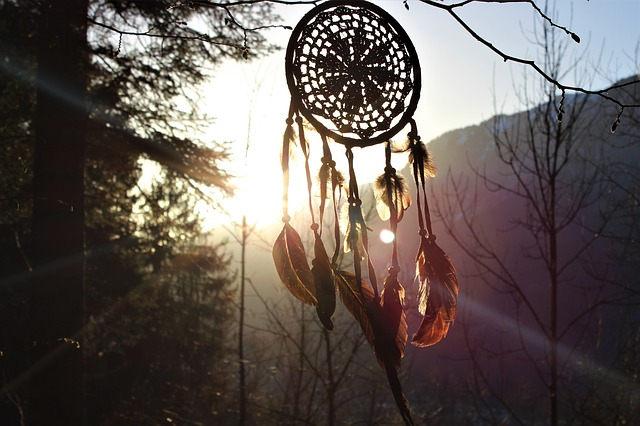

# The related (or similar)

In [the list of that involves people in the hiking](hiking), the important place occupies possibility to feel feeling of autonomy and self-sufficiency, to feel being in "Open Space" - in literal and metaphorical sense. But for the overwhelming majority hikers is only time condition for the sake of which achievement they change the habitual lifestyle that after campaign end to come back in the ordinary inhabitancy. Therefore hikers it is always especially interesting to get acquainted with a lifestyle of those people for which the similar condition became not so "time", and "a constant" lifestyle. We do not speak here about professionals for whom tourism became a field of activity, allowing to earn on life and benefiting other people. It will be a question of others. More low the short survey of curious world outlooks and a selection of reference materials for more profound acquaintance.

 [Image by Aline Berry from Pixabay](https://pixabay.com/photos/dream-catcher-feather-sunset-forest-3299832/)

## Naturism, nudists, "savages"

Naturism - one of the modern world outlook currents, which basic idea - the maximum approach of the person to the nature for body and spirit improvement.

> Naturism, or nudism, is a cultural and political movement practicing, advocating, and defending personal and social nudity, most but not all of which takes place on private property. The term may also refer to a lifestyle based on personal, family, or social nudity.\[1\] Naturism may take a number of forms. It may be practiced individually, within a family, socially, or in public. Additionally, there is also militant naturism, including campaigning, and extreme naturism is sometimes considered a separate category.
> [https://en.wikipedia.org/wiki/Naturism](https://en.wikipedia.org/wiki/Naturism)  
> Savages - it is formal, it is the human civilisation standing at a low step of development, in a primeval condition. However from an easy hand of some writers this word began to be used in metaphorical sense for a world outlook designation, in something close to a naturism.

## Hippie

> A hippie is a member of the counterculture of the 1960s, originally a youth movement that began in the United States during the mid-1960s and spread to other countries around the world. The word hippie came from hipster and was used to describe beatniks who moved into New York City's Greenwich Village and San Francisco's Haight-Ashbury district. The term hippie first found popularity in San Francisco with Herb Caen, who was a journalist for the San Francisco Chronicle.
> [https://en.wikipedia.org/wiki/Hippie](https://en.wikipedia.org/wiki/Hippie)

Normally it is considered that hippies trust in following positions:

* The person should be free;
* To reach freedom it is possible, only having changed an inner system of soul;
* Acts of internally unchained person are defined by aspiration to preserve the freedom as the greatest jewelry;
* The beauty and freedom are identical each other and that realisation of that and another - purely spiritual problem;
* All who divide told above, form a spiritual community;
* Spiritual community - the ideal form of a hostel;

> The hippie is the specific subgroup of the subculture which have arisen in the USA in the early sixties of the XX-th century which has quickly extended on all countries of the world, and has practically disappeared to the middle of the seventieth. In the original of hippie were a part of the youth movement consisting almost completely from white teenagers and enough of young adults at the age from fifteen to twenty five, which have inherited cultural revolt from bohemia and beatniks. Hippies with contempt concerned the settled concepts, criticised values of middle class and acted as radical opposition to application of the nuclear weapon, war in Vietnam. They have made popular and have shined aspects of the religions which are distinct from a Judaism and Christianity almost unknown at that point in time. Hippies have literally pushed sexual revolution; they encouraged the use of psychodelic junks on purpose to expand human consciousness. Hippies created original communes where their values were cultivated.
> [http://www.sub-culture.ru/hippy.php](http://www.sub-culture.ru/hippy.php)

## Communards

The Communard (with reference to a theme of our site) is the person who is the participant of a modern commune-settlement.

> A commune (the French word appearing in the 12th century from Medieval Latin communia, meaning a large gathering of people sharing a common life; from Latin communis, things held in common) is an intentional community of people living together, sharing common interests, often having common values and beliefs, as well as shared property, possessions, resources, and, in some communes, work, income or assets. In addition to the communal economy, consensus decision-making, non-hierarchical structures and ecological living have become important core principles for many communes. There are many contemporary intentional communities all over the world, a list of which can be found at the Fellowship for Intentional Community (FIC)
> [https://en.wikipedia.org/wiki/Commune](https://en.wikipedia.org/wiki/Commune) **Interesting references:**

* To live without the state: Five communes where build the new world [https://apparat.cc/world/5-communes-new-world/](https://apparat.cc/world/5-communes-new-world/)

## Downshifting

> The term downshifting in the English language refers to the act of reducing the gear ratio while driving a vehicle with manual transmission. This title or term has now been re-purposed and applied to describe a social behavior or trend in which individuals live simpler lives to escape from what critics call the rat race. The long-term effect of downshifting can include an escape from what has been described as economic materialism, as well as reduce the "stress and psychological expense that may accompany economic materialism". This new social trend emphasizes finding an improved balance between leisure and work, while also focusing life goals on personal fulfillment, as well as building personal relationships instead of the all-consuming pursuit of economic success. Down-shifting, as a concept, shares many characteristics with simple living. However, it is distinguished as an alternative form by its focus on moderate change and concentration on an individual comfort level and a gradual approach to living.\[1\] In the 1990s, this new form of simple living began appearing in the mainstream media, and has continually grown in popularity among populations living in industrial societies, especially the United States, the United Kingdom, New Zealand, and Australia, as well as Russia.
> [https://en.wikipedia.org/wiki/Downshifting\_(lifestyle)](<https://en.wikipedia.org/wiki/Downshifting_(lifestyle)>)

**Interesting references:**

* Hampson, Jo \& Perkins, Georgina. [http://www.steppingoff.co.uk/index.html](http://www.steppingoff.co.uk/index.html) A good site for testimonials about and advice for downshifting.

## Hermit

> A hermit (adjectival form: eremitic or hermitic) is a person who lives in seclusion from society, usually for religious reasons.\[1\]\[2\]\[3\] Hermits are a part of several sections of Christianity, and the concept is found in other religions as well.
> [https://en.wikipedia.org/wiki/Hermit](https://en.wikipedia.org/wiki/Hermit) **Interesting references:**

* [The tradition of the Lersi Hermits](http://magiedubouddha.com/p_thai-lersi1-intl.php)
* [British hermits: the growing lure of the solitary life](https://www.independent.co.uk/news/uk/this-britain/british-hermits-the-growing-lure-of-the-solitary-life-859656.html)
* [A forum for hermits \& solitaries](http://www.hermitary.com/slate/)
