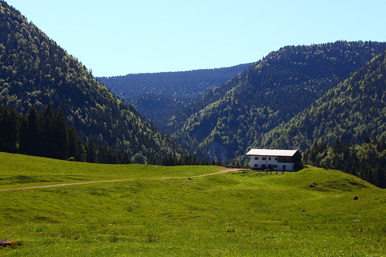
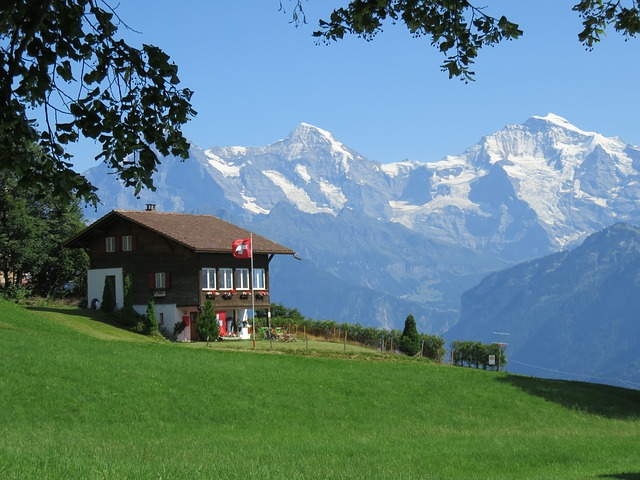


# Housing for the hikers

Selection of the help information on how the tourist to search and reserve housing.

## Hotels and apartments

The most known sites for housing search

Booking.com - system of Internet booking of hotels, [https://www.booking.com](https://www.booking.com)

[https://www.hostelworld.com/](https://www.hostelworld.com/)- hostels and budgetary hotels

Airbnb - online a platform for housing, search and short-term rent of private housing worldwide. [https://airbnb.com/](https://ru.airbnb.com/)

[https://www.couchsurfing.com/](https://www.couchsurfing.com/)- service of search of free housing at local residents worldwide.

Real responses of travellers about hotels, restaurants and sights offers TripAdvisor [https://www.tripadvisor.com](https://www.tripadvisor.com/) -- the most popular portal all over the world.

## Camping

[https://camping.info](https://camping.info/) Here you will find 23 019 places (for May, 2019) for a camping in Europe and can estimate them.

## Mountain huts

 [Image by Ale Bah from Pixabay](https://pixabay.com/photos/alm-mountain-alpine-austria-hut-2721842/)

> A mountain hut (also known as alpine hut, mountain shelter, mountain refuge, mountain lodge, and mountain hostel) is a building located high in the mountains, generally accessible only by foot, intended to provide food and shelter to mountaineers, climbers and hikers. Mountain huts are usually operated by an Alpine Club or some organisation dedicated to hiking or mountain recreation. Mountain huts can provide a range of services, starting with shelter and simple sleeping berths. Some, particularly in remote areas, are not staffed, but others have staff which prepare meals and drinks and can provide other services, including providing lectures and selling clothing and small items. Mountain huts usually allow anybody to access their facilities, although some require reservations.
> [https://en.wikipedia.org/wiki/Mountain\_hut](https://en.wikipedia.org/wiki/Mountain_hut)

Unfortunately, for today there is no uniform system of booking of places in mountain huts like similar for hotels, hostels or campings. Therefore to reserve spending the night in such huts it is necessary to learn independently its contacts (phone), to call up and agree. However gradually rudiments of similar systems appear.

For example:

On a site of the Swiss Alpine union. Search of mountain huts (only Switzerland) [https://www.sac-cas.ch/de/huetten-und-touren/sac-tourenportal/](https://www.sac-cas.ch/de/huetten-und-touren/sac-tourenportal/)

On a site of the Austrian Alpine union (Austria, Germany, Italian Tirol) [https://www.alpenverein.at/huetten/finder.php](https://www.alpenverein.at/huetten/finder.php)  
 [Image by Stefanie Laubscher from Pixabay](https://pixabay.com/photos/alpine-mountains-panorama-1024932/)

## Independent residing at tents

As a rule, in all countries you can live in the tent, stopping in specially taken away campings. It will be not free, but essentially is cheaper than residing at hotel. Possibility of independent residing in tent out of кемпинговых zones strongly depends on the concrete country and region. In the Central Europe it is ordinary is not welcomed, though it is sometimes supposed above forest level. And here, for example, in Norway laws more liberal. More concrete information needs to be learnt in the tourist centres of regions.  
 [Image by anurag kaushik from Pixabay](https://pixabay.com/photos/camping-travel-sunrise-adventure-2581242/)
