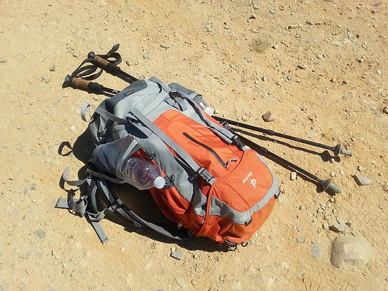
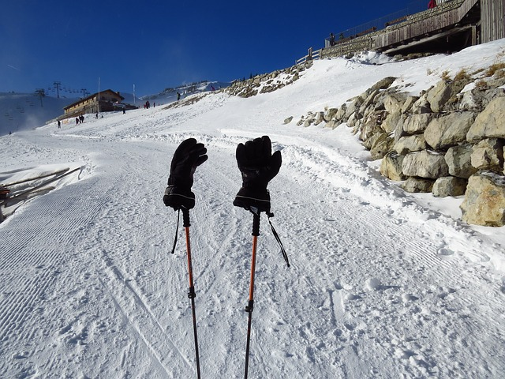


# About tourist equipment

One of advantages of the hiking is that the equipment is quite accessible to this kind of pastime at the price. The campaign costs not much: in comparison with any other sport your original expenses on articles of prime necessity are minimum, everything that it is necessary for you as base, these are good boots, some subjects of the appropriate clothes, convenient packing. Nevertheless, if you decide to realise the consumer requirements, at your service the extensive industry of the tourist goods and equipment from various world brands.

Generally speaking, the consumerism is alien to spirit of the hiking which basic ideology is "freedom" from civilization frameworks and stereotypes, and also naturalness, affinity to the nature. Nevertheless it is not necessary to erect it in the absolute, completely rejecting and despising work of hundreds thousand the people working in the industry of manufacture of the tourist goods. They do it not only for the sake of a profit, but also and for the sake of self-realization and progress, put the work and talent, and finally try for us.

Therefore, if financial possibilities allow, tourist "shopping" can become the additional inspiring factor for the hiker. However, if financial possibilities are limited, it at all will not be an obstacle for employment by the hiking since in the elementary event of any especial equipment it is not required.

 [Image by rggroning from Pixabay](https://pixabay.com/photos/backpack-camino-camino-de-santiago-1062702/)

The basic equipment of the hiker for one-day хайкинга are:

* Backpack
* Footwear
* Protection against a rain

For campaigns with spending the night it is added

* Tent
* Sleeping bag
* Tourist rug or inflatable mattress
* Tourist complete sets for cooking. And about food and water also it is not necessary to forget :)

Additional equipment in both events enough big set of various things can be:

See also "Ten Essentials" in ["Rule"](rules) section

* trekking poles
* Additional warm clothes, including the complete set of thermolinen, glove, sports cap
* Protection against the sun. Sun glasses, a sun-protection cream for lips and a skin, a hat, clothes for protection against the sun.
* Navigation means. An electronic topographic map on the smart phone, the portable navigator or other electronic device. A paper topographic map and various maps in the water-proof container, and also a magnetic compass, additional высотомер or the GPS-receiver.
* Illumination. A headlight, a small lamp, accumulators. The light-emitting diode lamp is preferable to prolongation of a lifetime of the battery.
* First aid subjects (the first aid first-aid set), and also means from insects.
* Fire. A butanovaja lighter, matches in water-proof container.
* The repair complete set and tools. Knifes, the multipurpose tool, scissors, flat-nose pliers, a screw-driver, a shpatel/shovel, a sticky tape, cable couplers.
* ледоруб for travel on a glacier or a snow field (if necessary)
* Signalling devices, such as a whistle, a mobile phone, a bilateral radio communication, satellite phone, an unbreakable alarm mirror or flash, a laser pointer.
* Etc.

As producers of tourist equipment are directly interested in advertising of the goods, the Internet can be found in a net enough professional surveys, comparisons and reports on equipment testing (references in each section and in the end of page see). We, without applying for completeness of coverage of a theme, we give here only a few the basic councils, a concerning choice of tourist equipment.

## Tourist backpack

The key rule at a choice of a backpack for a lung hiking is simple: in it all your things which you are going to take with yourselves should be located. Therefore be not too lazy to gather in advance them, including protection against a rain, warming clothes and a stock of provisions and at least a litre bottle of water approximately to estimate necessary volume (some even advise to take weigh this set with itself in tourist shop).

The second are important the factor (even for easy campaigns) water resistance of a backpack is. However, in this respect there are some approaches

* Good waterproof a backpack (unlike a jacket or boots, from it normally it is not required that the backpack "breathed" so the choice of materials is more), with stitched, glued and protected by seams
* Backpack from any material (it is desirable partially water-proof) if the special waterproof cover is applied on it
* Backpack from any material (it is desirable partially water-proof) if your raincoat from a rain has such design which allows you to put on after you have put on a backpack (the raincoat appears from above a backpack)
* Backpack from any material (it is desirable partially water-proof), but in which you carefully pack all things into waterproof packages. The most undesirable variant, and here to pack valuable things into airproof packing it is useful at any deal.

At a choice of a backpack for more difficult campaigns when the backpack has considerable weight, on the foreground there is a factor of a design of fastening of a backpack on a back. In particular, the design and coverage of a zone belt are important. If the backpack is picked up correctly, the most part weight, should have not on shoulders, and on feet (a support - a zone belt). Actual the rigid design of a skeleton of a back of a backpack also is

Recommendations about volume of a tourist backpack

|           Duration of a campaign           | Backpack volume, l |
|--------------------------------------------|--------------------|
| For one day or with one spending the night | 20-50              |
| 2-3 days                                   | 50-60              |
| 3-5 days                                   | 60-80              |
| From a week and more                       | From 80            |

And at last, it is necessary to pay attention to additional factors: presence of pockets, various branches for things, convenience of access to them, special fastenings for hinged things (for example, bottles with water, trekking poles or ice ax). Good addition will be presence on a zone belt of a backpack of special pockets - in them it is possible to hold small things which are required to be taken out often in process of movement on a route. However such pockets if they are not compensated by clothes pockets, it is possible to compensate absence purchase of an additional zone bag. Last variant is very convenient for easy tracking since the easy backpack often has no zone belt in general.

**References:**

The Ultimate Guide to Choosing the Best Travel Backpack 2018 [https://www.wheressharon.com/x-featured-discussions/best-travel-backpack/](https://www.wheressharon.com/x-featured-discussions/best-travel-backpack/)

## Tourist footwear

For a lung hiking the simple sports footwear quite approaches: snickers or simple tourist boots. Than easier footwear, especially universal it is, and consequently it can be used and out of campaign time that will allow to save money. There are some factors which dictate necessity of more specialised footwear:

* Campaigns in the conditions of a difficult surface. For example, in the conditions of mountain stony district are desirable more rigid tourist boots protecting a foot (and a boot) from lateral blows about stones. In the conditions of a wet surface (especially stony) the footwear with good coupling on a wet surface is necessary.
* Campaigns with a heavy backpack. Are desirable more rigid tourist boots are desirable.
* For people with certain physical problems or weak physical preparation, and also excess weight it is necessary to select footwear individually and whenever possible to prefer specialised tourist footwear of the universal. For example, at the raised hazard to sprain a foot (old traumas, stretchings, etc.) are desirable higher tourist boots somewhat protecting an ankle joint. At problems with flat feet the great value gets presence of anatomic insoles, etc.

 [Image by Gianni Crestani from Pixabay](https://pixabay.com/photos/boot-mountain-top-carega-refuge-1632050/)

The standard classification of tourist footwear

* Boots for a lung trekking or hiking boots. For simple tourist routes and day off campaigns provided that the weight of a backpack does not exceed 15 kg
* Classical "midweight trekking boots". For extended tourist routes at heights to 3000 m with moderately heavy backpack in weight to 25 kg.
* Trekking boots for mountain or difficult campaigns lasting many days ("heavy backpacking boots"). For passage of routes with a difficult land forms, in a changing weather environment and weight of a backpack more than 25 kg.

Councils at purchase of boots

* Not to buy before the campaign (time is necessary to get used to boots, to "carry" them)
* Not to buy there where it is impossible to try on (for example, in Internet shops) if certainly you have no already sufficient experience of similar purchases
* It is desirable to buy footwear in such shops where you гарантированно can exchange it in case the size and a design has not approached
* It is necessary to prefer more free footwear of narrower since during long movement of stop can swell. Nevertheless the footwear should be selected so that the foot "did not dangle" in a boot.
* To try on boots in shop it is better in the evening - foot will be slightly wider and more in volume that simulates its condition on a route.
* At примерке try variants with various socks (thick and thin), calculated on a various weather environment
* Your fingers of feet should not concern a sock when the footwear is laced densely up. To estimate, whether enough free space before fingers, it is possible to unlace slightly a boot and as much as possible to shift foot forward against the stop. Released "stock" should make 0.5-1 sm at boots for a lung and an average треккинга, and 1-1.5 sm - for heavy.
* More free footwear can be partially compensated use of special anatomic insoles

Water resistance of boots.

Water resistance of boots is unequivocally necessary for the hiker since the campaign is normally planned at least on to be the overtaken rain all the day and consequently the risk essentially increases. Besides morning and evening dew at passage of grassy sites, campaigns on boggy district, snow sites - all it also is the factors leading промоканию of a boot. However the more "waterproof" the boot is, the is worse he "breathes" that provokes raised потоотделение with all that it implies from this problems. Therefore it is necessary to search for itself for the reasonable compromise.

One of possible decisions is use of membrane technologies (for example, GORE-TEX). These technologies provide preservation of dryness and comfort of a foot in a difficult weather environment (as that: from moisture hit inside and at the expense of a partial conclusion of a moisture outside). Nevertheless, the foot in such boots breathes nevertheless worse, than in промокаемых materials. It is necessary to consider a membrane normally there are in inner thin enough layer boots and and to walking wears out fastest that results to loss of water protective attributes. Wrong drying is hazardous to membranes (for example, near a fire) which can lead to sintering of a time of a synthetic material then the foot in such boots ceases to breathe in general (good news thus is that boots become completely water-proof :))

**References:**

How to Choose Hiking Boots [https://www.rei.com/learn/expert-advice/hiking-boots.html](https://www.rei.com/learn/expert-advice/hiking-boots.html)

## Tourist clothes

Normally consider some "layers"

* Inside layer. Underwear, thermal underwear (contrary to ordinary opinion, the thermal underwear main task not directly warming, and moisture tap (sweat) that promotes warming indirectly).
* Intermediate layer. Warming. A sweater, fleece, or the second layer of warming linen.
* External layer. Protection against a rain and a wind.

By itself, presence of all three layers as separate component is unessential, since their functions can be combined in certain models of equipment. For example, the jacket can serves both external, and a warming layer. Or certain models of two-layer thermal underwear (expensive enough) combine functions sweat lead and warming.

## Good advice

> About ultralight. I very much love easy equipment. The easier the backpack weight, the is less spent forces and the more them it is necessary to look around and admire the nature. After all behind it we also go to mountains? At all for this purpose, what "to die under a backpack"! However it is important to understand that the economy of each kg and even gramme of weight of equipment is reached or decrease in its reliability or demands use of the most technological and expensive materials, miracles do not happen! Whether there is an optimum in this race for simplification of weight of your equipment?? Here at everyone the answer which, in my opinion to experience, depends not only on financial possibilities. Whether it is necessary to overpay five thousand roubles for a sleeping bag which is easier on 500 gramme? Whether the overpayment of 3000 roubles for lungs, but stronger кроссовки, than cheap stuff from pseudo-sports brands is justified? I will tell so: all depends on how much you love yourselves, are how much ready to be spent in the hobby for mountains. Here again, unfortunately, the limit to fanaticism is not present. For example, my purpose by next summer to go to peshe-mountain campaigns lasting many days with a backpack in weight no more than 10-12 kg and for achievement of this purpose I am ready to spend money. On what you stop - solve!
> D.Kovinov [http://www.kovinov.com/europe/alpy/snarjazhenie/](http://www.kovinov.com/europe/alpy/snarjazhenie/)

 [Image by Hans Braxmeier from Pixabay](https://pixabay.com/photos/gloves-cold-warming-black-ski-run-81377/)

## References

Hiking equipment [https://en.wikipedia.org/wiki/Hiking\_equipment](https://en.wikipedia.org/wiki/Hiking_equipment)

 [Image by anurag kaushik from Pixabay](https://pixabay.com/photos/camping-travel-sunrise-adventure-2581242/)
