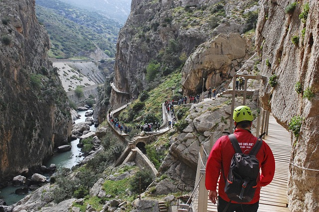
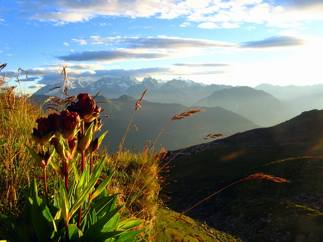


# The hiking

## The basic idea of the hiking

What involves people in the hiking? Why it so is popular in the world? The answer, apparently, lies on a surface. To be engaged in the hiking simply. Are not necessary neither special equipment, nor special skills. For employment by the hiking it is not obligatory to leave far from the house, possibilities for the hiking are practically in any district. That is at the hiking "a low threshold of occurrence", including from financial side. So all business in simplicity? And and is not present. Such answer would be too surface. After all we perfectly know mass of people which have enough ample opportunities for distant travel and various travel, but thus again and again preferring the hiking. Why so? Probably there are any else reasons involving people to this kind of activity.

It is interesting to listen to tourists. For this purpose we introduce a selection from interview of the people who have been carried away by the hiking. You can read, as they for themselves explain the reasons of the hobby. But before to read, try to answer for itself This question. Then compare the answers with read more low. Probably, thus you Will feel relationship of your soul with souls their authors, as well as you being members of huge community of the hikers. If you do not find the own answer in a selection or you have an interesting story about your personal sensations, write to us, and we will try to add the given section.

 [Image by Bernd Hildebrandt from Pixabay](https://pixabay.com/photos/hike-lunar-landscape-tenerife-663337/)

**So, what involves different people in the hiking?**

Campaigns give fine possibility to us to estimate width and a variety of the nature. It brings to us elation and gives feeling of gratitude for ours собственноe existence. It connects us with that nature from which we have occurred and from which we are created. The hiking is also an excellent way to plunge into the nature for one day and an easy miniadventure, which you can spend on days off to leave from city vanity and to freshen yourselves till the morning on Monday.

 [Image by Foundry Co from Pixabay](https://pixabay.com/photos/hike-hikers-scene-climb-boyfriend-863454/)

In campaigns we are involved with absence of necessity always to fill silence with words. You do not need to speak anything when you lie under stars or look in deep mountain gorge. Thus you have a feeling of surprise, extensiveness and sense.

The hiking gives the chance to you to see absolutely tremendous landscapes which you simply do not receive in a city and cannot see from the car. You are waited for by beauty of mountain landscapes, lakes, falls, risings and sunsets. If you are fond of a photo or a video shooting the hiking, especially, will be interesting to you.

Touch to a reality. In a campaign you will catch a nature smell, instead of other sweaty people in sports hall. The dirt road rough country is pleasant to people much more, than the asphalted sidewalk. For those who does not love false things, the elliptic training apparatus or a racetrack - always remain only weak imitation of that the nature gives to us free of charge.

Sense of achievement - the key moment in mountain hiking. Climbing up on an abrupt mountain you remember that, as the spirit of adventurism is not alien to you.

Feeling of autonomy. You can take and bear with yourselves everything that it is necessary for you for life, movement, a food and a lodging for the night. Check up to the ability to cook food, to equip "house", to clean itself and the clothes, using [the map](maps), a compass or GPS to find the way and to be ready to feel comfortable in any conditions.

 [Image by kordula vahle from Pixabay](https://pixabay.com/photos/almsee-schladming-lake-nature-3507818/)

Self-sufficiency and personal confidence, feeling of the executed debt (mission). The more time you spend, being engaged in the hiking, the there will be your skills more sharply. You become the present adventurer. You will start to distinguish a weather environment, can read more consistently district and understand that is necessary for your body for optimum work. Your system of equipment becomes more effective, and you learn to take from tourist equipment of more advantage with smaller expenses. You can travel at any time year in any conditions (snow, a rain, mountains, desert and etc.) For longer periods of time and to take pleasure, being engaged in it. The constant increase in personal confidence will increase also your pleasure from campaigns. In a campaign you have everything that is necessary for a survival, and there is it in your backpack or in pockets (well and in your head, certainly). It that fills any person with enthusiasm and positive energy.

The hiking allows to feel being in Open Space in literal and metaphorical sense. Certainly, this sensation strongly depends on in what district you travel. But such areas of travel where you can see only a few person during your campaign are quite accessible to any person also. If you are in journey to the remote place or in inter-season period, there is a probability that you in general will see nobody. This physical open-space can have peace and freshening effect for the traveller. Absence of noise and "narrowness" also will allow your mind to wander in places in which it normally would not be, and to think differently, than normally. Not casually, creative people have made many of the most pleasant and productive mental finds during the pedestrian walks.

 [Image by guillermo gavilla from Pixabay](https://pixabay.com/photos/caminito-del-rey-malaga-adventure-2227526/)

In the pedestrian campaign the person makes monotonous repeating movements, which consist only in serially to put one foot before another. Under certain conditions such monotony, in a combination to an environing landscape, promotes creation at the person inner positive creative and mental the space different from the daily. It is considered that runners, oarsmen, climbers and etc. test something similar when get to the "a current zone". And it gives the chance to the person to look from outside as though at itself every day, occupied with current affairs and cares. Especially it is actual, if you concern those people who live far from countryside.

Campaigns are useful to health. Campaigns help to support physical activity, potentially you can grow thin, lower risk of heart diseases, lower an arterial hypertensia and slow down ageing process, and also raise mental health, reducing stress and anxiety. Campaigns can prevent depression, make you less intense and will result you in the form.

 [Image by rawpixel from Pixabay](https://pixabay.com/photos/freedom-travel-hiking-together-2768515/)

 [Image by Nicolò Anastasio from Pixabay](https://pixabay.com/photos/freedom-fly-dream-empty-infinite-1681696/)

Dialogue. Sometimes we would like to be alone on a track, but sometimes we like to meet on a track of different people and to get new friends. Such meetings are especially pleasant, when the basic part of a campaign you spend one or in small collective. And if you casually meet old acquaintances - that it will be a pleasant additional gift of destiny.

The pedestrian walks are simple: "the occurrence threshold" for beginners is low. You can monitor intensity of the training and find rate which approaches you. In comparison with many other things активностями in the open air, for campaigns the simple subjects of equipment [which are a little easily acquired and practical skills](rules) are required only a few.

Bonus: it can be inexpensive. The campaign costs not much: in comparison with any other sport your original expenses on articles of prime necessity are minimum. Everything that is necessary for you as a base set of equipment, these are good boots, some subjects of the appropriate clothes, a convenient backpack. Nevertheless, if you decide to realise the consumer requirements, at your service the extensive industry of the tourist goods and [equipment](equipment) from various world brands.

## Than still it is in addition possible to diversify a campaign

* Sports orientation
* Geocaching (game with application of the satellite navigating systems, consisting in a finding of the hiding places hidden by other participants of game)
* Mountaineering, rock-climbing
* Paragliding
* Photography
* Observation over animals
* Fishing
* Gathering of berries
* Etc.

 [Image by Florence D. from Pixabay](https://pixabay.com/photos/alps-flower-mountain-ski-light-2947165/)

**The used sources:**

* What makes hiking so fun? (That does campaigns such interesting?) - a interview selection [https://www.quora.com/What-makes-hiking-so-fun](https://www.quora.com/What-makes-hiking-so-fun)
* "Short pitch on hiking" Video lecture. [https://www.youtube.com/watch?v=OyjV7x6IhDE](https://www.youtube.com/watch?v=OyjV7x6IhDE)
* Feeling of "achievement" of top (sense of achievement) a photo selection on these keywords, the best photo - [http://michellegielan.com/psychology-today-how-to-go-from-i-think-i-can-to-i-know-i-can/achievement-goal-mountain/](http://michellegielan.com/psychology-today-how-to-go-from-i-think-i-can-to-i-know-i-can/achievement-goal-mountain/) (from a site Michel Gilan -- the American author of books on happiness psychology)
* Than still it is possible to be engaged in campaigns to make their even more interesting. [https://www.thoughtco.com/fun-activities-for-hikers-1766200](https://www.thoughtco.com/fun-activities-for-hikers-1766200)
* The miscellaneous found on open spaces of the Internet
