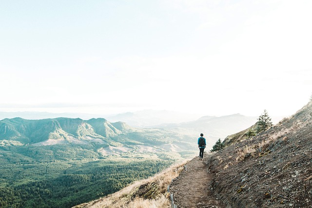
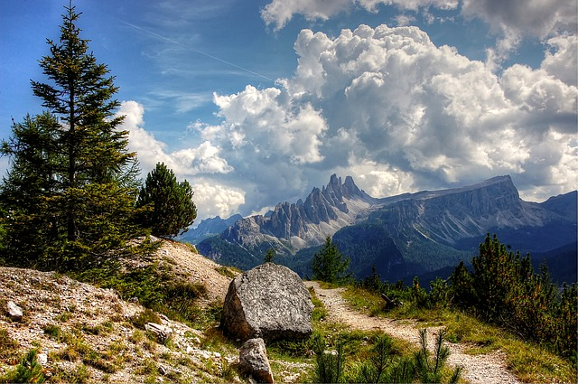
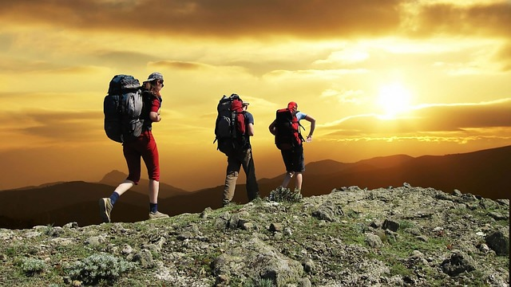


# The world of hiking

Our project is about world of hiking (trekking, backpacking, etc. - see the section ["Terminology"](terms)). We give to you some "[the inspiring" materials](hiking) telling about why this kind of activity are such popular among people. Our overall objective - to help beginners to join this remarkable world of physical activity. Here you can find the help and technical information, helping to choose a direction for travel, to plan and be prepared for your trip. Our project also can be interesting to experienced travelers.  
 [Image by Pexels from Pixabay](https://pixabay.com/photos/adventure-hike-hill-landscape-1851262/)

Hiking give fine possibility to us to estimate width and a variety of the nature. It brings to us elation and gives feeling of gratitude for ours existence. It connects us with that nature from which we have occurred and from which we are created. Hiking is also an excellent way to plunge into the nature for one day and an easy adventure, which you can spend on days off to leave from city vanity and to freshen yourselves till the morning on Monday.

In hiking we are involved with absence of necessity always to fill silence with words. You do not need to speak anything when you lie under stars or look in deep mountain gorge. Thus you have a feeling of surprise, extensiveness and sense.

The hiking gives the chance to you to see absolutely tremendous landscapes which you simply do not receive in a city and cannot see from the car. You are waited for by beauty of mountain landscapes, lakes, falls, risings and sunsets.

 [Image by kordula vahle from Pixabay](https://pixabay.com/photos/croda-da-lago-dolomites-italy-3573170/)

Sense of achievement - the key moment in mountain hiking. Climbing up on an abrupt mountain you remember that, as the spirit of adventurism is not alien to you.

The hiking allows to us to take pleasure in feeling of autonomy. You can take and bear with yourselves everything that it is necessary for you for life, movement, a food and a lodging for the night. Check up to the ability to cook food, to equip "house", to clean itself and the clothes, using [the map](maps), a compass or GPS to find the way and to be ready to feel comfortable in any conditions.
**The short guidebook to site materials**

The theoretical and "inspiring" information contains in section the theory: articles [hiking](hiking), [terminology](terms).

The information in the selected tourist directions in section [Regions](places/list) (the information on the countries of the Alpine Europe is at the moment introduced)

The help and technical information in sections [Cartography](maps) (online maps, GPS tracks, devices and the software). [Transport](trafic) (plans, railway, cars), [Booking](booking), [Equipment](equipment). Separately - [Rules in campaigns](rules) (time calculation, the safety, typical errors of beginning tourists), [the Alpine unions](alpenverein)

 [Image by skeeze from Pixabay](https://pixabay.com/photos/hikers-mountain-sunset-hiking-1147796/)

In addition sections: [Related](around) (or Similar) (a selection about related to tourism hobbies: nuddism, naturism, hippies, hermits), [Image Gallery](gallery/gallery), [Films about tourism](media/list) and [Links catalogue](links).
