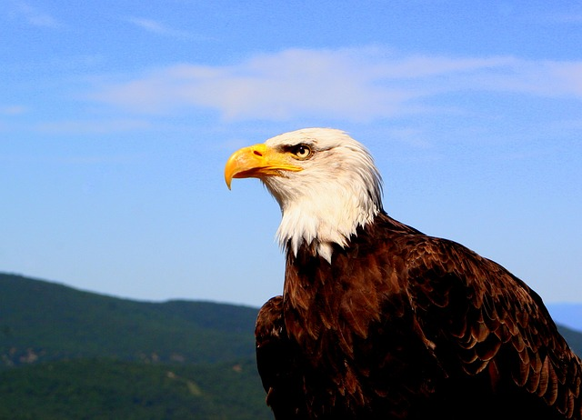
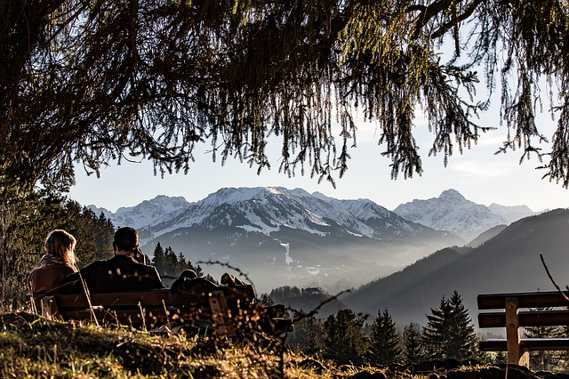
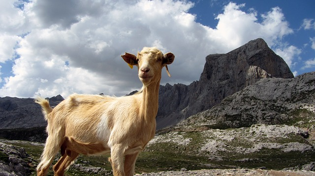
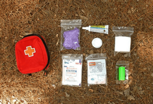


# Links catalogue

[https://www.alpenverein.de/](https://www.alpenverein.de/) The German Alpine Union. Deutscher Alpenverein (DAV)

[http://www.alpenverein.at](http://www.alpenverein.at/portal/index.php) The Austrian Alpine Union. Österreichischer Alpenverein (ÖAV)

[https://www.alpenvereinaktiv.com/en/](https://www.alpenvereinaktiv.com/en/) alpenvereinaktiv.com is the joint tour portal of Deutscher Alpenverein (DAV), Austrian Alpine Club (ÖAV) and Alpenverein Südtirol (AVS). It is an information platform for (mountain) tours and open to all, regardless of whether or not an Alpine Club membership exists. The focus of the portal is on mountain businesses such as hiking, mountaineering, alpine tours, climbing, mountain biking, ski touring and snowshoeing in the Eastern Alps.

[https://www.sac-cas.ch/](https://www.sac-cas.ch/) The Swiss Alpine union

[http://www.cai.it/](http://www.cai.it/) The Italian Alpine union

 [Image by chezbeate from Pixabay](https://pixabay.com/photos/eagle-majestic-animal-bird-freedom-1009771/)

[https://www.bergfex.com/](https://www.bergfex.com/) Bergfex.at Is an Austrian Internet platform for mountaineering and the Alpine sports, the largest in Europe in this sector. The site gives more than 1700 mounting skiing resorts from twelve European countries and 525 tourist regions from seven states. For reception of the information on destination as that, the information on station work, objects of housing, reports on snow and the weather, carefully prepared maps and sharts, references to webcams and other timely information, concerning excursions and rest. Besides, there are numerous descriptions of rounds on more simple campaigns and bicycle routes, from family walks before rounds top-level, and also to sights in this area. The portal is accessible in 18 languages (bergfex.at, bergfex.ch, bergfex.de, bergfex.it, bergfex.fr so further).

[http://www.wandermap.net/](http://www.wandermap.net/) The interactive map with the user foot routes (worldwide, but the greatest quantity in Europe)

[https://www.summitpost.org](https://www.summitpost.org) SummitPost is a collaborative content community focused on climbing, mountaineering, hiking and other outdoor activities. This site is built by its members, and we welcome you to contribute: (1) Post photos, trip reports, events, logs, and albums. (2) Share your expertise by submitting how-to articles and informational pages. (3) Shape the content of the site by voting on other people's work. The bad submissions get buried, and the good stuff rises to the top.

[http://www.via-alpina.org/](http://www.via-alpina.org/) The Via Alpina: a network of 5 walking trails across the eight countries of the Alpine region, more than 5000km long and with 342 day stages. Find here the official description of all the stages, a wide selection of tourist offers and places of natural and cultural interest, the real life experiences of many hikers and additional information to help prepare your Alpine trip on line.

 [Image by D Mz from Pixabay](https://pixabay.com/photos/allg%C3%A4u-break-rest-bank-view-1094796/)

[https://www.booking.com](https://www.booking.com) Booking.com - system of Internet booking of hotels

[https://www.hostelworld.com/](https://www.hostelworld.com/)- hostels and budgetary hotels

[https://airbnb.com/](https://ru.airbnb.com/) Airbnb - online a platform for housing, search and short-term rent of private housing worldwide.

[https://www.couchsurfing.com/](https://www.couchsurfing.com/)- service of search of free housing at local residents worldwide.

[https://www.tripadvisor.com](https://www.tripadvisor.com/) -- the most popular portal all over the world. Real responses of travellers about hotels, restaurants and sights offers TripAdvisor.

[https://camping.info](https://camping.info/) Here you will find 23 019 places (for May, 2019) for a camping in Europe and can estimate them.

[http://www.freizeitkarte.at/](http://www.freizeitkarte.at/freizeitkarte.php?gebiet_id=62&type=gebiet) the Site (in German) with the interactive appendix (on the basis of Adobe Flash - it is tested in FireFox) on several Alpine regions. At an input on a site it is necessary to choose region from the list. After that the corresponding site will open. Further it is necessary to start by means of the navigation menu passage any of routes available on a site. After that the route will be stage by stage shown on 3D the district image.

[https://www.acls.net/2016/02/17/wilderness-first-aid-basics/](https://www.acls.net/2016/02/17/wilderness-first-aid-basics/) This article offers the essential knowledge and practical tips for handling medical emergencies that may arise during outdoor activities. It covers a wide range of topics, such as identifying and treating common injuries, dealing with environmental hazards, and handling medical emergencies in remote areas.  

