# Cartography (maps)

From our point of view, the map are the main organizational and inspiring means of the hiker. Also they can be used for entertainment :).

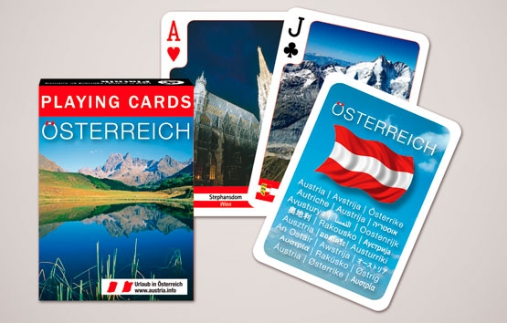

Further we result the survey of the most popular cartographical means and tools. The basic attention is given computer means that at all does not cancel for each tourist of necessity to have at itself and the paper map (the accumulator in which will never be discharged and will not bring you during the most necessary moment).

[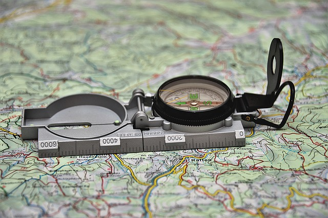](../images/pixabay/compass-3072364_1280.jpg) [Image by PixLord from Pixabay](https://pixabay.com/photos/compass-hiking-outdoor-travel-3072364/)

In each section of means are sorted as their popularity and efficiency for the hikers (from our point of view).

## Paper maps

Paper topographic maps can be got in bookshops, booths at stations and the airports, the local tourist offices and in hotels where you live.

On the Alpine region the authoritative publisher of maps considers Kompass Karten. It is the Austrian publisher of maps who are based in Innsbruck who specialises on foot maps and guidebooks, digital maps, and also on bicycle maps and ​​ guidebooks.

KOMPASS has about 1,000 titles in its programme, including 700 hiking, cycling and ski touring maps. Just under 500 hiking maps have been published covering the hiking areas of Austria, South Tyrol, Germany, the Balearic and Canary Islands. Hiking regions in the rest of Italy, the Swiss Alps, the Czech Republic and Slovakia have some coverage. The maps are mainly published at a scale of 1:25,000 or 1:50,000, with trails, footpaths and additional tourist information highlighted. The new generation of hiking maps is printed with c coordinate grid for GPS navigation. Since mid-2011 weatherproof and rip-resistant maps have been printed, gradually replacing the existing maps.

KOMPASS-Verlag has just under fifty digital maps in its range, covering the whole of Austria, several walking areas in Germany, South Tyrol, the Canaries, the Balearics, Malta and Elba. The digital maps are usable on PDAs and mobile phones using Java technology for outdoor navigation. The map material is at a scale of 1:50,000 zoomable to 1:10,000.

Since 2009 there has been a cycling map series at a scale of 1:70,000. In 2011 a cycling guide series appeared. Both are printed on rip-resistant and weatherproof paper.

The company also publishes hiking atlases, nature guides, panoramas, cookery books and ski tour guides.

**References on a theme:**

Interesting, though also a little out-of-date research in which various foot maps for one concrete Alpine area (Grande Traversata delle Alpi) [https://klingenfuss.org/drim\_lit.htm#karten](https://klingenfuss.org/drim_lit.htm#karten).

## Online maps

### Google Maps

Service represents the map and satellite pictures of mother Earth. For today it is the most popular online the map. [https://www.google.ru/maps/](https://www.google.ru/maps/)

### OpenStreetMap

OpenStreetMap (OSM) is a collaborative project to create a free editable map of the world. Rather than the map itself, the data generated by the project is considered its primary output. The creation and growth of OSM has been motivated by restrictions on use or availability of map information across much of the world, and the advent of inexpensive portable satellite navigation devices.\[6\] OSM is considered a prominent example of volunteered geographic information. [https://www.openstreetmap.org/](https://www.openstreetmap.org/)

### kompass.de

[http://www.kompass.de/](http://www.kompass.de/)

Kompass Karten is the Austrian publisher of maps who are based in Innsbruck who specialises on foot maps and guidebooks, digital maps, and also on bicycle maps and ​​ guidebooks. In its assortment more than 1000 names.

The given publishing house specialises on paper maps and in addition to it gives the computer program, and also the free Internet a site about online maps. [http://maps.kompass.de/](https://www.kompass.de/wanderkarte/) (a site in German). Unfortunately, is not present offline mode of usage. There is an software for desktop, but maps for it are necessary for buying.

Example of a screenshot with the map, made from this site.

[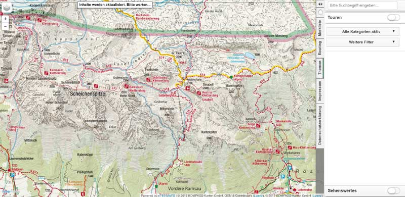](../images/kompass_example.jpg)

### Wikimapia

Wikimapia - the international free web site, the geographical online encyclopedia, which purpose consists in noting and describing all geographical objects on the Earth. Wikimapia combines in itself the interactive map with a principle of free editing вики. [http://wikimapia.org/](http://wikimapia.org/)

[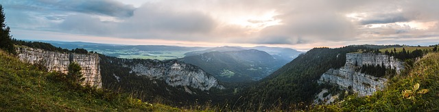](../images/pixabay/creux-du-van-2839090_1280.jpg)

### Wandermap

The interactive map with the user foot routes (worldwide, but the greatest quantity in Europe) [http://www.wandermap.net/](http://www.wandermap.net/)

### Bergfex

[https://www.bergfex.com/](https://www.bergfex.com/)

Bergfex.at Is an Austrian Internet platform for mountaineering and the Alpine sports, the largest in Europe in this sector.

The site gives more than 1700 mounting skiing resorts from twelve European countries and 525 tourist regions from seven states. For reception of the information on destination as that, the information on station work, objects of housing, reports on snow and the weather, carefully prepared maps and sharts, references to webcams and other timely information, concerning excursions and rest. Besides, there are numerous descriptions of rounds on more simple campaigns and bicycle routes, from family walks before rounds top-level, and also to sights in this area. The portal is accessible in 18 languages (bergfex.at, bergfex.ch, bergfex.de, bergfex.it, bergfex.fr so further).

For example, page with an interactive Austria map [https://www.bergfex.com/sommer/oesterreich/](https://www.bergfex.com/sommer/oesterreich/)

[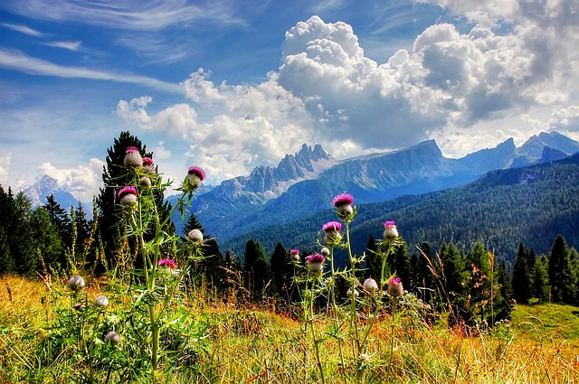](../images/pixabay/croda-da-lago-3514017_1280.jpg) [Image by kordula vahle from Pixabay](https://pixabay.com/photos/croda-da-lago-tofane-dolomites-3514017/)

### Others online services

[https://www.schweizmobil.ch/en/summer.html](https://www.schweizmobil.ch/en/summer.html) Maps of Switzerland

[http://www.freizeitkarte.at/](http://www.freizeitkarte.at/freizeitkarte.php?gebiet_id=62&type=gebiet) the Site (in German) with the interactive appendix (on the basis of Adobe Flash - it is tested in FireFox) on several Alpine regions. At an input on a site it is necessary to choose region from the list. After that the corresponding site will open. Further it is necessary to start by means of the navigation menu passage any of routes available on a site. After that the route will be stage by stage shown on 3D the district image.

The interesting map -- population density in the world. [https://pudding.cool/2018/10/city\_3d/](https://pudding.cool/2018/10/city_3d/)By means of the given map it becomes clear, why in Europe the Alpes - the most interesting place for хайкинга.

[https://earthengine.google.com/timelapse/](https://earthengine.google.com/timelapse/) the Service, allowing to see, how the satellite picture of a certain place for last 30 years has changed.

[https://www.strava.com/](https://www.strava.com/) Strava - service for tracing of activity of sportsmen by means of mobile devices. Service includes appendices for mobile devices, an Internet site, a database of the preserved trainings, API for access to them and other subsystems. Strava also it is positioned as a social net for sportsmen where they can compare the results, put the purposes, communicate and etc. service Working out it is led by company Strava, Inc which has been based in 2007; its basic office is in San Francisco, California

[https://www.relive.cc/](https://www.relive.cc/)allows to connect the account Strava (Relive works with Strava, Endomondo, Garmin Connect, Apple Health (Watch), MapMyRun, MapMyWalk, MapMyRide, MapMyHike and Polar Flow) and to create 3D video from a track of your employment. Relive transforms your adventure into personal video which should share. Fly by over the route, look, where you were, and look at your high lights!

[http://www.etomesto.ru/](http://www.etomesto.ru/) On EtoMesto.ru you can look and compare old maps online and impose them on the modern. On a site ancient Moscow maps and Moscow Region, St.-Petersburg and Leningrad region, and also other regions of Russia are introduced. The territory of Ukraine, Belarus, Moldova, Kazakhstan, the countries of Baltic and caucasus is a little captured also.

## GPS tracks

[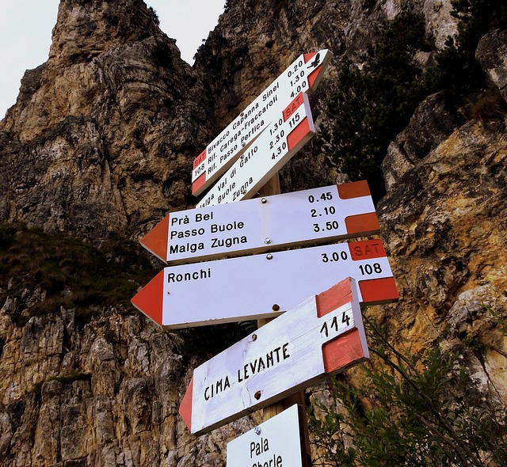](../images/pixabay/crossroads-1595989_1280.jpg) [Image by Gianni Crestani from Pixabay](https://pixabay.com/photos/crossroads-mountain-hiking-rock-1595989/)

The track is a sequence of points of GPS coordinates with marks of time of their passage. As a rule, it is generated by special devices (navigators) or special sofrtware for computers and smartphones. That is, someone has passed a certain route with the included navigator who preserved every second current coordinates in a file. Such track can be loaded in the navigator or special software for computers and smartphones that then to pass the same route. There are public storehouses of tracks on the Internet where it is possible to look at the user tracks and to download them to themselves on the computer device. Also it is possible to load the track into the given storehouse to share it with tourist community.

Using a track for route passage, it is not necessary to forget that the track not always can coincide with an optimum route, and also not always coincide with available tracks and roads. In most cases such coincidence will take place, but not always. The tourist who has written down a track, could descend periodically from a track aside or even it could appear for some time in position "lost the way". The track (especially it concerns mountain tracks) could change the thread eventually. All should be meant it.

Anyway, the analysis of another's tracks is useful at route planning.

[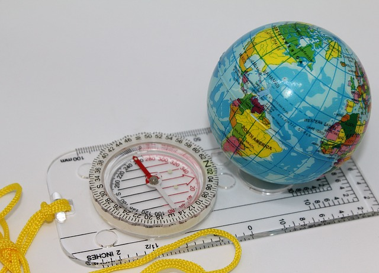](../images/pixabay/globe-2707935_1280.jpg) [Image by bluebudgie from Pixabay](https://pixabay.com/photos/globe-compass-travel-geography-2707935/)

There are various formats for tracks. But many modern devices/on support loading of tracks in several formats. As a last resort always it is possible to use programs for converting from one format in another.

Popular formats are: GPX (GPS eXchange Format), TCX, KML and KMZ (Google Earth), PLT (a format of program OziExplorer), GDB (Garmin Mapsource)

### How to write down GPS tracks

The instruction on record of tracks from openstreetmap for the subsequent loading in this project [https://wiki.openstreetmap.org/wiki/Recording\_GPS\_tracks](https://wiki.openstreetmap.org/wiki/Recording_GPS_tracks)

### Where to search, look and download. Storehouses of GPS tracks

[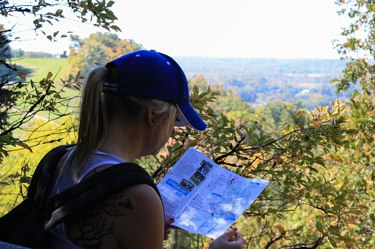](../images/pixabay/hike-467875_1280.jpg) [Image by Kelsey Vere from Pixabay](https://pixabay.com/photos/hike-trek-map-navigation-travel-467875/)

#### Wikiloc - World Footpaths

The most known storehouse GPS of tracks. The data from it uses Google Earth. On our site you can find on page of each region the reference for transition to site Wikiloc on which the map with display GPS of tracks of the given area will open.

Official site [https://wikiloc.com/](https://ru.wikiloc.com/)

On 03.2019 on Wikiloc 4 436 675 participants were registered, 11 234 084 tracks and 19 788 477 photos are added. There are appendices for iPhone and Android. The expanded functions are accessible for Premium an account. Since 2008 it is used Google to show tracks as a layer by default on Google Earth. There is the Russian interface, one mainly is an English-speaking site.  
The key idea Wikiloc formulated on their site: "We believe in a future where humanity spends more time enjoying and preserving the outdoors. Our goal is to help people have better experiences in community before, during and after outdoor activities and to inspire and support the preservation of nature.".  
There is a search by he map and by the region name. For search of a track in Europe it is necessary to use English-speaking names. For track downloading registration is required. Formats: GPX, TCX, a KML-file (a format for Google Earth), Garmin. Probably to receive a code for an insert of the information on a track in socila network or web site.

#### Others online of storehouse of tracks

[https://www.openstreetmap.org/traces](https://www.openstreetmap.org/traces) Official storehouse of tracks OpenStreetMap.

Popular GPS-tracks. Viewing of last loaded GPS-tracks. If you at track record went on road, and this road is not present on map OpenStreetMap (OSM) - you can help community, having loaded the track on site OSM.

[https://www.gpsies.com/](https://www.gpsies.com/)a Considerable quantity of tracks worldwide. But objectively it is less than tracks, than in Wikiloc. The Multijazychnyj site. There are appendices for iPhone and Android. A Considerable quantity of formats and additional options for downloading. Downloading is possible without registration. On page a track there are references for introduction on the site.

[https://www.alltrails.com](https://www.alltrails.com) (Everytrail.com)  
From web site: "The beauty of nature doesn't need to be hard to find. Our goal is simple - build the largest collection of hand-curated trail guides, so you can explore the outdoors with confidence. Anytime. Anywhere". Registration is necessary For track viewing.

## Computer and the software

### Software for desktop

#### Google Mother Earth (Google Earth)

Google Mother Earth (English Google Earth) - company Google project in which frameworks in a net the Internet have been placed satellite (or in some points of an aerophoto) images of all terrestrial surface. Photos of some regions have the high permission is unprecedented. Google mother Earth is displayed in the form of the digital globe which displays a planet surface using one compound image from the big distance. At the big increase in the image pass in various images of the same area with more fine details which can differ on date and time of shooting from one area to another. Google mother Earth has possibility to show to 3D-model of buildings, constructions and monuments. In separate cities, including the photorealistic. Unlike other similar services showing satellite pictures in the ordinary browser (for example, maps Google), in the given service client program Google Earth is used special, loaded on the computer of the user. Such approach though demands закачивания and program installations, but further provides the additional possibilities difficultly realised by means of the web interface.

There is also paid version Google Earth Plus and the free version Google Earth Pro, different support GPS of navigation, means of presentations and the raised permission of listing. [https://www.google.com/intl/ru/earth/](https://www.google.com/intl/ru/earth/)

[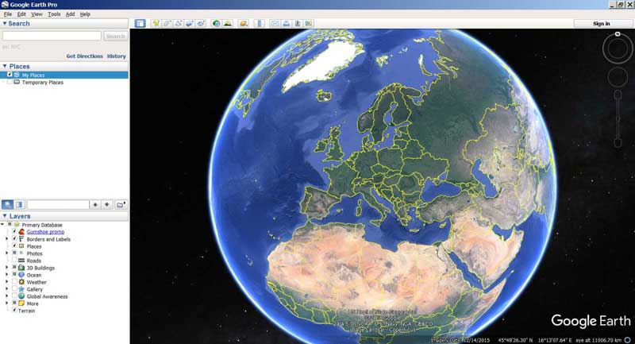](../images/google_earth/main.jpg)

Until mid-2019, there was a Wikiloc track layer in Google Earth, which was quite convenient. However, the collaboration with Wikiloc is now terminated and this layer is not available. For the sake of history, we saved screenshots of how it all looked.

Designation GPS track in program Google Earth

[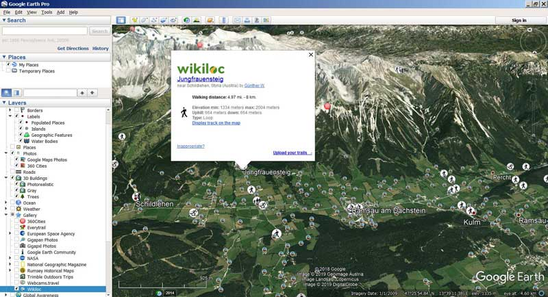](../images/google_earth/wikiloc.jpg)

GPS track in program Google Earth

[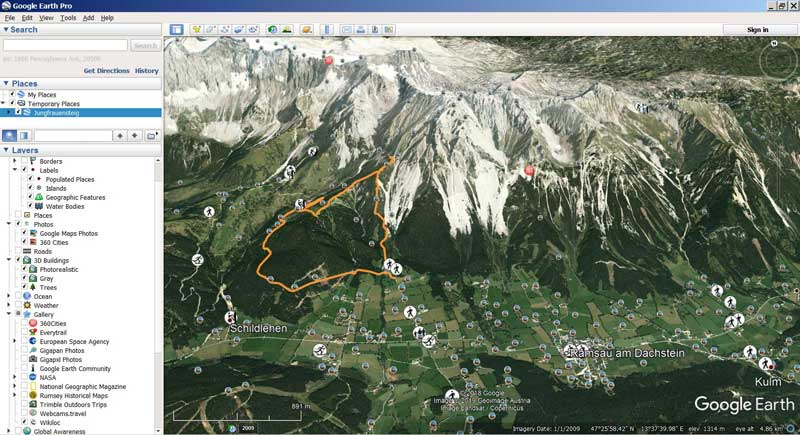](../images/google_earth/track.jpg)

Viewing of photos on the choosen track

[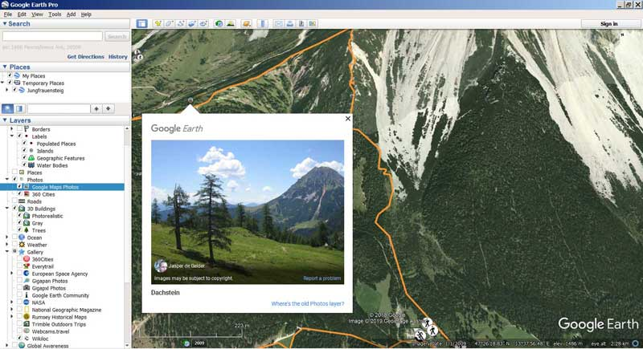](../images/google_earth/foto.jpg)

Links to the page of GPS track in Wikiloc web site

[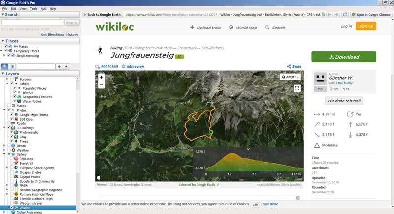](../images/google_earth/trackpage.jpg)

Approach: a mountain track with a GPS track passing along it

[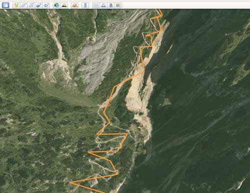](../images/google_earth/track_zoom.jpg)

However, it remains possible to see the track on the map by manually downloading it from Wikiloc and uploading it to Google Earth. For instructions on how to do this, watch a [video lecture](https://www.youtube.com/watch?v=MfClwG_vZ7A) on our video channel. (Russian language. Subtitles: Russian, automatic translation is available for English and other languages)

#### SAS.Planet

SAS.Planet - Free of charge extended navigating program uniting in possibility of loading and viewing of maps and satellite photos of a terrestrial surface of a considerable quantity of cartographical online-services. The program works with подружаемыми from the Internet layers popular cartographical servers. The loaded data is preserved in independent кеше. It is possible to load preliminary the data for the rectangle chosen on district, however it is impossible to load кеш for the certain country or an administrative unit. From other possibilities of the program: cохранение map parts in one image which can be seen and processed in any graphic editor and also to use in other GIS-APPENDICES, for example, in OziExplorer (for which the program will create a binding file); display of files KML; loading and display of objects Wikimapia; addition of the user maps; possibility of use of the GPS-receiver for navigation. [http://www.sasgis.org/](http://www.sasgis.org/)

#### GPXSee

GPXSee - the simple free program for viewing and analysis GPS of tracks. There is a Russian-speaking interface. Tracks are loaded from files (thus there is a possibility quickly to look through all tracks from a current directory). Formats GPX, TCX, FIT, KML, IGC, NMEA, SLF, LOC, OziExplorer (PLT, RTE, WPT), GeoJSON and Garmin CSV. Substrate maps can be loaded also from files (formats: MBTiles, OziExplorer maps, TrekBuddy maps/atlases, Garmin JNX maps, TwoNav RMaps, GeoTIFF images) or to work about the Internet as sources. [https://sourceforge.net/projects/gpxsee/](https://sourceforge.net/projects/gpxsee/)

#### GPS Track Editor

GPS Track Editor - the free supplement for Windows which does all with GPS-tracks. With the current version you can: to analyze and clear your tracks GPS; to create accurate structure of segments of a way to see the trajectory in colour; to examine travelling points; to take track parts to preserve as file GPX, NMEA or CSV; to unite some tracks in one; to generate time notches. [http://www.gpstrackeditor.com/](http://www.gpstrackeditor.com/)

#### OziExplorer

OziExplorer - the appendix for combination of raster maps with data GPS. OziExplorer supports work with GPS-receivers Garmin, Magellan, Lowrance, Eagle, Brunton/Silva, MLR and allows to carry out navigation under raster maps in an interactive regime. Earlier OziExplorer was one of the most popular appendices for cartography (especially for pocket devices on the basis of Win CE), it is now forced out by another ON. [https://www.oziexplorer4.com/w/](https://www.oziexplorer4.com/w/)

### Software for mobile devices

#### MAPS.ME

MAPS.ME (The former name - MapsWithMe) - the free supplement for mobile devices on the basis of free map OpenStreetMap. Since November, 2014 Maps.me belongs Mail.ru Group and develops within the limits of its international project My.com. Maps generally city, than tourist, nevertheless, the basic tracks on them are designated. [https://maps.me/](https://maps.me/)

#### OsmAnd

OsmAnd (OSM Automated Navigation Directions) - the software with an open initial code, for oflajn-navigation. The basic source of the cartographical data are vector maps OpenStreetMap, and also many raster maps (Yandex. Maps, Mapnik, Osmarender, CloudMade, Cyclemap, OpenPisteMap, MapSurfer.Net, Microsoft Maps/Earth/Hybrid). [http://osmand.net/](http://osmand.net/)

#### iGO

iGO - the program of satellite GPS-navigation, which is created by company NNG (earlier - Nav'N'Go) from Hungary. In the market versions under Windows CE, Windows Mobile, Apple iOS and, since recent time, under Android are accessible. In the program cartography Tele Atlas, Navteq, and also local developers is used. The program first of all ориенторана on problems of automobile navigation. [http://www.igonavigation.com/](http://www.igonavigation.com/)

[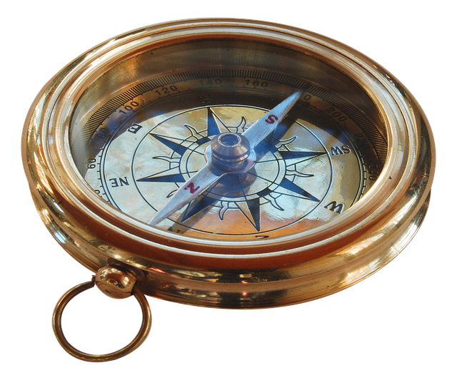](../images/pixabay/compass-3674904_1280.png) [Image by Sunny Sunflower from Pixabay](https://pixabay.com/photos/compass-transparency-cutout-3674904/)
