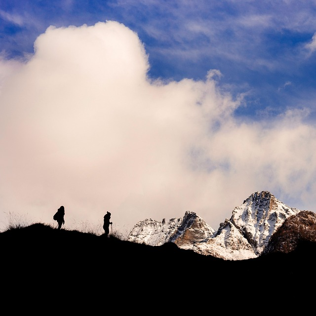
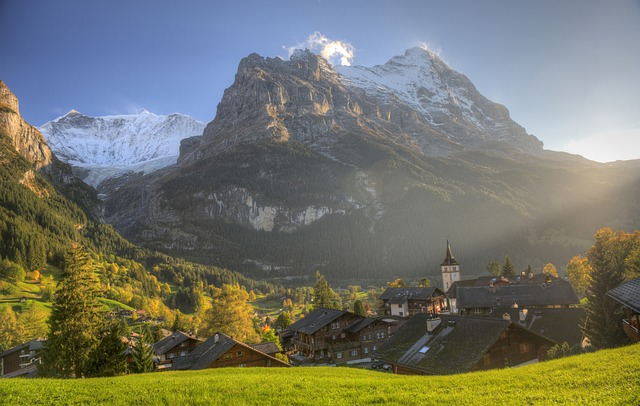
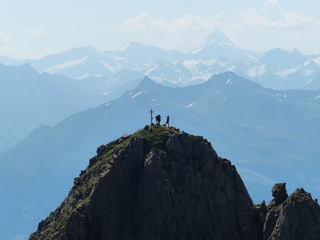

# Rules of the hiking

Rules in the hiking are based on three principles: not to harm itself, not to harm other people and not to harm the nature.

## Time calculation

Correct calculation of prospective time of a campaign is especially important for one-day hiking when route passage is carried out without independent spending the night. At campaigns on flat district calculation is simple and is based that average speed of walking - 5 km/hour. It is necessary to put time for halts and a possible deviation from a route, and also on speeding up of obstacles (for example, the rivers). Carefully study a district map before a campaign.

In mountain campaigns of a rule of calculation of time more difficult. We result calculation from a site of the Alpine union. [http://www.alpenverein.at/portal/news/aktuelle\_news\_kurz/2018/2018\_06\_14\_wie-berechnet-man-die-gehzeit-auf-wanderwegen.php](http://www.alpenverein.at/portal/news/aktuelle_news_kurz/2018/2018_06_14_wie-berechnet-man-die-gehzeit-auf-wanderwegen.php) see also "Naismith's rule" [https://en.wikipedia.org/wiki/Naismith's\_rule](https://en.wikipedia.org/wiki/Naismith's_rule)

Rough values for calculation of time of walking:

* About 300 metres of height at an o'clock for lifting
* About 500 metres of height at an o'clock for draining off
* About 4 kilometres across at an o'clock

At first we count both values (time of walking for a difference in height or for horizontal distance) separately. Then smaller value decreases twice and is added to большему to value.

Example: 1200 м and 8 km of distance to huts (lifting). At height of 1200 metres lifting occupies about 4 hours, and the 8-kilometre horizontal distance adds even 2 hours. Smaller value (2 hours) decreases twice and is added to larger value. So, 4 hours + 1 hour = 5 hours of an ascension.

 [Image by StockSnap from Pixabay](https://pixabay.com/photos/cloud-sky-landscape-highland-2561878/)

## Safety in a campaign

### Possible hazards of outdoor recreation

The survey is based on the article "Hazard of outdoor recreation" [https://en.wikipedia.org/wiki/Hazards\_of\_outdoor\_recreation](https://en.wikipedia.org/wiki/Hazards_of_outdoor_recreation)

Outdoor recreation, such as hiking, camping, canoeing, cycling, or skiing, entails risks, even if participants do not recklessly place themselves in harm's way. In some circumstances, such as being in remote locations or in extreme weather conditions, even a minor accident may create a dangerous situation that requires survival skills. However, with correct precautions, even fairly adventurous outdoor recreation can be enjoyable and safe.

### General safety measures

Every hazard has its own safety measure, and every ailment a particular remedy. A standard precaution for all back country activities is carrying the "ten essentials", a collection of tools chosen for their utility in preventing or reacting to various emergencies.\[1\]

The common practice of traveling in a group improves safety in all regards. If one person is injured, group members can administer first aid or seek help. A group can avoid poor decisions that a lone traveler might make. If an emergency occurs, a group can pool its muscle power, brain power, and body heat.

Another precaution is informing people outside of the group of the itinerary and expected return time (expected hiking time can be estimated using Naismith's rule). A communication device, such as a cell phone or a satellite phone, may help in the case of an emergency. However, with the exception of mountain tops that are in line-of-sight to populated areas, cell phone coverage in wilderness areas is often quite poor. In the wilderness one should always be prepared to hike out for help, if necessary.

### Dangerous circumstances

#### Bad weather

Blizzards, flash floods, fog, dust or sandstorms, tornados, and other meteorological events may or may not be predictable, and may require immediate response for survival. Lightning is a frequent and serious threat in many regions

#### Hazardous terrain

Exposure is a climbing and hiking term. Sections of a hiking path or climbing route are described as "exposed" if there is a high risk of injury in the event of a fall because of the steepness of the terrain. If such routes are negotiated without any protection, a false step can result in a serious fall. The negotiation of such routes can cause fear of falling because of the potential danger.

"Exposed" sections of a path or a route can cause fear as well as serious problems for climbers and walkers in mountainous terrain if they lack a head for heights. However, what may feel exposed to some people, may hardly affect others at all. In critical situations it is therefore necessary, either to turn back or to use a protective measure such as a rope; some paths have fixed ropes, chains, ladders, etc. The anxiety caused by the exposure reduces with habituation, but even experienced climbers often have to get used to heights again at the start of the climbing season.

Sure-footedness refers to the ability, especially when hiking or mountain climbing, to negotiate difficult or rough terrain safely. Such situations place demands on a person's coordination and reserves of strength as well as requiring sufficient appreciation of the terrain. A person who is sure-footed is thus unlikely to slip or stumble.

On many hiking trails and mountain tours, sure-footedness is assumed to be a prerequisite without ever being defined. The term is frequently used in the literature presumably to ensure that the reader is made sufficiently aware that, under certain circumstances, one false step may lead to serious consequences.

Although there is no standard definition of sure-footedness, the following is a list of attributes that, as a rule, constitute what is generally meant:

* Possession of sufficient coordination to progress over uneven ground as intended, without losing one's balance. That also includes being able to compensate for small slips when moving forward, without any serious consequences.
* Correct assessment of the ground, both in terms of usable footholds or steps and also the level of grip they afford. One must be able to do this on all types of terrain, including scree, rock, schrofen, bare earth or firn, and also in wet conditions.
* An ability to recognise those parts of the route which need to be negotiated with particular care due to the risk of falling.
* Proper assessment of one's own level of coordination and ability, even when tired, in order to adjust one's rate of progress accordingly. Experience has shown that sure-footedness decreases in the afternoon due to physical and mental fatigue.

Sure-footedness is something that one can be trained in to a certain extent, especially through regular, strenuous exercise in steep, rough terrain that is not exposed. In the early phases hiking sticks can be helpful. However, too great a reliance on them can be detrimental to sure-footedness when crossing terrain where they are of no use-as for example on protected rock sections. On the other hand, hiking poles can be invaluable, especially for older hikers, and those with knee problems, and as well provide added security where a stumble might be hazardous, on uneven ground or an exposed path.

Backcountry avalanches are generally triggered by the immediate action of the party. Precautions include training, monitoring weather conditions to learn the history of the snow pack, digging hasty pits, modifying the route, passing one-by-one through dangerous areas, wearing avalanche beacons, and carrying avalanche probes and snow shovels. Other non-avalanche snow immersions can be similarly dangerous, including tree wells.

Other mass movements include icefalls, landslides, and rockfalls. When choosing a campsite care must be taken to avoid those along with dead trees, snags, trees with large dead branches, or trees that have previously been through a forest fire. Collectively, these are called "widowmakers" by experienced campers.

Slips may occur:

* On wet rocks or logs.
* When crossing streams, rivers, lakes, and other bodies of water, which can be dangerous due to poor visibility, uneven surfaces, smooth and algae or moss-covered rocks, and strong currents. The tops of waterfalls are especially dangerous because of fast moving water and smooth, slanted rocks. Rubber soles grip poorly on slime, compared to felt soles, crampons, or hob-nailed boots. Precautions include being aware of the danger, using hiking poles, loosening packs straps to lower gravity and in case of becoming submerged, and crossing with other people linked arm to arm or using a rope.
* Because of loose material. Loose gravel or scree on top of smooth rock acts like ball bearings. Precautions include spotting the situation ahead, keeping knees bent and weight forward, using hiking sticks, and brushing aside the gravel where possible.
* Ice

When travelling over glaciers, crevasses pose a grave danger. These giant cracks in the ice are not always visible, as snow can be blown and freeze over the top to make a snowbridge. At times snowbridges can be as thin as a few inches. Climbers and hikers use ropes to protect themselves from such hazards. Basic gear for glacier travel includes crampons and ice axes, and teams of two to five tie into a rope equally spaced. If someone begins to fall the other members of the team perform a self-arrest to stop the fall and then attempt a rescue.

Drownings are especially likely when accompanied by head injuries (which may render people unconscious), in very cold water (which can sap energy quickly), or in white water (which may be so frothy that it is impossible to float, or even swim, to the surface).

When walking beaches or crossing estuaries, it is essential to be aware of the tides.

#### Losing the way

Travelers may become lost, either if a group cannot find its way or if an individual becomes separated from the party and cannot find it again. Lost hikers who cannot find their way to their destination on time may run out of food and water, or experience a change in weather. The absence of clearly marked trails increases the risk of losing one's way.

If a group splits up into several subgroups moving at different speeds, one of the subgroups may take a wrong turn at a trail junction. A common procedure to avoid this is for the leaders to stop at junctions and wait for the others. Keeping the group together is important in the wilderness, especially when visibility is blocked due to weather, rocks, or trees.

Carrying a map and compass, and knowing how to use them, will decrease the risk of getting lost. Likewise, a Global Positioning System may prove invaluable, as it can pinpoint a traveler's location, revealing his exact position and the direction to roads, services, and inhabited areas. Most GPS devices can also be designed to mark one's path on a map, making it easy to backtrack. Family Radio Service, General Mobile Radio Service, and amateur radios operating on the "2 meters" band may help maintain communication. Flashing lights, signal mirrors, and whistles are low-tech emergency signals.

Without a distant focal point, such as a mountain top, or the sun or moon, people who are lost can sometimes wander in circles.

#### Hazardous bystanders

Individuals encountered in the outdoors may not always be friendly and in some cases may pose a danger to outdoor recreationalists. These can take the case of robberies, sexual assault, or other attacks.

#### Wild animals

In many areas, adventurers may encounter large predatory animals such as bears or cougars. These animals rarely seek out humans as food, but they will attack under some conditions. Some hazardous encounters occur when animals raid human property for food. Additionally, if travelers come upon an unsuspecting animal and surprise it, it may attack. Regularly making loud noise, such as by clapping or yelling, reduces the risk of surprising an animal. Some people use bear bells as noisemakers, but these are usually too quiet to be heard from far away. Any mammal infected with rabies may behave unexpectedly, even aggressively, and could infect a human with rabies by biting.

Venomous animals, including snakes, scorpions, spiders and bees, may cause harm either directly or through anaphylactic shock. Overall, the greatest danger is often from insects, such as mosquitoes, ticks and fleas, which carry communicable diseases.

### Specific accidents and ailments

#### Metabolic imbalances

Metabolic imbalances can affect general functioning and lead to other injuries.

* Dehydration can rapidly incapacitate an adventurer, especially in warm weather. In conditions of low humidity, sweat evaporates so quickly that a person may not notice the water loss. Carrying and drinking an adequate amount of water helps avoid dehydration. Depending on conditions, two liters of water may be enough for a day hike, but under hot conditions (such as hiking the Grand Canyon in summer), one liter per hour may be required. Naturally occurring water is often unfit to drink (see [Potability of backcountry water](https://en.wikipedia.org/wiki/Potability_of_backcountry_water "Potability of backcountry water")).
* Sweating removes not only water, but also salt. This may result in a deficiency of [sodium](https://en.wikipedia.org/wiki/Sodium "Sodium") ([hyponatremia](https://en.wikipedia.org/wiki/Hyponatremia "Hyponatremia")). Eating salty snacks together with drinking water helps to avoid this problem.
* If deprived of food for several days, travelers may become malnourished. Malnutrition takes several weeks to kill a person, but because it impairs judgment, it can cause problems much sooner. Low blood sugar may have a similar effect, especially for those with diabetes. Carrying extra food will minimize risk to the hiker.
* Hypothermia is a potentially fatal drop in core body temperature. It occurs most easily in cold weather and when wet. Wet or damp clothing (due to rain, sweat, stream crossings, etc.) can bring it on even in relatively warm air, particularly at high elevation, windy conditions, or at low humidity. Even if hypothermia does not kill the victim directly it causes confusion, irrationality and impaired judgment, increasing the risk of other injuries. Sufficient clothing helps prevent hypothermia, but some materials (especially cotton) are discouraged because they absorb and hold water.
* Heat exhaustion, possibly developing into heatstroke, can occur in hot weather, particularly if one is dehydrated or dressed too warmly. The risk of heatstroke can be minimized by avoiding direct sun, and staying wet when possible. This is a life-threatening condition: a victim must be cooled off and transported to a hospital immediately.
* Altitude sickness results from climbing rapidly to elevations beyond 2,500 metres (approximately 8,000 feet). The process of acclimatization generally takes several days, but may be helped by drugs, such as Diamox. Acute mountain sickness (AMS) may develop into high altitude pulmonary edema (HAPE) or high altitude cerebral edema (HACE), both of which are life-threatening and require immediate transportation to a lower altitude.
* Carbon monoxide poisoning may occur in tents, igloos, cabins, or trailers due to faulty or misused equipment. It may also occur near the exhausts of motorboats, where the CO concentrations can be high enough to be quickly fatal.

#### Topical injuries

* Frostbite can occur when bare skin is exposed to very low temperatures. Frostbite can be prevented by adequate clothing.
* Sunburn, which may occur in hot or cold conditions, can be debilitating. Sunburn may be prevented by wearing adequate sunscreen.
* Snow blindness, a burning of the cornea, is caused by the intense ultraviolet solar radiation multiplied by sunlit snow. Snow blindness may be prevented by wearing dark sunglasses or goggles.
* Burns can occur when dealing with camp stoves. Boiling pots are overturned, clogged fuel lines explode, hot metal is touched with bare skin. Burns are also caused by campfires, cookfires and bonfires.
* Lacerations may be caused by careless use of knives or axes, or contact with sharp rocks or barbed wire. Tetanus and other infections can result.
* Poisonous plants, such as poison ivy or stinging nettle, cause rashes.
* Plant thorns and animal quills can cause deep puncture wounds, and can be difficult to remove, often requiring pliers.

#### Internal injuries

When combined with lack of proper physical conditioning, cumbersome backpacks increase the risk of missteps and falls, particularly on difficult terrain. Poor judgment due to exhaustion or inattention on steep or slippery slopes can also lead to injury.

* Ankle sprain is a common and debilitating injury. Proper hiking boots can help prevent it.
* Foot blisters are caused by friction and irritation of the skin. Wet socks and poorly fitting shoes precipitate the occurrence of blisters. Two layers of socks (using liner socks) help prevent blisters, and moleskin can be applied to blister-prone areas as a treatment or preventive measure.
* Back injury may result from packing more than one can carry or not having a proper backpack. A pack for backpacking should be bought from a recreational store, and as a rule of thumb, a person who is not overweight can comfortably carry up to one third of his or her body weight; however a backpack weighing more than 50 pounds (23 kg) should be avoided. Hiking poles may also reduce the likelihood of back injuries by spreading the load across multiple points. Care should be taken to lift and put on the pack with the least strain.

#### Digestive infections

Surface water in the wilderness can contain viruses, bacteria or parasites. The latter two can cause dysentery or wilderness diarrhea in untreated water and can be spread person-to-person by poor hygiene in camp. The most common cause of wilderness diarrhea is the parasite Giardia. [https://en.wikipedia.org/wiki/Wilderness-acquired\_diarrhea](https://en.wikipedia.org/wiki/Wilderness-acquired_diarrhea)

 [Image by Albert Häsler from Pixabay](https://pixabay.com/photos/eiger-grindelwald-village-autumn-487217/)

## Ten Essentials

[https://en.wikipedia.org/wiki/Ten\_Essentials](https://en.wikipedia.org/wiki/Ten_Essentials)

The Ten Essentials are survival items that hiking and Scouting organizations recommend for safe travel in the backcountry.

The Ten Essentials first appeared in print in the third edition of Mountaineering: The Freedom of the Hills (January 1974). Many regional organizations and authors recommend that hikers, backpackers, and climbers rigorously ensure they have the ten essentials with them. However, personal preferences and differences in conditions may dictate otherwise and with experience most adventurers add and subtract from the list depending on the situation. Some ultralight backpackers do not always carry all of the items and believe it is an acceptable risk they take in order to travel light and fast

### Main list

According to the eighth edition of Mountaineering: The Freedom of the Hills (2010) book there are ten essentials.

1. Navigation. Topographic map and assorted maps in waterproof container plus a magnetic compass, optional altimeter or GPS receiver.
2. Sun protection. Sunglasses, sunscreen for lips and skin, hat, clothing for sun protection.
3. Insulation. Jacket, hat, gloves, rain shell, and thermal underwear.
4. Illumination. Headlamp, flashlight, batteries. LED bulb is preferred to extend battery life.
5. First-aid supplies, plus insect repellent.
6. Fire. Butane lighter, matches in waterproof container.
7. Repair kit and tools. Knives, multi-tool, scissors, pliers, screwdriver, trowel/shovel, duct tape, cable ties.
8. Nutrition. Add extra food for one additional day (for emergency). Dry food is preferred to save weight and usually needs water.
9. Hydration. Add extra 2 liters of water for one additional day (for emergency).
10. Emergency shelter. Tarp, bivouac sack, space blanket, plastic tube tent, jumbo trash bags, insulated sleeping pad.

This book recommends supplementing the above with:

* Portable water purification and water bottles
* Ice axe for glacier or snowfield travel (if necessary)
* Signaling devices, such as a whistle, mobile phone, two-way radio, satellite phone, unbreakable signal mirror or flare, laser pointer.

### Other lists

Other outdoor organizations have variations of the Ten Essentials pertinent to local conditions.

Boy Scouts of America's "Scout Basic Essentials" are quite similar (Map and Compass, Sun Protection, Extra Clothing, Flashlight, First-Aid Kit, Matches and Fire-starters, Pocketknife, Trail Food, Water Bottle, and Rain Gear.)

Utah's Wasatch Mountain Club lists extra water in place of food, as Utah is mostly desert terrain, and water is more difficult to find.

The Spokane Mountaineers list "thirteen essentials", which supplement the list with emergency shelter such as a space blanket, signaling device, and toilet paper and trowel (for sanitary disposal of human waste; the toilet paper also doubles as tinder for starting a fire).

The "Ten Essential Groups" is an alternative approach to essential gear selection.\[8\] Items from each group should be chosen depending on the season, geographic location, and trip duration. In 2011, Columbia Sportswear adopted the "Ten Essential Groups" concept for their iOS app "Take Ten to the Greater Outdoors".

Central Arizona Mountain Rescue Association promotes the 12 Essentials, which includes Signaling Devices and Personal Items

## Rules

### The Tyrol Declaration

**The aim of the Tyrol Declaration for mountain sports**  
is to protect the freedom of participants and promote social development, cultural understanding and environmental awareness. To this end, the Tyrol Declaration follows the traditional unwritten values and codes of conduct inherent in mountain sports and expands on these to meet the demands of our times. These proposals for best practice in mountain sports are adressed to all lovers of the mountains worldwide - whether they be hikers and trekkers, sport climbers, or mountaineers seeking to push their limits at high altitudes. With these proposals we especially hope to reach young people, for they are the future of mountain sports.

The Tyrol Declaration is based on a set of values and maxims to give guidance on best practice in mountain sports. These values and maxims are not rules or detailed instructions, rather

1. they define today's fundamental values in mountain sports;
2. they contain principles and standards of conduct;
3. they formulate the ethical criteria for decision making and uncertain situations;
4. they present the ethical principles by which the public can judge mountain sports;
5. they introduce beginners to the values and moral principles relevant to their sport.

**The Tyrol Declaration for Mountain Sports**

APPEAL:

* Stretch your limits, lift your spirits and aim for the top. 
* Accept the risks and assume responsibility. 
* Balance your goals with your skills and experience. 
* Play by fair means and report honestly. 
* Strive for best practice and never stop learning. 
* Be tolerant, considerate and help each other. 
* Protect the wild and natural character of mountains and cliffs. 
* Act withing the limits of effort and the 'barrier of fatigue'. 
* Support local communities. |

VALUES:

***Human dignity***  
In keeping with Article 1 of the UN Bill of Human Rights, the proposals are based on the premise that human beings are born free and equal in dignity and rights and should treat one another in the spirit of brotherhood. Particular attention should be given to equal rights of men and women.

***Life, liberty, happiness***  
Is goes without saying that climbers and mountaineers subscribe to the inalienable human rights, foremost life, liberty, and the pursuit of happiness. We feel a special responsibility towards the indigenious populations of mountain areas, whose right to a dignified, self-determined life must be protected by all possible means.

***Intactness of nature***  
Thanks to their intensive contact with nature, climbers and alpinists develop awareness for the beauty of a healthy environment and the need to preserve its flora and fauna. "Leave no traces" has always been a key issue in our environmental philosophy. With the growing threat to fragile ecosystems in mountain regions all over the world, one of the most important commitments of the climbing community has become the protection of endangered species of flora and fauna, both in the mountains and in crag climbing areas.

***Solidarity***  
There are few situations in which people are so dependent on each other as are climbers on hard routes in wilderness areas. Rewarding experiences and success most readily manifest in a harmonious team where mutual support is the rule. The shared experience of intensive outdoor adventure diminishes differences due to social class, age, religion or nationality. Thus, climbing has become a means to promote understanding among individuals as well as nations. Solidarity between hikers, rock climbers and mountaineers also extends to the population of the regions they visit.

***Self-actualization***  
It is our conviction that all humans - after their immediate physical demands and their needs for security, love and recognition have been met - strive for self-actualization. For millions of people around the world, climbing and mountaineering have become a significant factor in the quest for a meaningful life. It is through climbing that they experience the support of a friendly social environment, recognition and the exhilarating pleasures of athletic accomplishment.

***Truth***  
As performance in climbing frequently goes unwitnessed and often can't be indisputably documented, experts and the public alike have to rely on the truthfulness of the activists who report on their accomplishments. If arbitrariness replaces truth, it becomes impossible to evaluate performance in climbing, thus robbing our sport of one of its most important motives.

***Excellence***  
All mountaineers and rock climbers like to tackle problems that challenge them both physically and mentally, striving for both elegant and controlled execution of the task. Many activists strive to improve their abilities. Without continual progress on the cutting edge of performance, climbing would lose much of its dynamism and fascination.

***Adventure***  
We experience our own performance most intensively when - moving close to our limits - we interact with the natural obstacles posed by mountains or crags as directly as possible, with a minimum of interfering technology. For this reason, risk and advantage are essential factors in climbing. The intensive feeling of satisfaction climbing can impart, is a product of the exiting balance between danger and safety achieved through skillfully blending courage, rational judgment, emotional control, responsibility and athletic prowess. The diversity of disciplines in mountain sports - hiking, adventure climbing and sport/plaisir climbing - allows everyone to chose their own individual adventure, where their skills and the dangers are in balance.

**The quality of values**  
Although individualistic values play an essential role in defining climbing, we need to realize that in any moral issue, these rank below humane principles and environmentally-oriented ideals. Putting self-actualization, performance and adventure above the right to life of Man and his natural environment is incompatible with the humanistic values of mountaineering and rock climbing. It is the responsibilty of every single climber to weigh and balance the values of his sport so that climbing can keep its integrity and is able to stand up against current trends marked by shortsightedness, egotism and greed.

-------------------------------------------------------------------------

For full text of the Tyrol Declaration see: [http://www.viaalpina.dk/info/dok/tyrol.htm](http://www.viaalpina.dk/info/dok/tyrol.htm) [https://www.theuiaa.org/documents/declarations/UIAA\_Declaration\_TyrolDeclaration.pdf](https://www.theuiaa.org/documents/declarations/UIAA_Declaration_TyrolDeclaration.pdf)

 [Image by Heinz Hummel from Pixabay](https://pixabay.com/photos/gro%C3%9Fvenediger-summit-snow-panorama-2255146/)
