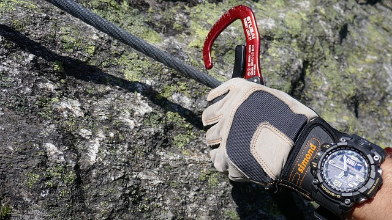

# Hiking and mountain terminology

Hiking - to walk or march a great distance, especially through rural areas, for pleasure, exercise, training, or the like.

More detailed terminology (trekking, backpacking, etc.) can have a little different shades of value depending on local features. Nevertheless, probably to use following definitions:

## English-speaking terminology

**Hiking** is short (as a rule, one-day) the pedestrian travel with light baggage. It is normally used concerning mountain or foothill district though it is unessential (is even the term "city hiking"). Hiking it is normally carried out with use of the marked and well prepared tracks.

 [Image by Ales Krivec from Pixabay](https://pixabay.com/photos/hiker-standing-woman-top-journey-918473/)

**Trekking** is more difficult and long pedestrian travel. Normally with spending the night which (as it is accepted in Europe) are carried out in campings or mountain shelters. At the same time, tracking is often used as the generalised term (including hiking) and designates the pedestrian travel on the planned routes (a track -- a route).

**Backpacking** is the outdoor recreation of carrying gear on one's back, while hiking for more than a day. It is often but not always an extended journey, and may or may not involve camping outdoors. In North America tenting is common, where simple shelters and mountain huts widely found in Europe are rare. In New Zealand, tramping is the term applied though overnight huts are frequently used. Hill walking is an equivalent in Britain (but this can also refer to a day walk), though backpackers make use of all kinds of accommodation, in addition to camping. Backpackers use simple huts in South Africa. Similar terms used in other countries are trekking and bushwalking.

**Backpacking (another usage of this term)** is a form of low-cost, independent travel. It includes the use of public transport; inexpensive lodging such as youth hostels; often a longer duration of the trip when compared with conventional vacations; and typically an interest in meeting locals as well as seeing sights. Despite the name it does not have to involve travelers carrying belongings in a backpack, although that is a common practice.

 [Image by Danny Schreiner from Pixabay](https://pixabay.com/photos/cappadocia-tuff-rock-hiking-1602916/)

**Walking** - it is comprehensible to the description of all forms of walking, whether it be walk in park or the hiking in the Alpes

**Rambling** (the old-fashioned term), hillwalking, fell walking -- basically is used in Great Britain

**Bushwalking** (walking on a forest) -- the term used in Australia

**Tramping** - in New Zealand so name long, vigorous walk or a campaign

## German-speaking terminology

**Wandern** - the pedestrian campaigns and walks, basically on special tracks with lodgings for the night in huts.

**Bergwandern** - mountain campaigns, with passage of passes and lodgings for the night to tents.

## Russian-speaking terminology

**Mountain tourism**- the kind of tourism consisting in movement of group of people by means of muscular force on a certain route, laid in mountain district in the conditions of high mountains. There are two disciplines on sports mountaineering: a route mountain and a distance mountain. By the given kinds of disciplines competitions as at level of tourist clubs, and regional federations on sports tourism are held.

 [Image by skeeze from Pixabay](https://pixabay.com/photos/hiker-mountain-backpacking-hiking-1763517/)

 [Image by Hans Braxmeier from Pixabay](https://pixabay.com/photos/climber-steep-descent-climb-59681/)

 [Image by joergweitz from Pixabay](https://pixabay.com/photos/climb-mountaineering-mountaineer-3590655/)

## Additional definitions

**Rock climbing** is a sport in which participants climb up, down or across natural rock formations or artificial rock walls. The goal is to reach the summit of a formation or the endpoint of a usually pre-defined route without falling. Professional rock climbing competitions have the objectives of either completing the route in the quickest possible time or attaining the farthest point on an increasingly difficult route.

**Mountaineering**is the set of activities that involves ascending mountains. Mountaineering-related activities include traditional outdoor climbing, hiking, skiing, and traversing via ferratas. Indoor climbing, sport climbing and bouldering are also considered mountaineering by some

**Lightweight (ultralight) backpacking** -- a direction in the tourism which distinctive feature is the maximum weight reduction of equipment without safety threat. [https://en.wikipedia.org/wiki/Ultralight\_backpacking](https://en.wikipedia.org/wiki/Ultralight_backpacking)

**Scrambling** (also known as alpine scrambling) is "a walk up steep terrain involving the use of one's hands". It is an ambiguous term that lies somewhere between hiking, hillwalking, mountaineering, and rock climbing. Canyoning often involves scrambling.

**Nordic walking**is a total body version of walking that can be enjoyed both by non-athletes as a health-promoting physical activity, and by athletes as a sport. The activity is performed with specially designed walking poles similar to ski poles.

**Canyoning** (**canyoneering** in the United States, kloofing in South Africa) is travelling in canyons using a variety of techniques that may include other outdoor activities such as walking, scrambling, climbing, jumping, abseiling (rappelling), and swimming. Although non-technical descents such as hiking down a canyon (canyon hiking) are often referred to as canyoneering, the terms canyoning and canyoneering are more often associated with technical descents - those that require abseils (rappels) and ropework, technical climbing or down-climbing, technical jumps, and/or technical swims. Canyoning is frequently done in remote and rugged settings and often requires navigational, route-finding, and other wilderness travel skills. [https://en.wikipedia.org/wiki/Canyoning](https://en.wikipedia.org/wiki/Canyoning)

**Hitchhiking** (also known as thumbing or hitching) is a means of transportation that is gained by asking individuals, usually strangers, for a ride in their automobile or other vehicle. A ride is usually, but not always, free. Itinerants have also used hitchhiking as a primary mode of travel for the better part of the last century, and continue to do so today.

**The used materials:**

* Wikipedia [https://en.wikipedia.org/wiki/Hiking](https://en.wikipedia.org/wiki/Hiking) [https://en.wikipedia.org/wiki/Scrambling](https://en.wikipedia.org/wiki/Scrambling) and other articles
