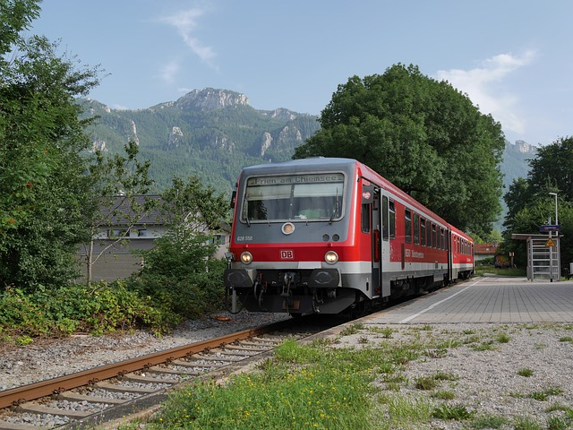
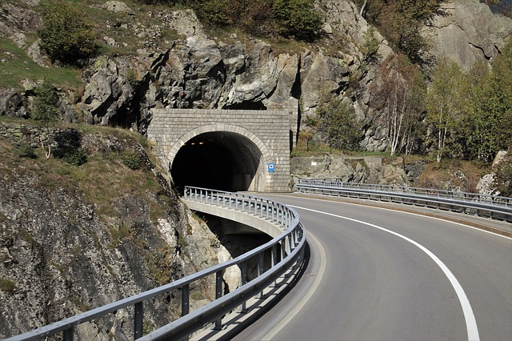
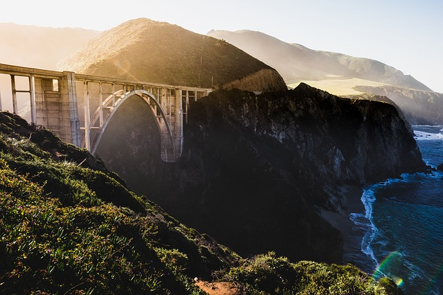
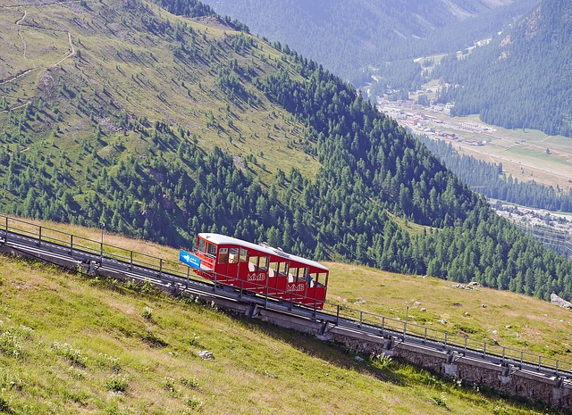


# Transport

The help information on transport for tourists (Europe).

## All types of transport

[https://www.rome2rio.com/](https://www.rome2rio.com/) Transport portal Rome2rio simplifies planning of journeys. The site gives the information on travel and booking from a door to a door, helping you to reach from any point of the world. Enter any address, sight or a city as destination, and the site will instantly display all your variants of journey and booking, and also the information on housing and sights in one convenient place.

## Fly

Sites for search of cheap air tickets:

[https://www.skyscanner.com](https://www.skyscanner.com/)

### easyJet

[https://www.easyjet.com/en/holidays/destinations](https://www.easyjet.com/en/holidays/destinations) This reference ill give to easyJet's flight booking, travel deals, and comprehensive travel information.

### TUI UK

[https://www.tui.co.uk/flight](https://www.tui.co.uk/flight)

### TUI Ireland

[https://www.tuiholidays.ie/flight](https://www.tuiholidays.ie/flight)

## Railway transport

### The Austrian railways

[http://www.oebb.at](https://www.oebb.at/) an official site

### EuroNight

EuroNight (in abbreviated form EN) - the main national and international night trains within the limits of the European net of the long-distance railways

[https://www.nightjet.com/](https://www.nightjet.com/) an official site

### The German railways

[http://www.bahn.de](http://www.bahn.de) an official site

### The Swiss railways

[http://www.sbb.ch/en/home.html](http://www.sbb.ch/en/home.html) an official site

### The Italian railways

[http://www.trenitalia.com](http://www.trenitalia.com) an official site

### The French railways

[http://www.tgv-europe.com](http://www.tgv-europe.com) official site TGV

[https://www.thalys.com](https://www.thalys.com)

[http://voyages-sncf.com](http://voyages-sncf.com)

### The Polish railways

[https://www.intercity.pl/en/](https://www.intercity.pl/en/) an official site

### The Hungarian railways

[https://www.mavcsoport.hu/en](https://www.mavcsoport.hu/en) an official site

### The Russian railways

[http://www.rzd.ru/](http://www.rzd.ru/) an official site

[http://forum.railwayclub.info/](http://forum.railwayclub.info/) the Forum of passengers of the Russian Railway

### The Ukrainian railways

[http://booking.uz.gov.ua](http://booking.uz.gov.ua) an official site

### The Belarus railways

[http://rasp.rw.by/ru](http://rasp.rw.by/ru) an official site

### The Serbian railways

[http://www.zeleznicesrbije.com](http://www.zeleznicesrbije.com) an official site

## Bus service

The Austrian buses [http://www.postbus.at](http://www.postbus.at)

The international bus companies:

[https://www.flixbus.com](https://www.flixbus.com)

[https://meinfernbus.de/](https://meinfernbus.de/)

## Ferry

The ferry on island Corsica [https://www.corsica-ferries.co.uk](https://www.corsica-ferries.co.uk)

Ferries Italy - Montenegro [http://www.montenegrolines.com](http://www.montenegrolines.com)

## Cars

Car rental

[https://www.rentalcars.com/](https://www.rentalcars.com/)

[https://www.global-rent-a-car.com](https://www.global-rent-a-car.com)

[https://www.viamichelin.com/](https://www.viamichelin.com/)the Interactive site for planning of an automobile route, including fare calculation (gas + road tax)

 [Image by StockSnap from Pixabay](https://pixabay.com/photos/highland-cliff-rock-hill-travel-2576780/)

## Cable cars

There are summer cableways in almost every alpine region. Disorder of the prices from 5 to 100 and above euro for one lifting. It is necessary to specify the period of their work on sites of rope-ways. Some rope-ways after a winter season are closed on preventive maintenance and open only to the beginning of a high summer season (July-August).

Example: a rope-way on a plateau of mountain Dachstein (South side) [https://www.derdachstein.at/en/tickets-infos/ascent-and-descent](https://www.derdachstein.at/en/tickets-infos/ascent-and-descent)

 [Image by Erich Westendarp from Pixabay](https://pixabay.com/photos/funicular-railway-aussichtspinkt-1611996/)
