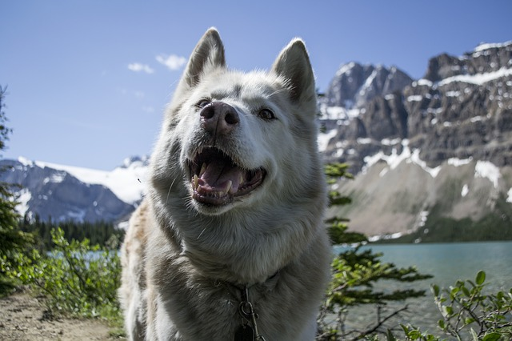
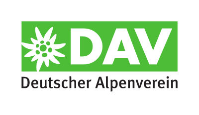
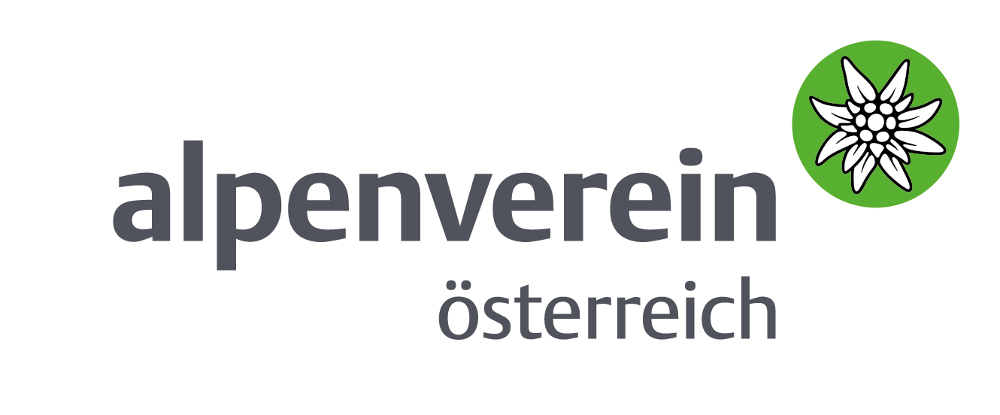
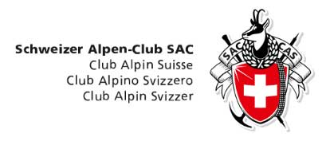

# Альпийские союзы

## Общая информация

Альпийскими союзами называют туристические объединения (организации), существующие в ряде европейских стран. Членство в этих организациях возможно и для зарубежных участников. Членство в них платное и дает участникам ряд преимуществ:

* скидки на стоимость проживания в горных хижинах;
* страховку, которая способна покрыть все расходы в случае возникновения чрезвычайной ситуации;
* бесплатное пользование топографическими картами;
* скидки на прокат прокат альпинистского снаряжения;
* доступ к учебным курсам, методической литературе, географическим картам и пр.;

См. "Что дает членство в европейских альпийских клубах" [http://spryquest.com/blog/blog\_46.html?l=ru](http://spryquest.com/blog/blog_46.html?l=ru)

Стоимость членства различается в зависимости от конкретного союза и конкретного регионального отделения.

Целесообразность вступления (с уплатой членских взносов) в альпийский союз для иностранных участников - вопрос спорный и решается каждым индивидуально. На эту тему есть, например, дискуссии на форуме [https://www.risk.ru/blog/15122](https://www.risk.ru/blog/15122) (Ветка форума с обсуждением целесообразности вступления в Альпийский союз).

Инструкции на тему, как оформить заявление для вступления в Альпийский союз хорошо расписаны здесь: "Как вступить в Альпийский союз" [http://www.kombrig.net/vstuplenie\_v\_alpklub.htm](http://www.kombrig.net/vstuplenie_v_alpklub.htm)

 [Image by M. Maggs from Pixabay](https://pixabay.com/photos/highway-mountain-trees-forest-2498002/)

Однако в любом случае знакомство с деятельностью Альпийских союзов является полезным для хайкеров. Сайты этих организация (информация на которых находится в свободном доступе для всех желающих, а не только для членов союзов) являются настоящим кладезем актуальной информации "из первых рук". На них можно найти:

* туристические карты регионов;
* информацию по горным хижинам;
* информацию по туристическим правилам безопасности;
* актуальную информацию по погоде и проходимости маршрутов;
* последние туристические новости и др.

## Немецкий Альпийский Союз. Deutscher Alpenverein (DAV)

> Немецкий Альпийский союз (нем. Deutscher Alpenverein, DAV ) - самая многочисленная альпинистская организация в мире и восьмая по величине спортивная организация в Германии. В союз входят 354 юридически независимые альпинистские объединения, клубы, объединяющие в общей сложности около 988 000 членов. Союз объединяет как профессионалов, так и любителей, занимающихся горными видами спорта: альпинизмом, скалолазанием, горным туризмом, ледолазанием, ски-альпинизмом, маунтинбайком и др.
> [https://en.wikipedia.org/wiki/German\_Alpine\_Club](https://en.wikipedia.org/wiki/German_Alpine_Club)

Страховка (ASS) действует на территории всей Европы (в том числе и на Кавказе). При дополнительной доплате действие страховки распространяется по всему миру.  
Членские взносы отличаются от раздела к разделу, в зависимости от их размера и предложений. Для взрослого членство стоит от 45 до 90 евро за календарный год.

Официальный сайт: [https://www.alpenverein.de/](https://www.alpenverein.de/)

Некоторые интересные страницы:

* Карта горных хижин [https://www.alpenverein.de/DAV-Services/Huettensuche/](https://www.alpenverein.de/DAV-Services/Huettensuche/)
* Отзывы о горных хижинах [https://www.alpenverein.de/Huetten-Wege-Touren/Huettentest/](https://www.alpenverein.de/Huetten-Wege-Touren/Huettentest/)
* Статистика происшествий [https://www.alpenverein.de/Bergsport/Sicherheit/Unfallstatistik/](https://www.alpenverein.de/Bergsport/Sicherheit/Unfallstatistik/)

## Австрийский Альпийский Союз. Österreichischer Alpenverein (ÖAV)

Официальный сайт: [http://www.alpenverein.at](http://www.alpenverein.at/portal/index.php)

На сайте можно посмотреть новости и события региональных секций. Например: Иннсбрук [http://www.alpenverein.at/innsbruck/](http://www.alpenverein.at/innsbruck/) (На сайте союза доступен журнал "Альпийский вестник")

На сайте Австрийского альпийского союза есть список горных приютов и хижин по регионам: Австрия, Германия, Итальянский Тироль [https://www.alpenverein.at/huetten/finder.php](https://www.alpenverein.at/huetten/finder.php)

Страховки AWS (Австрийского Альпийского Союза) [https://oeav.mitgliederversicherungsservice.at/informationen/die-alpenvereinsversicherung/](https://oeav.mitgliederversicherungsservice.at/informationen/die-alpenvereinsversicherung/)

Годовой взнос 2019 (календарный год) - € 57,00 (Секции Alpine Club с открытыми офисами в течение всего дня и расширенным сервисным предложением могут заработать чуть более высокие членские взносы. Для поставок за границу взимается компенсация расходов.)

Региональные секции (некоторые):

* Вена [https://www.alpenverein-austria.at/](https://www.alpenverein-austria.at/)
* Зальцбург [https://www.alpenverein-salzburg.at/](https://www.alpenverein-salzburg.at/)

## Швейцарский альпийский союз

Официальный сайт: [https://www.sac-cas.ch/](https://www.sac-cas.ch/)

Поиск горных хижин (только Швейцария) [https://www.sac-cas.ch/de/huetten-und-touren/sac-tourenportal/](https://www.sac-cas.ch/de/huetten-und-touren/sac-tourenportal/)

## Итальянский альпийский союз

Официальный сайт: [http://www.cai.it/](http://www.cai.it/)

Региональные секции (некоторые):

* Итальянский альпийский союз южного Тироля [https://www.alpenverein.it/](https://www.alpenverein.it/)
