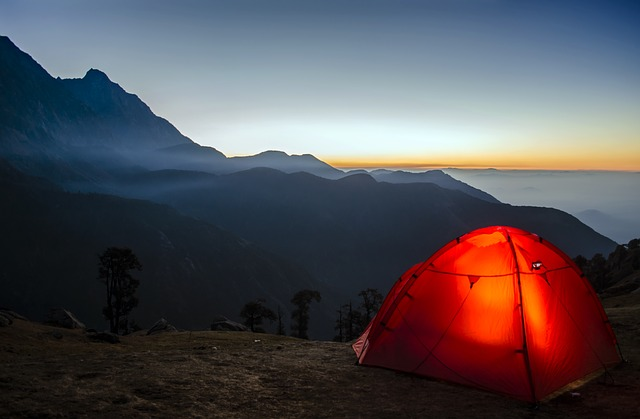

# Жилье для пешего туриста

Подборка справочной информации о том, как туристу искать и бронировать жилье.

## Гостиницы и апартаменты

Наиболее известные сайты для поиска жилья

Booking.com - система интернет-бронирования отелей, [https://www.booking.com](https://www.booking.com)

[https://www.hostelworld.com/](https://www.hostelworld.com/) - хостелы и бюджетные гостиницы

Airbnb - онлайн площадка для размещения, поиска и краткосрочной аренды частного жилья по всему миру. [https://airbnb.com/](https://ru.airbnb.com/)

[https://www.couchsurfing.com/](https://www.couchsurfing.com/) - сервис поиска свободного жилья у местных жителей по всему миру.

Сайты агрегаторы по поиску отелей на различных порталах по бронированию:

[https://www.roomguru.ru/](https://www.roomguru.ru/)

[https://www.trivago.ru/](https://www.trivago.ru/)

Реальные отзывы путешественников об отелях, ресторанах и достопримечательностях предлагает TripAdvisor [https://www.tripadvisor.com](https://www.tripadvisor.com/) -- популярнейший портал во всем мире.

## Кемпинги

[https://camping.info](https://camping.info/) Здесь Вы найдете 23 019 мест (на май 2019 г.) для кемпинга в Европе и можете сами их оценить.

## Горные приюты и хижины

 [Image by Ale Bah from Pixabay](https://pixabay.com/photos/alm-mountain-alpine-austria-hut-2721842/)

Горный приют, альпийский прию́т или альпи́йская хи́жина (нем. Schutzhütte, Berghütte, Schutzhaus, в Швейцарии также Hospiz или Ospizio, итал. Rifugio, фр. Refuge, англ. Mountain hut) - прочное здание, обеспечивающее защиту от непогоды для пастухов, альпинистов, туристов и других путешественников в горной местности вдали от населённых пунктов. Также горные приюты используются в качестве стационарных спасательных станций и базовых лагерей при организации спасательных работ в горах

Система горных приютов особенно широко распространена в Альпах на популярных альпинистских и туристических маршрутах. В других горных районах не всегда можно рассчитывать на наличие аналогичной густой сети горных приютов.

Горные приюты могут быть предназначены либо для ночёвки в экстренных случаях и не иметь никаких удобств, либо быть оборудованы спальными местами, приспособлениями для отопления помещения, приготовления пищи, санузлами и так далее. Оборудованные приюты могут иметь статус гостиницы (нем. Berggasthaus, в Швейцарии также Berghaus), ночёвка в них обычно осуществляется на платной основе. Такие приюты работают, как правило, во время туристического сезона и их работой руководят специальные служащие. В этих приютах помимо ночлега путешественникам за отдельную плату предлагается питание.

Многие приюты в Альпах принадлежат национальным и региональным союзам альпинистов. Ночлег в горных приютах, как правило, разрешён любым путешественникам, однако члены альпинистских клубов обычно имеют скидку при оплате. В ряде случаев для размещения в приюте необходимо заранее зарезервировать место.

[https://en.wikipedia.org/wiki/Mountain\_hut](https://en.wikipedia.org/wiki/Mountain_hut)

К сожалению, на сегодняшний день не существуют единой системы бронирования мест в горных приютах подобно аналогичной для гостиниц, хостелов или кемпингов. Поэтому чтобы забронировать ночевку в таком приюте необходимо самостоятельно узнавать его координаты (телефон), созваниваться и договариваться. Однако постепенно зачатки подобных систем появляются.

Например:

На сайте швейцарского альпийского союза. Поиск горных хижин (только Швейцария) [https://www.sac-cas.ch/de/huetten-und-touren/sac-tourenportal/](https://www.sac-cas.ch/de/huetten-und-touren/sac-tourenportal/)

На сайте Австрийского альпийского союза (Австрия, Германия, Итальянский Тироль) [https://www.alpenverein.at/huetten/finder.php](https://www.alpenverein.at/huetten/finder.php)

 [Image by Stefanie Laubscher from Pixabay](https://pixabay.com/photos/alpine-mountains-panorama-1024932/)

## Автономное проживание в палатках

Как правило, во всех странах вы можете проживать в своей палатке, останавливаясь в специально отведенных кемпингах. Это будет не бесплатно, но существенно дешевле проживания в отеле. Возможность же автономного проживания в палатке вне кемпинговых зон сильно зависит от конкретной страны и региона. В Центральной Европе обычно это не приветствуется, хотя и иногда допускается выше уровня леса. А вот, к примеру, в Норвегии законы более либеральные. Более конкретную информацию нужно узнавать в туристических центрах регионов.

 [Image by anurag kaushik from Pixabay](https://pixabay.com/photos/camping-travel-sunrise-adventure-2581242/)

Видеолекция "Походы по Альпам "дикарём". Ковинов онлайн!"
