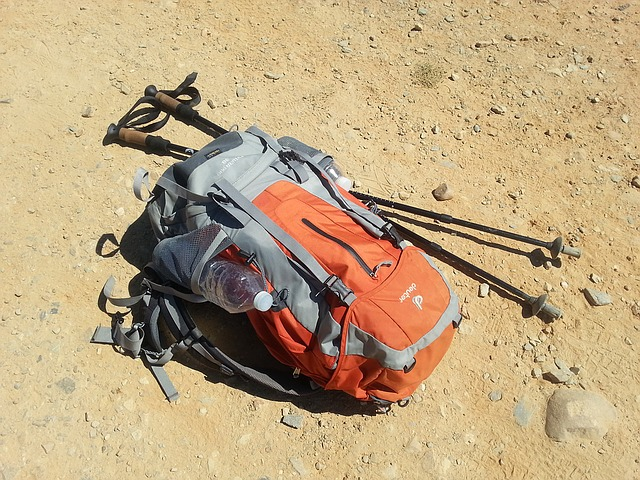
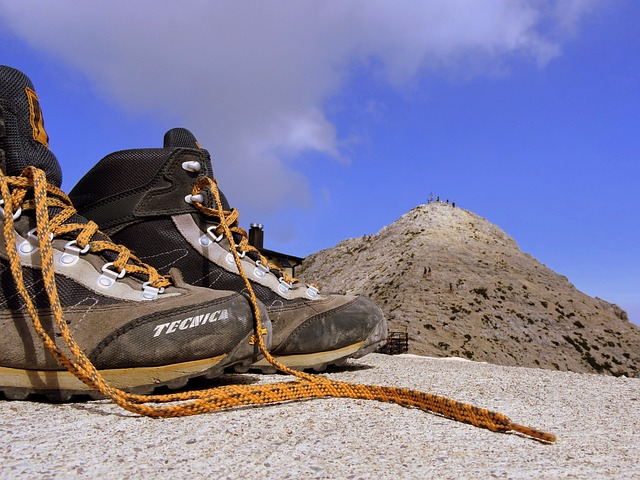
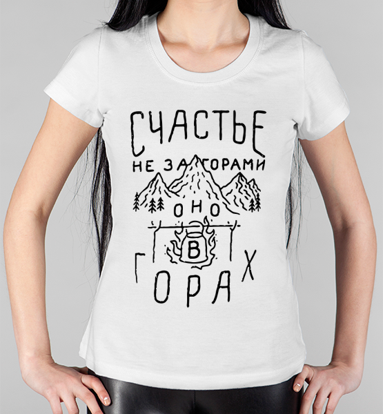
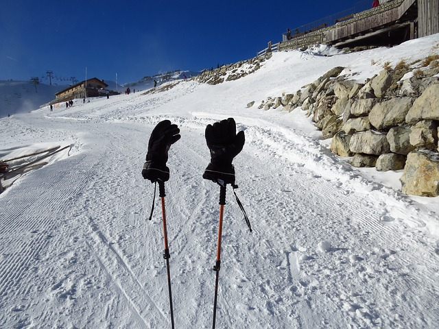

# О туристическом снаряжении

Одним из достоинств пешего туризма является то, что снаряжение для этого вида времяпровождения вполне доступно по цене. Поход стоит дешево: по сравнению с любым другим видом спорта ваши первоначальные расходы на предметы первой необходимости минимальны, все, что вам нужно в качестве базового, это хорошие ботинки, несколько предметов надлежащей одежды, удобная упаковка. Тем не менее, если вы решите реализовать свои потребительские потребности, то к вашим услугам обширная индустрия туристических товаров и снаряжения от различных мировых брендов.

Вообще говоря, дух потребительства чужд духу пешего туризма, основной идеологией которого является "свобода" от цивилизационных рамок и стереотипов, а также естественность, близость к природе. Тем не менее не следует возводить это в абсолют, полностью отвергая и презирая труд сотен тысяч людей, работающих в индустрии производства туристических товаров. Они делают это не только ради наживы, но также и ради самореализации и прогресса, вкладывают свой труд и талант, и в конечном итоге стараются для нас.

Поэтому, если позволяют финансовые возможности, туристических "шопинг" может стать дополнительным вдохновляющим фактором для пешего туриста. Однако, если же финансовые возможности ограничены, это ни в коей мере не будет препятствием для занятий пешим туризмом, т.к. в простейшем случае никакого особенного снаряжения не требуется.

 [Image by rggroning from Pixabay](https://pixabay.com/photos/backpack-camino-camino-de-santiago-1062702/)

Основным снаряжением пешего туриста для однодневного хайкинга являются:

* рюкзак
* обувь
* защита от дождя

Для походов с ночевкой добавляется

* палатка
* спальный мешок
* туристический коврик или надувной матрас
* туристические комплекты для приготовления пищи. Да и про саму пищу и воду также не стоит забывать :)

Дополнительным снаряжением в обоих случаях может являться достаточно большой набор разнообразных вещей:

(см. также "Десять предметов первой необходимости" в разделе ["Правила"](rules))

* треккинговые палки
* дополнительная теплая одежда, в том числе комплект термобелья, перчатки, спортивная шапка
* защита от солнца . Солнцезащитные очки, солнцезащитный крем для губ и кожи, шляпа, одежда для защиты от солнца.
* средства навигации. Электронная топографическая карта на смартфоне, портативном навигаторе или ином электронном устройстве. Бумажная топографическая карта и различные карты в водонепроницаемом контейнере, а также магнитный компас, дополнительный высотомер или GPS-приемник.
* освещение . Фара, фонарик, аккумуляторы. Светодиодная лампа предпочтительна для продления срока службы батареи.
* предметы первой помощи (аптечка первой помощи), а также средство от насекомых.
* огонь . Бутановая зажигалка, спички в водонепроницаемой таре.
* ремонтный комплект и инструменты . Ножи, многофункциональный инструмент , ножницы, плоскогубцы, отвертка, шпатель/лопата, клейкая лента, кабельные стяжки.
* ледоруб для путешествия по леднику или снежному полю (при необходимости)
* сигнальные устройства, такие как свисток , мобильный телефон , двусторонняя радиосвязь , спутниковый телефон , небьющееся сигнальное зеркало или вспышка , лазерная указка.
* и т.д.

Поскольку производители туристического снаряжения прямо заинтересованы в рекламе своих товаров, в сети интернет можно найти достаточно профессиональных обзоров, сравнений и отчетов о тестировании снаряжения (см. ссылки в каждом разделе и в конце страницы). Мы же, не претендуя на полноту охвата темы, даем здесь только несколько основных советов, касающихся выбора туристического снаряжения.

Скоростные походы: спидхайкинг и фастпэкинг. Видеолекция. Сергей Савельев - сотрудник магазина "Спорт-Марафон". Что такое скоростной туризм, и как это работает. Какое используется снаряжение и какая одежда для спидхайкинга. Чем питаться и как не остаться без запасов на маршруте. Как спланировать безопасный маршрут и учесть все факторы, которые могут как усложнить путешествие, так и облегчить его.

## Туристический рюкзак

Основное правило при выборе рюкзака для легкого хайкинга просто: в него должны помещаться все ваши вещи, которые вы собираетесь взять с собой. Поэтому не поленитесь заранее собрать их вместе, включая защиту от дождя, утепляющую одежду и запас провизии и как минимум литровую бутылку воды, чтобы примерно оценить необходимый объем (некоторые даже советуют брать весь этот набор с собой в туристический магазин).

Вторым важны фактором (даже для легких походов) является водонепроницаемость рюкзака. Впрочем, на этот счет существую несколько подходов

* хороший воднонепроницаемый рюкзак (в отличие от куртки или ботинок, от него обычно не требуется , чтобы рюкзак "дышал", а значит выбор материалов больше), с прошитыми, проклеенными и защищенным швами
* рюкзак из любого материала (желательно частично водонепроницаемого), если к нему прилагается специальный непромокаемый чехол
* рюкзак из любого материала (желательно частично водонепроницаемого), если ваш плащ от дождя имеет такую конструкцию, которая позволяет вам надеть после того как вы надели рюкзак (плащ оказывается сверху рюкзака)
* рюкзак из любого материала (желательно частично водонепроницаемого), но все вещи внутри которого вы тщательно упаковываете в непромокаемые пакеты. Самый нежелательный вариант, а вот упаковывать ценные вещи в герметичную упаковку полезно при любом раскладе.

При выборе рюкзака для более сложных походов, когда рюкзак имеет значительный вес, на первый план выходит фактор конструкции крепления рюкзака на спине. В частности, важны конструкция и охват поясного ремня. Если рюкзак подобран правильно, большая часть носимого веса, должна приходиться не на плечи, а на ноги (опора - поясной ремень). Актуальной также является жесткая конструкция каркаса спины рюкзака

Рекомендации по объему туристического рюкзака

|     Продолжительность похода      | Объём рюкзака, л |
|-----------------------------------|------------------|
| На один день или с одной ночёвкой | 20-50            |
| 2-3 дня                           | 50-60            |
| 3-5 дней                          | 60-80            |
| От недели и более                 | от 80            |

И наконец, стоит обратить внимание на дополнительные факторы: наличие карманов, различных отделений для вещей, удобство доступа к ним, специальные крепления для навесных вещей (например, бутылки с водой, треккинговых палок или ледоруба). Хорошим дополнением будет являться наличие на поясном ремне рюкзака специальных карманов - в них можно держать небольшие вещи, которые требуется часто вынимать по мере движения по маршруту. Однако отсутствие таким карманов, если они не компенсируются карманами одежды, можно компенсировать покупкой дополнительной поясной сумки. Последний вариант очень удобен для легкого трекинга, т.к. легкий рюкзак часто не имеет поясного ремня вообще.

**Ссылки:**

Выбор туристического рюкзака. Обзор от известного производителя туристического снаряжения "Tatonka" [http://www.tatonka.ru/articles/vybor-turisticheskogo-ryukzaka.html](http://www.tatonka.ru/articles/vybor-turisticheskogo-ryukzaka.html)

Как выбрать туристический рюкзак. Обзор от экспертов торговой сети "Спорт-Марафон" [https://sport-marafon.ru/article/kak-vybrat/kak-vybrat-turisticheskiy-ryukzak/](https://sport-marafon.ru/article/kak-vybrat/kak-vybrat-turisticheskiy-ryukzak/) [https://www.youtube.com/watch?v=YRUeniwOrA4](https://www.youtube.com/watch?v=YRUeniwOrA4)

Выбираем хороший туристический рюкзак [https://pohod-v-gory.com/как-выбрать-туристический-рюкзак/](https://pohod-v-gory.com/как-выбрать-туристический-рюкзак/)

### Как компактно сложить одежду в рюкзак

Как сложить одежду так, чтобы она занимала минимум места в рюкзаке или дорожной сумке? Эксперт от Спорт-марафона показывает 3 основных способа, которые позволят сделать вашу экипировку существенно компактнее, а поиск её в рюкзаке или сумке быстрее.

Если вы научитесь правильно упаковывать вещи, то у вас появится возможность взять с собой большее количество утепляющей одежды, что сделает ваше путешествие более комфортным и более безопасным.

## Трекинговые палки

Как выбрать треккинговые палки [https://www.youtube.com/watch?v=w0laYus1p3o](https://www.youtube.com/watch?v=w0laYus1p3o)

## Туристическая обувь

Для легкого хайкинга вполне подходит простая спортивная обувь: кроссовки или простые туристические ботинки. Чем проще обувь, тем более универсальной она является, а следовательно её можно использовать и вне времени похода, что позволит съэкономить некоторые средства. Есть несколько факторов, которые диктуют необходимость более специализированной обуви:

* Походы в условиях сложной поверхности, Например, в условиях горной каменистой местности желательны более жесткие туристические ботинки, защищающие ногу (и сам ботинок) от боковых ударов о камни. В условиях мокрой поверхности (особенно каменистой) необходима обувь с хорошим сцеплением именно на мокрой поверхности.
* Походы с тяжелым рюкзаком. Желательны желательны более жесткие туристические ботинки.
* Для людей с определенными физическими проблемами или слабой физической подготовкой, а также избыточным весом необходимо подбирать обувь индивидуально и по возможности предпочесть специализированную туристическую обувь универсальной. Например, при повышенной опасности подворота ноги (старые травмы, растяжения и т.п.) желательны более высокие туристические ботинки в некоторой степени защищающие голеностопный сустав. При проблемах с плоскостопием важное значение приобретает наличие анатомических стелек и т.п.

 [Image by Gianni Crestani from Pixabay](https://pixabay.com/photos/boot-mountain-top-carega-refuge-1632050/)

Общепринятая классификация туристической обуви

* ботинки для лёгкого треккинга или хайкинговые ботинки (в англ. "hiking boots"). для простых туристических маршрутов и походов выходного дня, при условии, что вес рюкзака не превышает 15 кг
* классические походные ботинки (в англ. "midweight trekking boots"). для протяжённых туристических маршрутов на высотах до 3000 м с умеренно тяжёлым рюкзаком весом до 25 кг.
* треккинговые ботинки для горных или сложных многодневных походов (в англ. "heavy backpacking boots"). для прохождения маршрутов со сложным рельефом, в меняющихся погодных условиях и весом рюкзака более 25 кг.

Советы при покупке ботинок

* не покупать перед самым походом (необходимо время, чтобы привыкнуть к ботинкам, "разносить" их)
* не покупать там, где невозможно примерить (например, в интернет-магазинах), если конечно вы не имеете уже достаточного опыта подобных покупок
* желательно покупать обувь в таких торговых точках, где вы гарантированно можете её обменять в случае, если не подошел размер и конструкция
* следует предпочесть более свободную обувь более узкой, т.к. во время длительного движения стопа может отекать. Тем не менее обувь следует подбирать так, чтобы нога не "болталась" в ботинке.
* примерять ботинки в магазине лучше вечером - стопа будет несколько шире и больше в объёме, что имитирует её состояние на маршруте.
* при примерке пробуйте варианты с различными носками (толстыми и тонкими), рассчитанными на различные погодные условия
* ваши пальцы стоп не должны касаться носка, когда обувь плотно зашнурована.Чтобы оценить, достаточно ли свободного пространства перед пальцами, можно слегка расшнуровать ботинок и максимально сдвинуть стопу вперёд до упора. Освободившийся "запас" должен составлять 0.5-1 см у ботинок для лёгкого и среднего треккинга, и 1-1.5 см - для тяжёлого.
* более свободная обувь может быть частично скомпенсирована использованием специальных анатомических стелек

Водонепроницаемость ботинок.

Водонепроницаемость ботинок однозначно необходима для пешего туриста, т.к. поход обычно планируется как минимум на целый день, а следовательно существенно возрастает риск быть застигнутым дождем. Кроме того утренняя и вечерняя роса при прохождении травянистых участков, походы по заболоченной местности, снежным участкам - всё это также является факторами, приводящими к промоканию ботинок. Однако чем более "непромокаемым" является ботинок, тем хуже он "дышит", что провоцирует повышенное потоотделение со всеми вытекающими из этого проблемами. Поэтому необходимо искать для себя разумный компромисс.

Одним из возможных решений является использование мембранных технологий (например, GORE-TEX®). Эти технологии обеспечивают сохранение сухости и комфорта ноги в сложных погодных условиях (как то: от попадания влаги внутрь и за счет частичного вывода влаги наружу). Тем не менее , нога в таких ботинках дышит всё же хуже, чем в промокаемых материалах. Следует учесть мембрана обычно находится во внутреннем достаточно тонком слое ботинки и и ходьбе изнашивается быстрее всего, что приводит утрате водозащитных свойств. Для мембран опасна неправильная сушка (например, возле костра) , которая может привести к спеканию пор синтетического материала, после чего нога в таких ботинках перестает дышать вообще (хорошей новостью при этом является, что ботинки становятся полностью водонепроницаемыми :) )

**Ссылки:**

Как выбрать треккинговые ботинки? Обзор от экспертов торговой сети "Спорт-Марафон" [https://sport-marafon.ru/article/kak-vybrat/kak-vybrat-trekkingovye-botinki/](https://sport-marafon.ru/article/kak-vybrat/kak-vybrat-trekkingovye-botinki/)

[https://www.youtube.com/watch?v=nWuu3B\_5Fs8](https://www.youtube.com/watch?v=nWuu3B_5Fs8)

Как выбрать треккинговые ботинки? Обзор от экспертов торговой сети "Альпиндустрия" [https://alpindustria.ru/school/articles/howto-trekking-shoes.html](https://alpindustria.ru/school/articles/howto-trekking-shoes.html)

Моя обувь для туризма и путешествий (обзор Дм. Ковинова) [http://www.kovinov.com/snarjazhenie/moe/obuv/](http://www.kovinov.com/snarjazhenie/moe/obuv/)

Как сушить ботинки [http://palatking.ru/Boots/Dry.html](http://palatking.ru/Boots/Dry.html)

Как завязать шнурки, чтобы они не развязывались [https://www.youtube.com/watch?v=w6PH5i3URFA](https://www.youtube.com/watch?v=w6PH5i3URFA)

Кроссовки с мембраной или без? Мифы и реальность [https://www.youtube.com/watch?v=RWuijDnsybs](https://www.youtube.com/watch?v=RWuijDnsybs)

## Туристическая одежда

Обычно рассматривают несколько "слоев"

* Внутренний слой. Нательное белье, термобельё (вопреки расхожему мнению, главная задача термобелья не напрямую согревающая, а отвод влаги (пота), что способствует согреванию косвенным образом).
* Промежуточный слой. Согревающий. Свитера, флиски, или же второй слой согревающего белья .
* Наружный слой. Защита от дождя и ветра.

Само собой, наличие всех трех слоев как отдельных компонет необязательно, т.к. их функции могут совмещаться в определенных моделях снаряжения. Например, куртка может служит как внешним , так и согревающим слоем. Или же определенные модели двухслойного термобелья (достаточно дорогие) совмещают функции потоотведения и согревания.

**Ссылки:**

"Теория слоёв" - что это и как работает [https://www.youtube.com/watch?v=C4yYR44wjzI](https://www.youtube.com/watch?v=C4yYR44wjzI)

"Пуховый свитер": что это такое, особенности, как выбрать [https://www.youtube.com/watch?v=84RSIQZVZxs](https://www.youtube.com/watch?v=84RSIQZVZxs)

Что такое утеплённые ("пуховые") шорты и для чего они нужны [https://www.youtube.com/watch?v=9uuGhTL1Uhk](https://www.youtube.com/watch?v=9uuGhTL1Uhk)

Как выбрать термобельё [https://www.youtube.com/watch?v=f9RyDetowjs](https://www.youtube.com/watch?v=f9RyDetowjs)

Как не промокнуть в походе? (Мария Веремьёва, Андрей Шлеенков) - аудио подкаст "Спорт-Марафон" [https://www.youtube.com/watch?v=gaUC9Wg8W2Q](https://www.youtube.com/watch?v=gaUC9Wg8W2Q)

## Палатки, спальники, тенты и другое снаяряжение для многодневных походов

Видеолекция от Спорт-Марафон. Про легкоходные ночёвки.

Сергей Савельев, эксперт Спорт-Марафон, рассказал о принципах ночевок в стиле Fast and light. Сергей серьёзно увлекается легкоходством, идеей максимального сокращения веса в походе. На лекции он рассказал про альтернативные способы ночёвки без палатки: - в гамаках - под тентом - со спасательным одеялом Так, чтобы вес рюкзака был как можно ниже, но при этом отдых был полноценным.

### Приготовление пищи в походе

На чём готовить в походе. Спикер: Кирилл Гурьев - консультант магазина "Спорт-марафон" [https://www.youtube.com/watch?v=Vwa9\_dv\_758](https://www.youtube.com/watch?v=Vwa9_dv_758)

## Полезные советы

> Про ультралайт. Я очень люблю легкое снаряжение. Чем легче вес рюкзака, тем меньше тратится сил и тем больше их остается для того, чтобы смотреть по сторонам и любоваться природой. Ведь именно за этим мы и идем в горы? Совсем не для того, что бы "умирать под рюкзаком"! Однако важно понимать, что экономия каждого килограмма и даже грамма веса снаряжения достигается либо снижением ее надежности либо требует использования самых технологичных и дорогих материалов, чудес не бывает! Есть ли оптимум в этой гонке за облегчение веса вашего снаряжения?? Тут у каждого свой ответ, который, по-моему опыту, зависит не только от финансовых возможностей. Стоит ли переплачивать пять тысяч рублей за спальник, который легче на 500 грамм? Оправдана ли переплата 3000 рублей за легкие, но более крепкие кроссовки, чем дешевка от псевдо-спортивных брендов? Я скажу так: все зависит от того, насколько вы себя любите, насколько готовы потратиться в своем увлечении горами. И здесь, к сожалению, предела фанатизму нет. Например, моя цель к следующему лету, ходить в многодневные пеше-горные походы с рюкзаком весом не более 10-12 килограмм и для достижения этой цели я готов тратить деньги. На чем остановитесь вы - решайте сами!
> Д.Ковинов [http://www.kovinov.com/europe/alpy/snarjazhenie/](http://www.kovinov.com/europe/alpy/snarjazhenie/)

 [Image by Hans Braxmeier from Pixabay](https://pixabay.com/photos/gloves-cold-warming-black-ski-run-81377/)

Как компактно сложить одежду в рюкзак или дорожную сумку [https://www.youtube.com/watch?v=lwpNuWYS4\_E](https://www.youtube.com/watch?v=lwpNuWYS4_E)

## Ссылки

Раздел "Снаряжение для туризма" на сайте опытнейшего популяризатора туризма Дмитрия Ковинова. Статьи данного автора особенно интересны тем, что он также является профессиональным работником в сфере торговли туристическими товарами. [http://www.kovinov.com/snarjazhenie/](http://www.kovinov.com/snarjazhenie/) В частности, статья "Снаряжение для похода по Альпам с палаткой. Советы и мой выбор." [http://www.kovinov.com/europe/alpy/snarjazhenie/](http://www.kovinov.com/europe/alpy/snarjazhenie/) Статья "Гид по современному туристическому снаряжению" [http://www.kovinov.com/snarjazhenie/guide/](http://www.kovinov.com/snarjazhenie/guide/)

Все для хайкинга, трекинга и бэкпекинга (статья о снаряжении) [https://turclub-pik.ru/blog/vse-dlya-hajkinga-trekinga-i-bekpekinga/](https://turclub-pik.ru/blog/vse-dlya-hajkinga-trekinga-i-bekpekinga/)

Ультимативный гид по туристическому снаряжению [https://trekkingmania.ru/ultimativnyij\_gid\_po\_turisticheskomu\_snaryazheniyu/](https://trekkingmania.ru/ultimativnyij_gid_po_turisticheskomu_snaryazheniyu/)

What to Pack for a Short Hike [https://www.thoughtco.com/packing-for-short-hike-4165282](https://www.thoughtco.com/packing-for-short-hike-4165282)

Личная походная аптечка [https://turclub-pik.ru/blog/lichnaya-pohodnaya-aptechka/](https://turclub-pik.ru/blog/lichnaya-pohodnaya-aptechka/)

Групповая аптечка [https://turclub-pik.ru/blog/gruppovaya-aptechka-pik/](https://turclub-pik.ru/blog/gruppovaya-aptechka-pik/)

Список в дорогу. Интерактивный сайт с различными пользовательскими списками-шаблонами. (Что взять с собой в поездку? Какие дела нужно обязательно сделать? Как ничего не забыть? Сервис Список в дорогу вам поможет!) [https://spisokvdorogu.ru/](https://spisokvdorogu.ru/)

 [Image by anurag kaushik from Pixabay](https://pixabay.com/photos/camping-travel-sunrise-adventure-2581242/)
