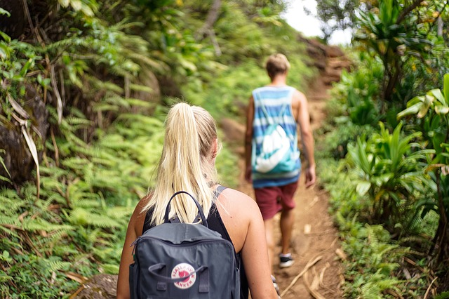


# Пеший туризм (хайкинг)

## Основная идея пешего туризма

Что привлекает людей в пешем туризме? Почему он так популярен в мире? Ответ, казалось бы, лежит на поверхности. Заниматься пешим туризмом просто. Не нужны ни специальное снаряжение, ни специальные навыки. Для занятий пешим туризмом не обязательно уезжать далеко от дома, возможности для пешего туризма есть практически в любой местности. То есть у пешего туризма "низкий порог вхождения", в том числе и с финансовой стороны. Так всё дело в простоте? И да и нет. Такой ответ был бы слишком поверхностным. Ведь мы прекрасно знаем массу людей, которые имеют достаточно широкие возможности для дальних путешествий и разнообразных путешествий, но при этом снова и снова отдающих предпочтение пешему туризму. Почему так? Видимо есть какие-то ещё причины, привлекающие людей к этому виду активности.

Интересно послушать самих туристов. Для этого мы представляем подборку из интервью людей, увлеченных пешим туризмом. Вы сможете прочитать, как они сами для себя объясняют причины своего увлечения. Но прежде чем читать, попробуйте сами для себя ответить на этот вопрос. Потом сравните свои ответы с прочитанными ниже. Возможно, при этом вы ощутите родство вашей души с душами их авторами, как и вы являющихся членами огромного сообщества пеших туристов. Если же вы не найдете свой собственный ответ в подборке или у вас есть интересный рассказ о ваших личных ощущениях, пишите нам, и мы постараемся дополнить данный раздел.

 [Image by Bernd Hildebrandt from Pixabay](https://pixabay.com/photos/hike-lunar-landscape-tenerife-663337/)

**Итак, что же привлекает разных людей в пешем туризме?**

Походы дают прекрасную возможность нам оценить широту и разнообразие природы. Это приносит нам душевный подъем и дает чувство благодарности за наше собственноe существование. Это связывает нас с той самой природой, из которой мы произошли, и из которой мы созданы. Пеший туризм - это также отличный способ погрузиться в природу на один день и легкое мини-приключение, которое вы можете провести на выходных, чтобы уйти от городской суеты и освежить себя до самого утра в понедельник.

 [Image by Foundry Co from Pixabay](https://pixabay.com/photos/hike-hikers-scene-climb-boyfriend-863454/)

В походах нас привлекает отсутствие необходимости всегда заполнять тишину словами. Вам не нужно ничего говорить, когда вы лежите под звездами или смотрите в глубокое горное ущелье. При этом вы испытываете чувство удивления, обширности и смысла.

Пеший туризм дает вам возможность увидеть абсолютно потрясающие пейзажи, которые вы просто не получите в городе и не сможете увидеть из машины. Вас ждут красоты горных пейзажей, озер, водопадов, восходов и закатов солнца. Если вы увлекаетесь фотографией или видеосъемкой, то пеший туризм, тем более, будет интересен для вас.

Прикосновение к реальности. В походе вы будете чувствовать запах природы, а не других потных людей в спортзале. Неровная местность грунтовой дороги нравится людям намного больше, чем асфальтированный тротуар. Для тех, кто не любит фальшивые вещи, эллиптический тренажер или беговая дорожка - всегда останутся лишь слабой имитацией того, что природа дает нам бесплатно.

Чувство "достижения" вершины (sense of achievement) - ключевой момент в горном пешем туризме. Взбираясь по крутой горе вы вспоминаете о том, что и вам не чужд дух авантюризма.

Чувство автономности. Вы можете взять и нести с собой все, что вам нужно для жизни, передвижения, питания и ночлега. Проверьте к своё умение готовить еду, обустроить свой "дом", почистить себя и свою одежду, используя [карту](maps), компас или GPS, чтобы найти свой путь и быть готовыми чувствовать себя комфортно в любых условиях.

 [Image by kordula vahle from Pixabay](https://pixabay.com/photos/almsee-schladming-lake-nature-3507818/)

Самодостаточность и личная уверенность, чувство выполненного долга (миссии). Чем больше времени вы проводите, занимаясь пешим туризмом, тем острее будут ваши навыки. Вы станете настоящим искателем приключений. Вы начнете распознавать погодные условия, сможете более последовательно читать местность и понимать, что нужно вашему телу для оптимальной работы. Ваша система снаряжения станет более эффективной, и вы научитесь извлекать из туристического снаряжения больше пользы с меньшими затратами. Вы сможете путешествовать в любое время года в любых условиях (снег, дождь, горы, пустыня и т. д.), на более длительные периоды времени и получать удовольствие, занимаясь этим. Постоянное увеличение личной уверенности будет увеличивать и ваше удовольствие от походов. В походе у вас есть все, что нужно для выживания, и находится оно в вашем рюкзаке или в карманах (ну и в вашей голове, разумеется) . Это то, что наполняет любого человека энтузиазмом и позитивной энергией.

Пеший туризм позволяет почувствовать себя находящимся в "открытом пространстве" (Open Space) в буквальном и метафорическом смысле. Конечно, это ощущение сильно зависит от того, в какой местности вы путешествуете. Но для любого человека вполне доступны и такие районы путешествий, где вы можете увидеть только несколько человек во время вашего похода. Если вы находитесь в поездке в отдаленном месте или в межсезонье, есть вероятность, что вы вообще никого не увидите. Это физическое открытое пространство может иметь мирный и освежающий эффект для путешественника. Отсутствие шума и "тесноты" также позволит вашему уму блуждать по местам, в которых он обычно бы не находился, и думать иначе, чем обычно. Не случайно, творческие люди сделали многие из своих самых приятных и продуктивных мысленных находок именно во время пеших прогулок.

 [Image by guillermo gavilla from Pixabay](https://pixabay.com/photos/caminito-del-rey-malaga-adventure-2227526/)

В пешем походе человек совершает монотонные повторяющиеся движения, которые заключаются всего лишь в том, чтобы поочередно ставить одну ногу перед другой. При определенных условиях такая монотонность, в сочетании с окружающим пейзажем, способствует созданию у человека внутреннего позитивного творческого и ментальное пространства, отличающегося от повседневного. Считается, что бегуны, гребцы, альпинисты и т. д. испытывают нечто подобное, когда попадают в свою "зону течения". И это дает возможность человеку как бы со стороны посмотреть на себя будничного, занятого текущими делами и заботами. Особенно это актуально, если вы относитесь к тем людям, которые живут вдали от сельской местности.

Походы полезны для здоровья. Походы помогают поддерживать физическую активность, потенциально вы можете похудеть, снизить риск сердечных заболеваний, снизить артериальную гипертензию и замедлить процесс старения, а также повысить психическое здоровье, уменьшая стресс и беспокойство. Походы могут предотвратить депрессию, сделать вас менее напряженным и приведут вас в форму.

 [Image by rawpixel from Pixabay](https://pixabay.com/photos/freedom-travel-hiking-together-2768515/)

 [Image by Nicolò Anastasio from Pixabay](https://pixabay.com/photos/freedom-fly-dream-empty-infinite-1681696/)

Общение. Иногда нам хочется побыть на тропе одному, но иногда нам нравится встречать на тропе разных людей и заводить новых друзей. Такие встречи особенно приятны, когда основную часть похода вы проводите один или в маленьком коллективе. А уж если вы случайно повстречаете своих старых знакомых - то это будет приятным дополнительным подарком судьбы.

Пешие прогулки просты: "порог вхождения" для начинающих низок. Вы можете контролировать интенсивность своей тренировки и находить темп, который вам подходит. По сравнению со многими другими активностями на свежем воздухе, для походов требуется только несколько простых предметов снаряжения, [несколько легко усваиваемых и практических навыков](rules).

Бонус: это может быть недорого. Поход стоит дешево: по сравнению с любым другим видом спорта ваши первоначальные расходы на предметы первой необходимости минимальны. Всё, что вам нужно в качестве базового набора снаряжения, это хорошие ботинки, несколько предметов надлежащей одежды, удобный рюкзак. Тем не менее, если вы решите реализовать свои потребительские потребности, то к вашим услугам обширная индустрия туристических товаров и [снаряжения](equipment) от различных мировых брендов.

## Чем ещё дополнительно можно разнообразить поход

* Спортивное ориентирование
* Геокэшинг (игра с применением спутниковых навигационных систем, состоящая в нахождении тайников, спрятанных другими участниками игры)
* Альпинизм, скалолазание
* Парапланиризм
* Фотография
* Наблюдение за животными
* Ловля рыбы
* Сбор ягод
* и т.д., и т.п.

 [Image by Florence D. from Pixabay](https://pixabay.com/photos/alps-flower-mountain-ski-light-2947165/)

**Использованные источники:**

* What makes hiking so fun? (Что делает походы такими интересными?) - подборка мини-интервью [https://www.quora.com/What-makes-hiking-so-fun](https://www.quora.com/What-makes-hiking-so-fun)
* "Short pitch on hiking" Видео лекция (англ.). [https://www.youtube.com/watch?v=OyjV7x6IhDE](https://www.youtube.com/watch?v=OyjV7x6IhDE)
* Чувство "достижения" вершины (sense of achievement) подборка фото по этим ключевым словам, лучшее фото - [http://michellegielan.com/psychology-today-how-to-go-from-i-think-i-can-to-i-know-i-can/achievement-goal-mountain/](http://michellegielan.com/psychology-today-how-to-go-from-i-think-i-can-to-i-know-i-can/achievement-goal-mountain/) (с сайта Мишель Гилан -- американского автора книг по психологии счастья)
* Чем ещё можно заняться в походах, чтобы сделать их ещё более интересными. [https://www.thoughtco.com/fun-activities-for-hikers-1766200](https://www.thoughtco.com/fun-activities-for-hikers-1766200)
* разное, найденное на просторах Интернета
