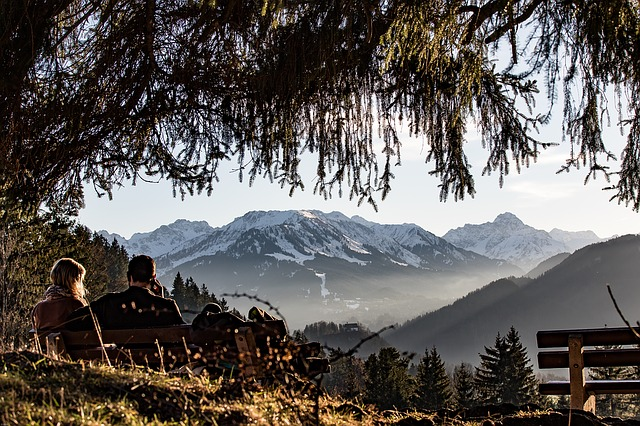

# Каталог ссылок

## Пешеходный туризм и экстрим

[http://www.mountain.ru/](http://www.mountain.ru/) Популярный портал об альпинизме. Страница, посвященная Европе [http://www.mountain.ru/world\_mounts/western\_europe/](http://www.mountain.ru/world_mounts/western_europe/)

[https://www.risk.ru/](https://www.risk.ru/) Портал о горном туризме и экстремальных видах спорта. Цитата: "Риск.ру - сайт о людях и для людей, жизнь которых связана с горами; сайт о спорте и досуге в горах; и, конечно, сайт о горах!"

[http://www.trekkingclub.ru](http://www.trekkingclub.ru) Сайт Нижегородского клуба туристов, ставшего (по словам его участников) за девять лет самым большим и успешным горным клубом в стране. Материалы о походах по различным направлениям во всем мире. Справочные материалы. Другие их сайты: [http://www.turpohod.org/](http://www.turpohod.org/) [http://www.fotogor.ru/](http://www.fotogor.ru/)

[http://skitalets.ru](http://skitalets.ru) Сайт о путешествиях и путешественников с большой библиотекой различных материалов. Долгое время находился в запущенном состоянии, но в этом году ситуация изменилась. Есть большая подборка старой литературы, а также туристических рассказов

[http://eurotourist.club/](http://eurotourist.club/) Украинский туристический форум с богатой, продолжительной и непростой историей, пик популярности которого пришелся на прошлое десятилетие. Ранее сайт имел адрес [https://travel.org.ua](https://travel.org.ua) Множество архивный дискуссий на различные туристические темы. Если внимательно вникнуть в историю этого форума (кторая прошла перед нашими глазами), то становится отчетливо видно, что пеший туризм привлекает две совершенно различные группы людей. Для одних пеший туризм является возможностью зарядиться энергией, чтобы затем активно участвовать в жизни общества, а для других - это бегство от жизни, возможность "спрятать голову в песок".

[http://www.kombrig.net](http://www.kombrig.net/vstuplenie_v_alpklub.htm) Авторский сайт о пеших походах в Альпах. Один из наиболее полных и авторитетных сайтов по данной тематике. [http://ru-alps.livejournal.com/](http://ru-alps.livejournal.com/) . Группа в "Живом журнале"по теме трекинг в Альпах. Основано и поддерживается автором этого сайта. Однако есть несколько интересных архивных материалов и обсуждений.

 [Image by chezbeate from Pixabay](https://pixabay.com/photos/eagle-majestic-animal-bird-freedom-1009771/)

[http://www.kovinov.com](http://www.kovinov.com) Авторский сайт Д. Ковинова (Путешествия по всему миру, особое внимание уделено региону Сочи). Есть страница о европейских путешествиях. [http://www.kovinov.com/europe/](http://www.kovinov.com/europe/) Статьи данного автора особенно интересны тем, что он также является профессиональным работником в сфере торговли туристическими товарами. [http://www.kovinov.com/snarjazhenie/](http://www.kovinov.com/snarjazhenie/)

[https://trekkingmania.ru](https://trekkingmania.ru) Авторские статьи о путешествиях и снаряжении. Позиционирует себя как "Всеросийский проект - игра для любителей активного отдыха". Много живых авторских материалов.

[http://legkohod.com](http://legkohod.com) Сайт Легкоход.com был создан для обмена опытом и распространения информации о легкоходном туризме на русском языке. В бывшем СССР всё ещё господствует представление о пешем туризме, как о занятии для тех, кто способен нести на горбу рюкзак объёмом 80 и более литров и весом от 20 кг. Мы хотим рассказать о новых материалах и методах и немножко пошатнуть существующие стереотипы. Новое, более лёгкое снаряжение, новые знания и навыки открывают пешему туристу новые возможности для общения с природой. Задачи сайта - разъяснить общие принципы легкоходного туризма, рассказать о конкретном снаряжении и его практическом использовании, поделиться опытом походов, где использовалось лёгкое снаряжение.

[http://poxod.ru/](http://poxod.ru/) Свободный туризм. Портал о туризме Технические отчеты о походах. Снаряжение в походах.Учебные материалы. Выбор маршрута.

[http://www.vvv.ru/](http://www.vvv.ru/) Портал-каталог об экстремальных видах спорта. Дайвинг, даунхил, дельтапланеризм, кайтбординг, кайтсерфинг, каякинг, ледолазание и т.п.

[https://www.ski.ru/](https://www.ski.ru/) Портал о горнолыжном спорте, в частности об Альпийский горнолыжных курортах. Есть некоторое кол-во материалов и о пешем туризме в горах.

[http://alps-trip.livejournal.com/](http://alps-trip.livejournal.com/) Сообщество В "Живом журнале" по теме трекинг в альпах

[http://kovrik-super.ru/index.php/otchety](http://kovrik-super.ru/index.php/otchety) Авторский сайт, отчеты о походах Европа, Россия

[https://www.summitpost.org](https://www.summitpost.org) (англ.) SummitPost - это совместное контент-сообщество, ориентированное на скалолазание, альпинизм, походы и другие мероприятия на свежем воздухе. Этот сайт создан его членами, и мы приглашаем вас внести свой вклад: (1) Опубликовать фотографии, отчеты о поездках, события, журналы и альбомы.

 [Image by D Mz from Pixabay](https://pixabay.com/photos/allg%C3%A4u-break-rest-bank-view-1094796/)

## Турфирмы. В том числе, коммерческие предложения по походам

Турклуб "Клуб Приключений" (Россия, Москва, Спб.) [https://www.vpoxod.ru/allroutes](https://www.vpoxod.ru/allroutes) Коммерческие походы по всему миру. Цитата: "Путешествия -- это Клуб Приключений! Для тех, кто собирается активно провести отпуск, уже давно не встаёт вопрос, к кому обратиться. Обращаются к нам! В ответ на это высокое доверие мы постоянно развиваемся и гарантируем надёжность и высокое качество нашей работы!)

Турклуб "ПИК" (Россия, СПб) [https://turclub-pik.ru/](https://turclub-pik.ru/search/) Коммерческие походы. Цитата: "Турклуб "ПИК" - это команда профессиональных туристов, влюблённых в горы. Мы водим людей в походы, показываем красоту природы и помогаем каждому человеку поверить в себя. Походы доступны каждому, главное - ваше желание."

Туристический клуб "Маршрут" (Украина) [https://www.marshrut-club.com/calendar](https://www.marshrut-club.com/calendar) Походы: Исландия, Грузия, Турция, Украина, Румыния, Франция, Италия, Швейцария и др. Цитата: "Уже десятый год туристический клуб Маршрут проводит туристические походы в горы. За это время география наших маршрутов значительно расширилась, и сейчас мы ходим в горные походы по Грузии, Турции, Кипру, Черногории, Болгарии, Румынии, в Альпы и в Карпаты. А еще мы занимаемся организацией таких невероятных путешествий, как треккинг по Исландии, Норвегии и Непалу".

Альписсимо (Россия, Спб.) [https://alpissimo.ru/tour/trekking\_calendar.php](https://alpissimo.ru/tour/trekking_calendar.php) Коммерческий трекинг в альпах. В частности, организация самостоятельных туров без гида. Цитата: ""Альписсимо" -- профессиональный организатор походов в Альпах. Мы создали первые альпийские маршруты в 2010 году и за прошедшие годы заслужили добрую репутацию у любителей горных походов из многих городов России".

[http://svastour.ru/](http://svastour.ru/) (Россия, Москва) Турфирма, коммерческие походы по России. Цитата: "Фирма является многопрофильным туристическим предприятием и туроператором по пешеходному туризму (трекинг) - прогулки и походы в горы с максимальным комфортом".

[http://www.rusadventures.ru](http://www.rusadventures.ru) -- это российский интернет-портал об активном отдыхе, приключенческих турах и туризме. Портал существует с 2004 года. Это гид по регионам России и странам мира, а также крупнейший каталог туров и туркомпаний в области активного и приключенческого отдыха.

## Сайты о туризме

[http://forum.awd.ru/](http://forum.awd.ru/) Форум Винского. Наиболее крупный российский форум о путешествиях (в основном зарубежных). Много технических и справочных разделов. Например, достоин внимания раздел о текущей ситуацией с выдачей туристических виз. Основная часть пользовательских материалов посвящена "чемоданному" туризму, но, особенно в последнее время, стали появляться и интересные отчеты о пешем туризме.

[https://forum.piligrim.ua/](https://forum.piligrim.ua/) "Пилигрим" - сеть агентств путешествий (Украина) . Есть интересный форум, в частности с разделом "поиск попутчиков".

[http://www.nodima.ru/](http://www.nodima.ru/) Авторский (семейный) сайт Д. Новицкого. Сайт о путешествиях по Европе (по России, и др.) с детьми. Также много материалов по теме "Эмиграция в Германию".

[http://welcomeworld.ru/](http://welcomeworld.ru/) Клуб свободных путешественников. Цитата: "Мы -- Юрий и Екатерина Федоровы, создали этот сайт и Клуб, чтобы как можно больше людей смогли научиться путешествовать самостоятельно, экономно, комфортно и безопасно. Наш личный опыт поездок - более 60 стран на 5 континентах.... Только в нашем Клубе создана и успешно работает самая полная обучающая программа подготовки самостоятельных путешественников".

[http://rukivboki.ru](http://rukivboki.ru) Руки-в-боки. Сайт самостоятельных туристов (авторский сайт).

[https://turbina.ru/](https://turbina.ru/) Отчеты путешественников. Цитата: "Турбина - это сообщество людей, объединённых интересом к окружающему миру и путешествиями по нему - в самом общем смысле этих слов".

[https://nosviatores.com/](https://nosviatores.com/) Статьи, отчеты о путешествиях по России, Европе, Америке. Цитата: "Мы - путешественники. Обычные ребята, такие же, как и вы. Путешествия это наше хобби и наша страсть. Еще не вернувшись из поездки - мы уже начинаем планировать новую".

[http://my-roads.blogspot.com/](http://my-roads.blogspot.com/) Мои дороги. Авторский сайт о путешествиях. Есть статьи с полезными советами для путешественников.

[https://www.youtube.com/channel/UCWelL2bSyTRzIxa7Nq13sAw](https://www.youtube.com/channel/UCWelL2bSyTRzIxa7Nq13sAw) Go Alone Авторский канал (Виктория Раевская -- режиссер, оператор, монтажер и путешественник)
Go Alone -- все о треккингах. Видеодневник. Спецвыпуск
