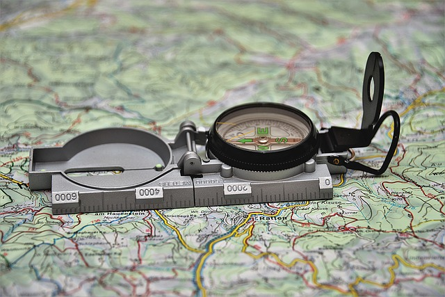
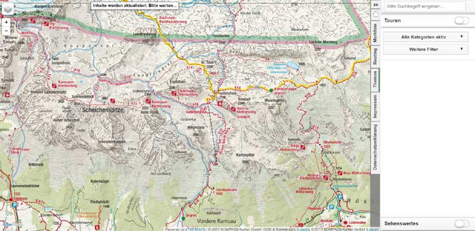
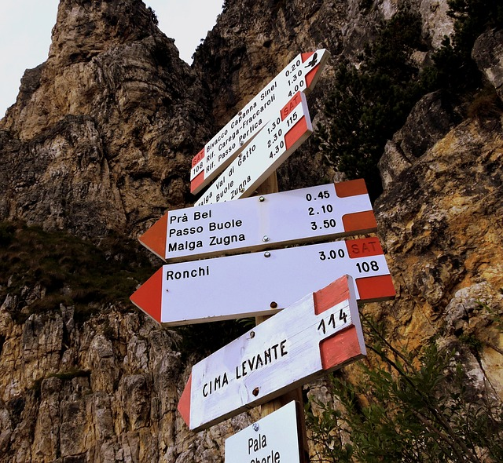
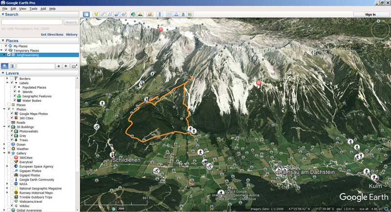


# Картография

С нашей точки зрения, карты являются главным организационным и вдохновляющим средством пешего туриста. Также их можно использовать для развлечения :).

Далее мы приводим обзор наиболее популярных картографических средств и инструментов. Основное внимание уделено компьютерным средствам, что ни в коей мере не отменяет для каждого туриста необходимости иметь при себе и бумажную карту (аккумулятор в которой никогда не разрядится и не подведет вас в самый необходимый момент).

 [Image by PixLord from Pixabay](https://pixabay.com/photos/compass-hiking-outdoor-travel-3072364/)

В каждом разделе средства сортированы в порядке их популярности и эффективности для пеших туристов (с нашей точки зрения).

## Наш видеоканал

На нашем [видеоканале](https://www.youtube.com/channel/UCsYA-4VXxbKB0lWMxkLoxFQ) мы в первую очередь разместили видеолекции по картографической тематике.

Планирование пешеходных туристических маршрутов с помощью электронных карт. (Google Maps, Google Earth, Openstreet, Wikimapia, Wikiloc, Kompass Karten, Bergfex и другие).

## Бумажные карты

Бумажные топографические карты обычно можно приобрести в книжных магазинах, киосках на вокзалах и аэропортах, местных туристических центрах и в отелях, где вы проживаете.

По альпийскому региону авторитетным издателем карт считается Kompass Karten. Это австрийский издатель карт, базирующийся в Инсбруке , который специализируется на пешеходных картах и путеводителях , цифровых картах, а также на велосипедных картах и ​​путеводителях. В каталоге KOMPASS около 1000 наименований, в том числе 700 карт для пеших, велосипедных и лыжных прогулок. Было опубликовано чуть менее 500 туристических карт, охватывающих туристические районы Австрии, Южного Тироля , Германии , Балеарских и Канарских островов. Также есть информация по туристическим регионам в остальной части Италии, швейцарских Альпах, Чешской Республике и Словакии. Карты в основном публикуются в масштабе1:25000 или 1:50000 с выделенными тропами, тропинками и дополнительной туристической информацией. Новое поколение туристических карт напечатано с координатной сеткой для GPS-навигации. С середины 2011 года были напечатаны атмосферостойкие и устойчивые к разрывам карты, постепенно заменяя существующие карты.

**Ссылки по теме:**

Интересное, хотя и несколько устаревшее исследование, в котором сравниваются различные пешеходные карты для одного конкретного альпийского района (Grande Traversata delle Alpi) [https://klingenfuss.org/drim\_lit.htm#karten](https://klingenfuss.org/drim_lit.htm#karten) (нем.язык).

## Online карты

### Карты Google

Карты Google (англ. Google Maps). Сервис представляет собой карту и спутниковые снимки планеты Земля. На сегодняшний день это наиболее популярная online карта. [https://www.google.ru/maps/](https://www.google.ru/maps/)

### OpenStreetMap

OpenStreetMap (дословно "открытая карта улиц"), сокращённо OSM - некоммерческий веб-картографический проект по созданию силами сообщества участников - пользователей Интернета подробной свободной и бесплатной географической карты мира. Для создания карт используются данные с персональных GPS-трекеров, аэрофотографии, видеозаписи, спутниковые снимки и панорамы улиц, предоставленные некоторыми компаниями, а также знания человека, рисующего карту. В OpenStreetMap при создании карты используется принцип вики. Каждый зарегистрированный пользователь может вносить изменения в карту. [https://www.openstreetmap.org/](https://www.openstreetmap.org/)

### kompass.de

[http://www.kompass.de/](http://www.kompass.de/)

Kompass Karten - это австрийский издатель карт, базирующийся в Инсбруке , который специализируется на пешеходных картах и путеводителях , цифровых картах, а также на велосипедных картах и ​​путеводителях. В его ассортименте более 1000 наименований.

Данное издательство специализируется на бумажных картах и в дополнение к этому предоставляет компьютерную программу, а также бесплатный интернет сайт с онлайн картами. [http://maps.kompass.de/](https://www.kompass.de/wanderkarte/) (сайт на немецком языке). К сожалению, нет офлайн режима. Есть приложение для декстопа, но карты для него необходимо покупать.

Пример скриншота с картой, сделанного с этого сайта.

### Викимапия (Wikimapia)

Викимапия (Wikimapia, сокращенно ВМ, WM) - международный бесплатный веб-сайт, географическая онлайн-энциклопедия, цель которой заключается в том, чтобы отметить и описать все географические объекты на Земле. Викимапия совмещает в себе интерактивную карту с принципом свободного редактирования вики. [http://wikimapia.org/](http://wikimapia.org/)

### Яндекс.Карты

Яндекс.Карты - поисково-информационная картографическая служба Яндекса. Открыта в 2004 году. Есть поиск по карте, информация о пробках, прокладка маршрутов и панорамы улиц крупных и других городов [https://yandex.ru/maps](https://yandex.ru/maps)

### Wandermap

Интерактивная карта с пользовательскими пешеходными маршрутами (по всему миру, но наибольшее количество в Европе) [http://www.wandermap.net/](http://www.wandermap.net/)

### Bergfex

[https://www.bergfex.com/](https://www.bergfex.com/)

Bergfex.at - это австрийская интернет-платформа для горного туризма и альпийских видов спорта , крупнейшая в Европе в этом секторе.

Сайт предоставляет более 1700 горнолыжных курортов из двенадцати европейских стран и 525 туристических регионов из семи государств. Для получения информации о пункте назначения как таковом, информации о работе станции, объектах размещения, отчетах о снеге и погоде, тщательно подготовленных картографических материалах, ссылках на веб-камеры и другой своевременной информации, касающейся экскурсий и отдыха. Кроме того, есть многочисленные описания туров по более простым походам и велосипедным маршрутам, от семейных прогулок до туров на высшем уровне, а также до достопримечательностей в этом районе. Портал доступен на 18 языках (bergfex.at, bergfex.ch, bergfex.de, bergfex.it, bergfex.fr так далее).

Например, страница с интерактивной картой Австрии [https://www.bergfex.com/sommer/oesterreich/](https://www.bergfex.com/sommer/oesterreich/)

 [Image by kordula vahle from Pixabay](https://pixabay.com/photos/croda-da-lago-tofane-dolomites-3514017/)

### nakarte.me

[https://nakarte.me/](https://nakarte.me/) (ранее nakarte.tk) Агрегатор различных картографических сервисов, сайт, который создан туристами для туристов, чтобы облегчить себе жизнь, планировать походы и кросс-походы в горах. Страница с описанием возможностей и инструкциями проекта. [https://docs.nakarte.me/](https://docs.nakarte.me/)

### Другие online сервисы

[https://www.schweizmobil.ch/en/summer.html](https://www.schweizmobil.ch/en/summer.html) Карты Швейцарии

[http://www.freizeitkarte.at/](http://www.freizeitkarte.at/freizeitkarte.php?gebiet_id=62&type=gebiet) Сайт (на немецком языке) с интерактивным приложением (на базе Adobe Flash - протестировано в FireFox) по нескольким альпийским регионам. При входе на сайта необходимо выбрать регион из списка. После этого откроется соответствующий сайт. Далее необходимо с помощью меню навигации запустить прохождение какого-нибудь из имеющихся на сайте маршрутов. После этого маршрут поэтапно будет показан на 3D изображении местности.

Интересная карта -- плотности населения в мире. [https://pudding.cool/2018/10/city\_3d/](https://pudding.cool/2018/10/city_3d/) С помощью данной карты становится ясно, почему в Европе Альпы - наиболее интересное место для хайкинга.

[https://earthengine.google.com/timelapse/](https://earthengine.google.com/timelapse/) Сервис, позволяющий увидеть, как изменился спутниковый снимок определенного места за последние 30 лет.

[https://www.strava.com/](https://www.strava.com/) Strava - сервис для отслеживания активности спортсменов с помощью мобильных устройств. Сервис включает в себя приложения для мобильных устройств, интернет-сайт, базу данных сохранённых тренировок, API для доступа к ним и другие подсистемы. Strava также позиционируется как социальная сеть для спортсменов, где они могут сравнивать свои результаты, ставить цели, общаться и т. д. Разработка сервиса ведётся компанией Strava, Inc, которая была основана в 2007 году; её основной офис находится в Сан-Франциско, Калифорния

[https://www.relive.cc/](https://www.relive.cc/) позволяет подключить свою учетную запись Strava (Relive работает со Strava, Endomondo, Garmin Connect, Apple Health (Watch), MapMyRun, MapMyWalk, MapMyRide, MapMyHike и Polar Flow) и создать 3D видео из трека вашего занятия. Relive превращает ваше приключение в личное видео, которым стоит поделиться. Пролетите над своим маршрутом, посмотрите, где вы были, и посмотрите на ваши основные моменты!

[http://www.etomesto.ru/](http://www.etomesto.ru/) На ЭтоМесто.ru вы можете посмотреть и сравнить старые карты онлайн и наложить их на современные. На сайте представлены старинные карты Москвы и Московской области, Санкт-Петербурга и Ленинградской области, а также других регионов России. Немного охвачена и территория Украины, Беларуси, Молдовы, Казахстана, стран Прибалтики и Кавказа.

### Обзоры и подборки

Самые интересные картографические сервисы [https://trekkingmania.ru/samyie\_interesnyie\_kartograficheskie\_servisyi/](https://trekkingmania.ru/samyie_interesnyie_kartograficheskie_servisyi/)

Об альпийских картах (статья на сайте Нижегородского турклуба) [http://www.trekkingclub.ru/alpin/pohodmap.htm](http://www.trekkingclub.ru/alpin/pohodmap.htm)

## GPS треки

 [Image by Gianni Crestani from Pixabay](https://pixabay.com/photos/crossroads-mountain-hiking-rock-1595989/)

Трек (track) - это последовательность точек координат GPS с отметками времени их прохождения. Как правило, генерируется специальными устройствами (навигаторами) или специальным ПО для ПК/смартфонов. То есть, кто-то прошел определённый маршрут с включённым навигатором, который каждую секунду сохранял текущие координаты в файл. Такой трек можно загрузить в свой навигатор или специальное ПО для ПК/смартфонов, чтобы затем пройти тем же маршрутом. Существуют публичные хранилища треков в интернете, где можно посмотреть пользовательские треки и скачать их к себе на компьютерное устройство. Также можно загрузить свой трек в данное хранилище, чтобы поделиться им с туристическим сообществом.

Используя трек для прохождения маршрута, не следует забывать о том, что трек не всегда может совпадать с оптимальным маршрутом, а также не всегда совпадать с имеющимися тропами и дорогами. В большинстве случаев такое совпадение будет иметь место, но не всегда. Турист, записавший трек, мог периодически сходить с тропы в сторону или даже мог на какое-то время оказаться в положении "заблудившегося". Тропа (особенно это касается горных троп) могла с течением времени изменить свою нить. Всё это надо иметь в виду.

В любом случае, анализ чужих треков полезен при планировании маршрута.

 [Image by bluebudgie from Pixabay](https://pixabay.com/photos/globe-compass-travel-geography-2707935/)

Существуют различные форматы для треков. Но многие современные устройства/ПО поддерживают загрузку треков в нескольких форматах. В крайнем случае всегда можно воспользоваться программами для конвертации из одного формата в другой.

Популярными форматами являются: GPX (GPS eXchange Format), TCX, KML и KMZ (Google Earth), PLT (формат программы OziExplorer), GDB (Garmin Mapsource)

### Как записывать GPS треки

[https://ichip.ru/zapisyvaem-i-ispolzuem-gps-trek.html](https://ichip.ru/zapisyvaem-i-ispolzuem-gps-trek.html)

Инструкция по записи треков от openstreetmap для последующей загрузки в этот проект [https://wiki.openstreetmap.org/wiki/RU:Запись\_треков\_GPS](https://wiki.openstreetmap.org/wiki/RU:Запись_треков_GPS)

### Где искать, смотреть и скачивать. Хранилища GPS треков

 [Image by Kelsey Vere from Pixabay](https://pixabay.com/photos/hike-trek-map-navigation-travel-467875/)

#### Wikiloc - Тропинки Мира

Наиболее известное хранилище GPS треков. Данные с него использует Google Earth. На нашем сайте вы можете найти на странице каждого региона ссылку для перехода на сайт Wikiloc, по которой откроется карта с отображением GPS треков данного района.

Официальный мультиязычный сайт [https://wikiloc.com/](https://ru.wikiloc.com/)

На 03.2019 на Wikiloc зарегистрировалось 4 436 675 участников, добавлено 11 234 084 треков и 19 788 477 фотографий. Есть приложения для iPhone и Android. Расширенные функции доступны для Premium аккаунта. С 2008 года используется Google, чтобы показать треки в качестве слоя по умолчанию на Google Earth. Есть русский интерфейс, одно преимущественно это англоязычный сайт.  
Ключевая идея Wikiloc, сформулированная на их сайте: "Мы верим в будущее, где человечество проводит больше времени, наслаждаясь и сохраняя природу. Наша цель состоит в том, чтобы помочь людям получить лучший опыт в обществе до, во время и после активного отдыха, а также вдохновлять и поддерживать сохранение природы.... мы остаемся верными нашей идентичности: независимому и процветающему сообществу вокруг подлинных открытых троп, разделяемых реальными людьми. Приключения любителей активного отдыха, как и вы".  
Есть поиск как по карте, таки по названию региона. Для поиска трека по Европе необходимо использовать англоязычные названия. Для скачивания трека требуется регистрация. Форматы: GPX, TCX, KML-файл (формат для Google Earth), Garmin. Возможно получить код для вставки информации о треке в соцсети или web сайт.

#### Другие онлайн хранилища треков

[https://www.openstreetmap.org/traces](https://www.openstreetmap.org/traces) Официальное хранилище треков OpenStreetMap.

Общедоступные GPS-треки. Просмотр последних загруженных GPS-треков. Если вы при записи трека ехали по дороге, и этой дороги нет на карте OpenStreetMap (OSM) - вы можете помочь сообществу, загрузив свой трек на сайт OSM.

[https://www.gpsies.com/](https://www.gpsies.com/) Большое количество треков по всему миру. Но объективно треков меньше, чем в Wikiloc. Мультиязычный сайт. Есть приложения для iPhone и Android. Большое количество форматов и дополнительных опций для скачивания. Скачивание возможно без регистрации. На странице треке есть ссылки для внедрения на свой сайт.

[https://www.gpslib.ru/](https://www.gpslib.ru/) PSLib -- это публичная библиотека GPS треков с возможностью организации, поиска и анализа GPS треков. Русскоязычный сайт. Поддерживаются практически все популярные форматы GPS/ГЛОНАСС треков, в том числе и OziExplorer, ГисРусса, Навител, NMEA, Garmin, iGo. GPSLib использует Google Maps API V3. Пешеходных треков по Европе не слишком много (например по Австрии примерно пешеходных 50 треков). Скачивать треки можно без регистрации.

[https://www.alltrails.com](https://www.alltrails.com) (Everytrail.com)  
По России очень мало треков, в основном по Европе (но меньше, чем на Wikiloc). Для просмотра трека необходима регистрация.

[https://gpsloglabs.com/](https://gpsloglabs.com/) Русскоязычный сайт. GPSLog Labs позволяет анализировать, сравнивать, строить графики и отчеты, просматривать на карте ваши передвижения, записанные с помощью GPS-трекеров. Вы можете использовать этот сайт для того, чтобы следить за Вашими занятиями и тренировками (пробежки, пешие и лыжные прогулки, вело-поездки, верховая езда...) и/или как дневник, для записи Вашей ежедневной активности. Пример пользовательской страницы [https://gpsloglabs.com/share/0b537c0ebd32b21cdad72138aa4020fa9ef26dc9/](https://gpsloglabs.com/share/0b537c0ebd32b21cdad72138aa4020fa9ef26dc9/) По Европе треков практически нет.

## Компьютерное и программное обеспечение

### Стационарные компьютеры и ПО

#### Google Планета Земля (Google Earth)

Google Планета Земля (англ. Google Earth) - проект компании Google, в рамках которого в сети Интернет были размещены спутниковые (или в некоторых точках аэрофото) изображения всей земной поверхности. Фотографии некоторых регионов имеют беспрецедентно высокое разрешение. Google Планета Земля отображается в виде цифрового глобуса, который отображает поверхность планеты используя одно составное изображение с большого расстояния. При большом увеличении изображения переходят в различные изображения одной и той же области с более мелкими деталями, которые могут отличаться по дате и времени съемки от одной области к другой. Google Планета Земля имеет возможность показывать 3D-модели зданий, сооружений и памятников. В отдельных городах, в том числе и фотореалистичные. В отличие от других аналогичных сервисов, показывающих спутниковые снимки в обычном браузере (например, карты Google), в данном сервисе используется специальная, загружаемая на компьютер пользователя клиентская программа Google Earth. Такой подход хотя и требует закачивания и установки программы, но зато в дальнейшем обеспечивает дополнительные возможности, трудно реализуемые с помощью веб-интерфейса.

Существуют также платная версия Google Earth Plus и бесплатная версия Google Earth Pro, отличающиеся поддержкой GPS навигации, средств презентаций и повышенным разрешением распечатки. [https://www.google.com/intl/ru/earth/](https://www.google.com/intl/ru/earth/)

До середины 2019 года в программе Google Earth существовал слой треков Wikiloc, что было достаточно удобно. Однако теперь сотрудничество с Wikiloc прекращено и данный слой недоступен. Ради истории мы сохранили скриншоты, как всё это выглядело.

Обозначение GPS трека в программе Google Earth

Вид GPS трека в программе Google Earth

Просмотр фотографий на предполагаемом маршруте

Переход на станицу GPS трека в Wikiloc

Приближение: горная тропа с проходящим вдоль неё треком

Тем не менее, остается возможность увидеть трек на карте, скачав его с Wikiloc вручную и загрузив в Google Earth. Инструкцию, как это сделать, смотрите в [видеолекции](https://www.youtube.com/watch?v=MfClwG_vZ7A) на нашем [видеоканале](https://www.youtube.com/watch?v=MfClwG_vZ7A).

#### SAS.Планета

SAS.Планета - бесплатно распространяемая навигационная программа, объединяющая в себе возможность загрузки и просмотра карт и спутниковых фотографий земной поверхности большого количества картографических online-сервисов. Программа работает с подружаемыми из интернет слоями популярный картографических серверов. Загруженные данные сохраняются в автономном кеше. Можно предварительно загрузить данные для выбранного на местности прямоугольника, однако нельзя загрузить кеш для определенной страны или административной единицы. Из других возможностей программы: cохранение части карты в одно изображение, которое можно просмотреть и обработать в любом графическом редакторе, а также использовать в других ГИС-приложениях, например, в OziExplorer (для которого программа создаст файл привязки); отображение файлов KML; загрузка и отображение объектов Wikimapia; добавление пользовательских карт; возможность использования GPS-приёмника для навигации. [http://www.sasgis.org/](http://www.sasgis.org/)

#### GPXSee

GPXSee - простая бесплатная программа для просмотра и анализа GPS треков. Есть русскоязычный интерфейс. Треки загружаются из файлов (при это есть возможность быстро просматривать все треки из текущей директории). Форматы GPX, TCX, FIT, KML, IGC, NMEA, SLF, LOC, OziExplorer (PLT, RTE, WPT), GeoJSON and Garmin CSV. Карты подложки можно также загрузить из файлов (форматы: MBTiles, OziExplorer maps, TrekBuddy maps/atlases, Garmin JNX maps, TwoNav RMaps, GeoTIFF images) или работать с интернет источниками. [https://sourceforge.net/projects/gpxsee/](https://sourceforge.net/projects/gpxsee/)

#### GPS Track Editor

GPS Track Editor - бесплатное приложение для Windows, которое делает все с GPS-треками. С текущей версией вы можете: анализировать и очищать ваши треки GPS; создать четкую структуру сегментов пути просмотреть свою траекторию в цвете; осматривать путевые точки; извлекать части трека сохранить как файл GPX, NMEA или CSV; объединить несколько треков в один; генерировать метки времени. [http://www.gpstrackeditor.com/](http://www.gpstrackeditor.com/)

#### OziExplorer

OziExplorer - приложение для совмещения растровых карт с данными GPS. OziExplorer поддерживает работу с GPS-приемниками Garmin, Magellan, Lowrance, Eagle, Brunton/Silva, MLR и позволяет осуществлять навигацию по растровым картам в интерактивном режиме. Ранее OziExplorer являлся одним из самых популярных приложений для картографии (особенно для карманных устройств на базе Win CE), сейчас вытеснен другим ПО. [https://www.oziexplorer4.com/w/](https://www.oziexplorer4.com/w/)

#### ГИС "Панорама"

Настольная ГИС "Панорама" -- российская геоинформационная система, имеющая средства создания и редактирования электронных карт, выполнения различных измерений и расчетов, оверлейных операций, обработки растровых данных, средства подготовки графических документов в электронном и печатном виде, а также инструментальные средства для работы с базами данных. ПО в основном ориентировано на использование в среде госструктур, для туризма не актуально, но интересно для всех людей, увлекающихся картографией. Ранее карты к программе не прилагались, необходимо было добывать их самостоятельно. Сегодня производитель указывает, что "поиск объектов при просмотре снимков с геопорталов обеспечивается за счет встроенного доступа к адресной базе данных, размещенной на открытом сервере в web" - не проверяли. [https://gisinfo.ru](https://gisinfo.ru)

### Мобильные устройства и ПО

#### MAPS.ME

MAPS.ME (прежнее название - MapsWithMe, рус. карты со мной) - бесплатное приложение для мобильных устройств на основе свободной географической карты OpenStreetMap. С ноября 2014 года Maps.me принадлежит Mail.ru Group и развивается в рамках её международного проекта My.com. Карты по большей части городские, чем туристические, тем не менее, основные тропы на них обозначены. [https://maps.me/](https://maps.me/)

#### OsmAnd

OsmAnd (OSM Automated Navigation Directions) - программное обеспечение с открытым исходным кодом, для офлайн-навигации. Основным источником картографических данных являются векторные карты OpenStreetMap, а также многие растровые карты (Яндекс.Карты, Mapnik, Osmarender, CloudMade, Cyclemap, OpenPisteMap, MapSurfer.Net, Microsoft Maps/Earth/Hybrid). [http://osmand.net/](http://osmand.net/)

#### iGO

iGO - программа спутниковой GPS-навигации, которая создаётся компанией NNG (ранее - Nav'N'Go) из Венгрии. На рынке доступны версии под Windows CE, Windows Mobile, Apple iOS и, с недавнего времени, под Android. В программе используется картография Tele Atlas, Navteq, а также локальных разработчиков. Программа в первую очередь ориенторана на задачи автомобильной навигации. [http://www.igonavigation.com/](http://www.igonavigation.com/)

 [Image by Sunny Sunflower from Pixabay](https://pixabay.com/photos/compass-transparency-cutout-3674904/)

## Доплнительные ссылки

Планирование пешеходных туристических маршрутов с помощью электронных карт. (Google Maps, Google Earth, Openstreet, Wikimapia, Wikiloc, Kompass Karten, Bergfex и другие). Лекция размещена на нашем [видеоканале](https://www.youtube.com/channel/UCsYA-4VXxbKB0lWMxkLoxFQ).

"Современные источники картографической информации" Видеолекция Сергея Савельева - инструктора детско-юношеского туризма
