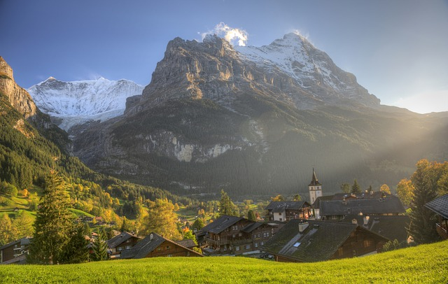
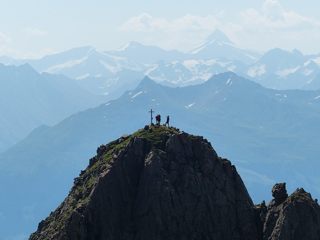

# Правила пешего туризма

Правила в пешем туризме базируются на трех принципах: не причинить вред себе, не причинить вред окружающим и не причинить вред природе.

## Телефоны экстренных служб

Номер **112** - это единый номер телефона большинства стран мира (в том числе ЕС и России), по которому надо звонить в экстренных случаях. Аналогичный номер на территории США и Канады - 911 [https://en.wikipedia.org/wiki/Emergency\_telephone\_number](https://en.wikipedia.org/wiki/Emergency_telephone_number)

Мобильные телефоны можно использовать в странах с разными номерами служб экстренной помощи. Это означает, что путешественнику, посещающему другую страну, необязательно знать местные номера служб экстренной помощи. В мобильном телефоне и на SIM-карте есть предварительно запрограммированный список номеров экстренных служб (например, **112** и 911). Когда пользователь пытается установить вызов, используя номер службы экстренной помощи, происходит специальная установка вызова службы экстренной помощи. Фактический номер даже не передается в сеть, но сеть перенаправляет вызов службы экстренной помощи в местную службу экстренной помощи. Большинство мобильных телефонов GSM могут набирать номера служб экстренной помощи, даже когда клавиатура телефона заблокирована, в телефоне нет SIM-карты (вместо PIN-кода вводится номер службы экстренной помощи) или нет сигнала сети (сеть занята).

## Расчет времени

Правильный расчет предполагаемого времени похода особенно важен для однодневного хайкинга, когда прохождение маршрута осуществляется без автономных ночевок. При походах по равнинной местности расчет прост и основывается на том, что средняя скорость ходьбы - 5 км/час. Необходимо закладывать время на привалы и возможное отклонение от маршрута, а также на форсирование препятствий (например, рек). Тщательно изучайте карту местности перед походом.

В горных походах правила расчета времени более сложные. Мы приводим расчет с сайта Альпийского союза. [http://www.alpenverein.at/portal/news/aktuelle\_news\_kurz/2018/2018\_06\_14\_wie-berechnet-man-die-gehzeit-auf-wanderwegen.php](http://www.alpenverein.at/portal/news/aktuelle_news_kurz/2018/2018_06_14_wie-berechnet-man-die-gehzeit-auf-wanderwegen.php) См. также "Naismith's rule" [https://en.wikipedia.org/wiki/Naismith's\_rule](https://en.wikipedia.org/wiki/Naismith's_rule)

Ориентировочные значения для расчета времени ходьбы:

* около 300 метров высоты в час для подъема
* около 500 метров высоты в час для спуска
* около 4 километров по горизонтали в час

Сначала мы рассчитываем оба значения (время ходьбы для разницы в высоте или для горизонтального расстояния) отдельно. Затем меньшее значение уменьшается вдвое и добавляется к большему значению.

Пример: 1200 м набор высоты и 8 км расстояние. На высоту 1200 метров подъем занимает около 4 часов, а 8-километровое горизонтальное расстояние добавляет еще 2 часа. Меньшее значение (2 часа) уменьшается вдвое и добавляется к большему значению. Итак, 4 часа + 1 час = 5 часов восхождения.

*Альтернативная формула для расчета, приводимая в статье А.Лебедева* [*http://static.turclubmai.ru/papers/1835/*](http://static.turclubmai.ru/papers/1835/)

*T = (10 \* H + L)/V, где T - чисто* *е\*\*ходово* *е\*\*врем* *я*\*, L - длина участка пути \[км\], H - положительная вариация высоты \[км\] или суммарный набор высоты на участке пути, V - скорость, равная 3,3 км/час.\*

 [Image by StockSnap from Pixabay](https://pixabay.com/photos/cloud-sky-landscape-highland-2561878/)

## Безопасность в походе

### Возможные опасности отдыха на природе

Обзор базируется на нашем переводе статьи англоязычной Википедии "Опасности отдыха на природе" [https://en.wikipedia.org/wiki/Hazards\_of\_outdoor\_recreation](https://en.wikipedia.org/wiki/Hazards_of_outdoor_recreation)

Отдых на природе, таких как пеший туризм, кемпинг, катание на каноэ, езда на велосипеде или на лыжах, влечет за собой риск , даже если участники не безответственно себя в опасности. В некоторых обстоятельствах, например, в отдаленных местах или в экстремальных погодных условиях, даже небольшая авария может создать опасную ситуацию, требующую навыков выживания . Тем не менее, с правильными мерами предосторожности, даже довольно авантюрный отдых на природе может быть приятным и безопасным.

### Общие меры безопасности

Иметь при себе важный для безопасности туристический инвентарь. Например, "десять предметов первой необходимости".

По возможности следует предпочитать путешествия в группе одиночным путешествиям. Это повышает безопасность похода во всех отношениях. Если один человек получил травму, члены группы могут оказать первую помощь или обратиться за помощью. Группа может избежать плохих решений, которые может принять одинокий путешественник. Если возникает чрезвычайная ситуация, группа может объединить свои мышечные силы, мозговую мощность и тепло тела. Другая мера предосторожности - информирование людей вне группы о маршруте и ожидаемом времени возвращения.

Иметь надежные средства связи (например, сотовый телефон). Это может помочь в случае чрезвычайной ситуации. Однако, нужно быть готовым к тому, что сотовая связь в районах дикой природы часто довольно плохая.

### Опасные обстоятельства

#### Непогода

Вьюги, внезапные наводнения, туман, пыль или песчаные бури, торнадо и другие метеорологические явления могут быть или не быть предсказуемыми и могут потребовать немедленного реагирования для выживания. Молния является частой и серьезной угрозой во многих регионах.

> Если гроза застала вас в горах  
> В горах, если началась гроза, следует отойти от горных гребней, скальных возвышений и других вершин. Многие, кто находился в области грозовой активности, рассказывают об электризации всего вокруг: волосы встают "дыбом" или "шевелятся", металлические предметы звенят, жужжат и искрят. Это говорит о максимальной опасности в данное время и в данной местности.  
> В горах, безусловно, в таких ситуациях, когда идет гроза и вокруг сверкают молнии, нужно спуститься как можно ниже, снять весь металлический инвентарь (ледорубы, карабины, страховочные системы, крючья, палки) и оставить всё выше себя в одном место на максимальное расстояние. Также следует прекратить какую бы то ни было физическую активность (бег, прыжки), так как есть точка зрения, что пот и быстрые движения "притягивают" молнию. От любой металлической техники (мотоцикл, велосипед, дельтаплан) также следует держаться на расстоянии не менее 30 - 50 метров.
> 
> ИТАК, что делать во время грозы категорически нельзя:  
> Держаться за руки друг с другом (веревка тоже проводит ток молнии, поэтому ходьба в связке представляет опасность, расстояние между людьми должно быть не менее 5 - 7 метров)  
> Находиться на возвышенности  
> Игнорировать признаки усиления статического электричества и поля (поднятие волос, искрение металла)  
> Пользоваться мобильными телефонами, портативными компьютерами, станциями связи  
> Находится на открытом пространстве в транспортном средстве открытого типа (квадроцикл, багги).  
> Исключение: в условиях равнины закрытая машина (например, джип) на резиновых колесах из цельнометаллического корпуса является относительно надежным временным укрытием.
> Источник: [Удары молний в горах, лесах и на балконах](https://www.ski.ru/az/blogs/post/udary-molnii-v-gorakh-lesakh-i-na-balkonakh/)

#### Опасная местность

Высотные открытые участки (Exposure, Exposed). Участки пешеходной тропы или альпинистского маршрута описываются так, если существует высокий риск получения травмы в случае падения из-за крутизны местности. Необходимо быть уверенным, что у туриста нет акрофобии, иррационального страха перед высотой, и он не склонен к страху падения или головокружению. В отличие от акрофобии, естественный страх высоты - нормальное явление. Когда человек оказывается в незащищенном месте на большой высоте, он чувствует, что его положение нестабильно. Нормальный страх высоты может вызвать чувство беспокойства, а также вегетативные симптомы, такие как повышенное потоотделение.

Список атрибутов, которые, как правило, позволяют туристу чувствовать себя уверенным на высотных участках (ощущать уверенность в ногах):

* Владение достаточной координацией для продвижения по неровной поверхности без потери баланса. Также включает возможность компенсации небольших проскальзываний при движении вперед без каких-либо серьезных последствий.
* Правильная оценка местности, как с точки зрения используемых опорных точек или ступеней, так и уровня сцепления, которое они предоставляют. Нужно быть в состоянии сделать это для любого типа местности, в том числе сыпучей поверхности, скалы, крутой местность, усыпанной камнями, голой земле или утрамбованного снега, а также в условиях повышенной влажности.
* Способность распознавать те части маршрута, которые нужно проходить с особой осторожностью из-за риска падения.
* Надлежащая оценка своего уровня координации и способностей, особенно если вы устали, чтобы соответствующим образом скорректировать уровень своего прогресса. Опыт показывает, что во второй половине дня из-за физической и умственной усталости уменьшается уверенность в ногах.

Уверенность в ногах - это то, чему можно научиться в определенной степени, особенно с помощью регулярных, напряженных упражнений на крутой пересеченной местности. На ранних этапах могут быть полезны трекинговые палки. Однако слишком большая зависимость от них может отрицательно сказаться на уверенности при пересечении местности, где они бесполезны, например, на скальных участках. С другой стороны, палки для пешего туризма могут быть незаменимы, особенно для пожилых туристов и тех, у кого проблемы с коленом. Трекинговые палки также обеспечивают дополнительную безопасность там, где спотыкание может быть опасным, на неровной земле или на открытой дороге.

Снежные горные участки с повышенной лавиной опасностью. Меры предосторожности включают обучение, мониторинг погодных условий для изучения истории снежного покрова, прохождение одного за другим (с достаточной дистанцией) через опасные зоны, ношение лавинных маяков, ношение лавинных зондов и снежных совков.

Также на снежных участках существуют и другие опасности, связанные с возможным проваливанием в глубокий снег. Особенную опасность представляют колодцы с деревьями (tree well - пространство вокруг дерева под его ветвями, которое не получает такое же количество снега , как и окружающее открытое пространство. Они создают пустоту или область рыхлого снега под ветвями и вокруг ствола, которая опасна для любых туристов, лыжников и сноубордистов, которые падают в них) .

Другими похожими опасностями являются ледопады, оползни и камнепады, падение деревьев (При выборе места для лагеря нужно быть осторожным, чтобы избежать таких, как мертвые деревья, коряги, деревья с большими мертвыми ветвями или деревья, которые ранее подвергались лесному пожару) .

Могут возникнуть ошибки, приводящие к падениям и травмам:

* На мокрых камнях или бревнах.
* При пересечении ручьев, рек, озер и других водоемов, которые могут быть опасны из-за плохой видимости, неровных поверхностей, гладких и покрытых водорослями или мхами скал и сильных течений. Верхушки водопадов особенно опасны из-за быстро движущейся воды и гладких наклонных скал. Резиновые подошвы плохо держатся на слизи по сравнению с войлочными подошвами, кошками или сапогами. Меры предосторожности включают в себя осведомленность об опасности, использование палок для походов, ослабление ремней пакетов для снижения силы тяжести и в случае погружения в воду, а также пересечение с другими людьми, связанными рука об руку или с помощью веревки.
* Из-за сыпучего материала. Свободный гравий или осыпь сверху гладкой породы действует как шарикоподшипники . Меры предосторожности включают определение ситуации впереди, сгибание колен и вес вперед, использование палок для походов и чистку гравия, где это возможно.
* На льду

Ледовые участки местности. Путешествуя по ледникам, трещины представляют серьезную опасность. Эти гигантские трещины во льду не всегда видны, так как снег может взорваться и замерзнуть, превратившись в снежный мост . Иногда снежные мосты могут быть тонкими, как несколько дюймов. Альпинисты и туристы используют веревки, чтобы защитить себя от таких опасностей. Основное снаряжение для передвижения по леднику включает в себя кошки и ледорубы , а команды из двух-пяти человек связывают веревку на равном расстоянии друг от друга. Если кто-то начинает падать, другие члены команды проводят самообман, чтобы остановить падение, а затем пытаются спастись.

Утопления особенно вероятны, когда они сопровождаются травмами головы (которые могут привести к потере сознания), в очень холодной воде (которая может быстро истощить энергию) или в белой воде (которая может быть настолько пенистой, что невозможно плавать или даже плавать, на поверхность).

При ходьбе по пляжам или при пересечении лиманов важно знать о приливах.

#### Потеря пути (заблудиться)

В некоторых парках пешеходные тропы четко и точно обозначены.  
Путешественники могут потеряться, либо если группа не может найти свой путь, либо если человек отделяется от партии и не может найти его снова. У потерянных путешественников, которые не могут вовремя добраться до места назначения, может не хватить еды и воды, или может произойти изменение погоды. Отсутствие четко обозначенных троп увеличивает риск сбиться с пути.

Без дальнего ориентира, такого как вершина горы, солнце или луна, люди, которые потерялись, могут иногда бродить кругами.

Если группа распадается на несколько подгрупп, движущихся с разными скоростями, одна из подгрупп может сделать неправильный поворот на перекрестке. Обычная процедура, позволяющая избежать этого, состоит в том, чтобы лидеры останавливались на перекрестках и ждали остальных.

Ношение карты и компаса и знание того, как их использовать, уменьшит риск потеряться. Глобальная система определения местоположения (GPS) может оказаться неоценимой, поскольку она может точно определить местоположение путешественника, показывая его точное местоположение и направление к дорогам, службам и населенным пунктам. Большинство устройств GPS также могут быть спроектированы так, чтобы отмечать путь на карте, что облегчает обратную дорогу. Портативные любительские радиостанции могут помочь поддерживать связь. Мигающие огни, сигнальные зеркала и свистки - это высокотехнологичные аварийные сигналы.

#### Опасные свидетели

Люди, встречающиеся на открытом воздухе, не всегда могут быть дружелюбными, а в некоторых случаях могут представлять опасность для любителей активного отдыха. Это может быть случай грабежей, сексуальных посягательств или других нападений.

#### Дикие животные

Опасные столкновения между животными и людьми могут происходить, когда животные пытаются получить пищу, заготовленную туристами для себя. Правильное хранение пищи защищает как людей, так и животных.  
Во многих районах туристы могут столкнуться с крупными хищными животными, такими как медведи или пумы. Эти животные редко ищут людей в пищу, но при определенных условиях они будут атаковать. Если путешественники натолкнутся на ничего не подозревающее животное и испугают его, оно может атаковать. Регулярный громкий шум, например, хлопанье в ладоши или крик, снижает риск внезапного испуга животного. Любое млекопитающее, зараженное бешенством, может вести себя неожиданно, даже агрессивно, и может заразить человека бешенством, кусая его.

Ядовитые животные, в том числе змеи , скорпионы , пауки и пчелы , могут причинить вред либо непосредственно, либо через анафилактический шок . В целом, наибольшую опасность часто представляют насекомые, такие как комары , клещи и блохи , которые переносят инфекционные заболевания.

Лекция "Дикие животные: опасные и неопасные". Лектор: Михаил Кречмар - Российский зоолог, охотовед, писатель, режиссёр-документалист и журналист Дальнего Востока России.

### Распространенные несчастные случаи и болезни

#### Метаболические дисбалансы

Метаболический дисбаланс может повлиять на общее функционирование и привести к другим травмам.

* **Обезвоживание** может быстро вывести из строя неопытного пешего туриста, особенно в жаркую погоду. В условиях низкой влажности пот испаряется так быстро, что человек может не заметить потери воды. Достаточный запас воды и регулярное питьё помогает избежать обезвоживания. В зависимости от условий, для дневного похода может быть достаточно двух литров воды, но в жарких условиях может потребоваться один литр в час. Вода, встречающаяся в природе, часто не пригодна для питья, но в экстренных случаях можно использовать определенные методы обеззараживания.
* **Недостаток соли** . Потоотделение удаляет не только воду, но и соль. Это может привести к дефициту натрия (гипонатриемия). Употребление соленых закусок вместе с питьевой водой помогает избежать этой проблемы.
* **Недостаточное питание** занимает несколько недель, чтобы убить человека, но поскольку оно ухудшает деятельность мозга, оно может вызвать проблемы гораздо раньше. Низкий уровень сахара в крови может иметь аналогичный эффект, особенно для людей с диабетом . Запас дополнительной еды минимизирует риск для путешественника.
* **Гипотермия** - это потенциально смертельное падение температуры тела. Это наиболее легко происходит в холодную погоду и во влажную погоду. Мокрая или влажная одежда (из-за дождя, пота, пересечений ручьев и т.п.) Может вызывать ее даже в относительно теплом воздухе, особенно на большой высоте, в ветреную погоду или при низкой влажности. Даже если переохлаждение не убивает жертву напрямую, это приводит к путанице, иррациональности и нарушению суждения, увеличивая риск других травм. Достаточная одежда помогает предотвратить переохлаждение, но некоторые материалы (особенно хлопок ) не рекомендуются, потому что они впитывают и удерживают воду.
* **Тепловое истощение** , возможно, перерастает в тепловой удар, может происходить в жаркую погоду, особенно если человек обезвожен или одет слишком тепло. Риск теплового удара можно свести к минимуму, избегая прямых солнечных лучей и оставаясь мокрым, когда это возможно. Это опасное для жизни состояние: жертва должна быть немедленно охлаждена и доставлена в больницу.
* **Высотная болезн** ь возникает в результате быстрого подъема на высоту более 2500 метров (приблизительно 8000 футов). Процесс акклиматизации обычно занимает несколько дней, но ему могут помочь некоторые лекарства. Острая горная болезнь (AMS) может перерасти в высокогорный отек легких (HAPE) или высокогорный отек мозга (HACE), которые опасны для жизни и требуют немедленной транспортировки на более низкую высоту.
* **Отравление угарным газом** может происходить в палатках, хижинах, каютах или трейлерах из-за неисправного или неправильно используемого оборудования. Это может также произойти вблизи выхлопных газов моторных лодок, где концентрации CO могут быть достаточно высокими, чтобы быть быстро смертельными.

#### Распространенные травмы

* **Обморожение** может произойти, когда голая кожа подвергается воздействию очень низких температур. Обморожение можно предотвратить с помощью соответствующей одежды.
* **Солнечный ожог** , который может возникнуть в жарких или холодных условиях, может быть изнурительным. Солнечный ожог можно предотвратить, если надеть соответствующий солнцезащитный крем .
* **Снежная слепота** , жжение роговицы , вызвано интенсивной ультрафиолетовой солнечной радиацией, умноженной на солнечный снег. Снежную слепоту можно предотвратить, надев темные очки или защитные очки.
* **Ожоги** могут возникнуть при работе с походными печами. Варочные котлы перевернуты, засорены топливные магистрали, раскаленный металл соприкасается с голой кожей. Ожоги также вызваны кострами , кострами и кострами .
* **Рваные раны** могут быть вызваны небрежным использованием ножей или топоров или контактом с острыми камнями или колючей проволокой. Столбняк и другие инфекции могут возникнуть.
* **Ядовитые растения** , такие как ядовитый плющ или крапива, вызывают сыпь .
* **Шипы растений и перья животны**х могут вызвать глубокие колотые раны , и их трудно удалить, часто требуется пинцет.

#### Внутренние травмы

В сочетании с отсутствием надлежащей физической подготовки громоздкие рюкзаки увеличивают риск ошибок и падений, особенно на труднопроходимой местности. Плохая мозговая деятельность из-за истощения или невнимания на крутых или скользких склонах также может привести к травме.

Растяжение связок голеностопного сустава является распространенной и изнурительной травмой. Надлежащие походные ботинки могут помочь предотвратить это.

Волдыри на ногах вызываются трением и раздражением кожи. Мокрые носки и плохо подогнанная обувь ускоряют появление волдырей. Два слоя носков (с использованием подкладочных носков) помогают предотвратить образование пузырей. Также специальные медицинские средства можно наносить на участки, подверженные образованию пузырей, в качестве лечебной или профилактической меры.

Травма спины может возникнуть в результате превышения веса груза, который может нести один человек, или отсутствия надлежащего рюкзака. Рюкзак для пеших походов следует покупать в туристическом магазине, и, как правило, человек, не имеющий избыточного веса, может с комфортом переносить до одной трети своего веса; однако следует избегать рюкзака весом более 50 фунтов (23 кг). Походные палки также могут снизить вероятность травм спины, распределяя нагрузку по нескольким точкам. Следует соблюдать осторожность, чтобы поднять и надеть рюкзак с наименьшим напряжением.

#### Пищевые инфекции

Поверхностные воды в пустыне могут содержать вирусы, бактерии или паразиты. Последние два могут вызвать дизентерию или диарею в необработанной воде и могут передаваться от человека к человеку из-за плохой гигиены в лагере. ([https://en.wikipedia.org/wiki/Wilderness-acquired\_diarrhea](https://en.wikipedia.org/wiki/Wilderness-acquired_diarrhea))

 [Image by Albert Häsler from Pixabay](https://pixabay.com/photos/eiger-grindelwald-village-autumn-487217/)

## Десять предметов первой необходимости

[https://en.wikipedia.org/wiki/Ten\_Essentials](https://en.wikipedia.org/wiki/Ten_Essentials)

Десять предметов первой необходимости впервые появились в печати в третьем издании " Альпинизм: свобода холмов" (январь 1974 года). Многие региональные организации и авторы рекомендуют туристам , туристам и альпинистам неукоснительно следить за тем, чтобы у них было десять предметов первой необходимости. Однако личные предпочтения и различия в условиях могут диктовать иное, и с опытом большинство искателей приключений добавляют и вычитают из списка в зависимости от ситуации. Некоторые опытные туристы не всегда носят все вещи и считают, что они идут на приемлемый риск, чтобы путешествовать легко и быстро (легкоход).

* Навигация . Топографическая карта и различные карты в водонепроницаемом контейнере, а также магнитный компас, дополнительный высотомер или GPS-приемник.
* Защита от солнца . Солнцезащитные очки, солнцезащитный крем для губ и кожи, шляпа, одежда для защиты от солнца.
* Одежда. Куртка, шапка, перчатки, дождевик и термобелье.
* Освещение . Фара, фонарик, аккумуляторы. Светодиодная лампа предпочтительна для продления срока службы батареи.
* Предметы первой помощи , а также средство от насекомых.
* Огонь . Бутановая зажигалка, спички в водонепроницаемой таре.
* Ремонтный комплект и инструменты . Ножи, многофункциональный инструмент , ножницы, плоскогубцы, отвертка, шпатель/лопата, клейкая лента, кабельные стяжки.
* Питание . Добавьте дополнительное питание на один дополнительный день (на случай чрезвычайной ситуации). Сухие смеси предпочтительны для снижения переносимого веса, но необходима вода, чтобы их приготовить.
* Гидратация . Добавьте дополнительные 2 литра воды на один дополнительный день (на случай чрезвычайной ситуации).
* Аварийное укрытие . Брезент, бивуак , космическое одеяло , пластиковая палатка, большие мешки для мусора, утепленный спальный коврик.

Дополнительные рекомендации из других источников.

Портативные водоочистные и водные бутылки.  
Ледоруб для путешествия по леднику или снежному полю (при необходимости).  
Сигнальные устройства, такие как свисток , мобильный телефон , двусторонняя радиосвязь , спутниковый телефон , небьющееся сигнальное зеркало или вспышка , лазерная указка.

Список бойскаутов Америки: карта и компас, защита от солнца, дополнительная одежда, фонарик, аптечка первой помощи, спички и стартеры, карманный нож, пища для трейла, бутылка с водой и дождевик.

Список "тринадцать предметов первой необходимости", которые дополняют список аварийным укрытием, таким как космическое одеяло , сигнальное устройство, туалетная бумага и мастерок (для санитарной утилизации отходов жизнедеятельности человека; туалетная бумага также удваивается как трут для разжигания огня),  
 [Image by Heinz Hummel from Pixabay](https://pixabay.com/photos/gro%C3%9Fvenediger-summit-snow-panorama-2255146/)

## Туристические правила

### Тирольская декларация

Её текст является результатом работы Тирольской конференции, в которой приняли участие знаменитые европейские альпинисты и представители альпинистских сообществ Европы. Декларация была одобрена на конференции "Будущее горных видов спорта" в Инсбруке в сентябре 2002.

Миллионы людей во всем мире занимаются альпинизмом, туризмом, треккингом и скалолазанием. Во многих странах горный спорт стал значительным фактором повседневной жизни. Едва ли какой-либо другой вид деятельности, кроме горного спорта, содержит в себе такой широкий мотивационный спектр. Он дает людям возможность реализовывать персональные цели и вести активный образ жизни. Мотивы для занятий спортом в горах и на скалах варьируются от укрепления здоровья, получения удовольствия от движения, общения с природой и социальных стимулов до увлеченности исследованиями и приключениями.

Тирольская декларация о хорошем стиле в горных видах спорта, принятая конференцией "Будущее горного спорта" в Инсбруке 8 сентября 2002 года, содержит систему ценностей и этических принципов, разъясняющих, что такое хороший стиль в горных видах спорта. Они не являются правилами или детальными инструкциями, скорее они:

1. Определяют современные фундаментальные ценности в горном спорте.
2. Содержат принципы и стандарты поведения.
3. Формулируют этические критерии для принятия решений в неоднозначных ситуациях.
4. Представляют этические принципы, по которым общественность может судить о горном спорте.
5. Знакомят начинающих с ценностями и моральными принципами их спорта.

Цель Тирольской декларации -- помочь осознать потенциал, которым горный спорт располагает для рекреации и личностного роста, стимулирования социального развития, культурного взаимопонимания и понимания проблем окружающей среды. Преследуя эту цель, Тирольская декларация опирается на традиционные неписаные ценности и присущие этому спорту правила поведения, и раскрывает их суть в соответствии с требованиями нашего времени. Фундаментальные ценности, на которых базируется Тирольская декларация, актуальны для всех людей, занимающихся горным спортом во всем мире -- являются ли они туристами, треккерами, скалолазами или альпинистами, стремящимися расширить границы своих возможностей на высотных восхождениях. Некоторые из правил поведения касаются только ограниченной элиты, но многие из предложений, сформулированных в Тирольской декларации, адресованы всему сообществу людей, занимающихся горным спортом. Мы особенно надеемся, что наши рекомендации будут услышаны молодежью, поскольку она - будущее горного спорта.

Тирольская декларация призывает:

* Осознавать наличие риска и брать на себя ответственность
* Соотносить цели со своими навыками и снаряжением
* "Играть" по правилам и описывать события честно
* Стараться использовать лучшие методы и никогда не переставать учиться
* Быть терпимыми, внимательными и помогать друг другу
* Сохранять природу и естественный характер гор и скал
* Поддерживать местные сообщества и способствовать их развитию.

Тирольская декларация базируется на следующей иерархии ценностей:

**Человеческое достоинство** **(Human dignity)** -- подразумевается, что человеческие существа рождены свободными и равными в достоинстве и правах, и им следует обращаться друг с другом в духе братства. Особое внимание следует уделить равным правам мужчин и женщин.

**Жизнь, свобода и счастье** **(Life, liberty and happiness)**-- как неотъемлемые человеческие права. Особая ответственность занимающихся горным спортом -- помочь защитить права сообществ в горных районах.

**Неприкосновенность природы** **(Intactness of nature)**-- как обязательство защищать экологическую ценность и природные характеристики гор и скал во всем мире. Это включает в себя защиту тех видов флоры и фауны, которые находятся в опасности, их экосистем и ландшафта.

**Солидарность** **(Solidarity)** -- как возможность посредством занятий горным спортом содействовать работе в команде, кооперации и пониманию, и преодолевать барьеры, возникающие из-за различий в поле, возрасте, национальности, уровне способностей, социальном и этническом происхождении, религии и верованиях.

**Самореализация** **(Self-actualization)** -- как возможность посредством занятий горным спортом прогрессировать в достижении важных целей и добиваться самореализации.

**Правдивость** **(Truth)**-- как осознание того, что честность является обязательным условием для оценки достижений в горном спорте. Если правда подменяется искаженной информацией, становится невозможным оценить достижения.

**Мастерство** **(Excellence)** -- как возможность посредством занятий горным спортом бороться за ранее недостижимые цели и устанавливать более высокие стандарты.

**Приключение** **(Adventure)** -- как осознание того, что управление риском посредством его трезвой оценки, наличием навыков и личной ответственности, является важнейшим фактором в горном спорте. Многообразие видов горного спорта позволяет каждому выбрать для себя такое приключение, где мастерство и опасность находятся в равновесии.

Ознакомиться с полным текстом декларации можно по ссылкам: [http://alp.org.ua/?p=76613](http://alp.org.ua/?p=76613) [http://www.mountain.ru/useful/dictionaries/2004/tirol/](http://www.mountain.ru/useful/dictionaries/2004/tirol/) [http://www.geophotobank.com/Statute/2002-Tyrol-Declaration-FAR.pdf](http://www.geophotobank.com/Statute/2002-Tyrol-Declaration-FAR.pdf) (рус.) [https://www.theuiaa.org/documents/declarations/UIAA\_Declaration\_TyrolDeclaration.pdf](https://www.theuiaa.org/documents/declarations/UIAA_Declaration_TyrolDeclaration.pdf) (англ.)

Владимир Чайкин 3 ФАКТА КОТОРЫЕ БЕСЯТ В ТУРИСТАХ! [https://www.youtube.com/watch?v=PxKSkp0LgS8](https://www.youtube.com/watch?v=PxKSkp0LgS8)

## Ссылки по теме

Медицина в походе. Подборка [http://skitalets.ru/med/](http://skitalets.ru/med/)

Коструб А.А. Медицинский справочник туриста [https://skitalets.ru/infomation/books/4637/](https://skitalets.ru/infomation/books/4637/)

Как выжить в лесу, если заблудился? [https://turclub-pik.ru/blog/kak-vyzhit-v-lesu-esli-zabludilsya/](https://turclub-pik.ru/blog/kak-vyzhit-v-lesu-esli-zabludilsya/)

Гигиена в походе [https://turclub-pik.ru/blog/gigiena-v-pohode/](https://turclub-pik.ru/blog/gigiena-v-pohode/)

Питание в походе [https://turclub-pik.ru/blog/pitanie-v-pohode/](https://turclub-pik.ru/blog/pitanie-v-pohode/) [http://www.poezdnik.kiev.ua/pamyatka/menu\_i\_produkti.html](http://www.poezdnik.kiev.ua/pamyatka/menu_i_produkti.html) подборка статей [http://skitalets.ru/food/](http://skitalets.ru/food/)

Правила поведения в походе, изучаем и соблюдаем [https://turclub-pik.ru/blog/pravila-povedeniya-v-pohode/](https://turclub-pik.ru/blog/pravila-povedeniya-v-pohode/)

Экология в походе [https://turclub-pik.ru/blog/ekologiya-v-pohode/](https://turclub-pik.ru/blog/ekologiya-v-pohode/)

Переправа через реку: подготовка и организация [https://turclub-pik.ru/blog/pereprava-cherez-reku-podgotovka-i-organizaciya/](https://turclub-pik.ru/blog/pereprava-cherez-reku-podgotovka-i-organizaciya/)

Какие трудности могут поджидать в походе? [https://turclub-pik.ru/blog/kakie-trudnosti-mogut-podzhidat-v-pohode/](https://turclub-pik.ru/blog/kakie-trudnosti-mogut-podzhidat-v-pohode/)
