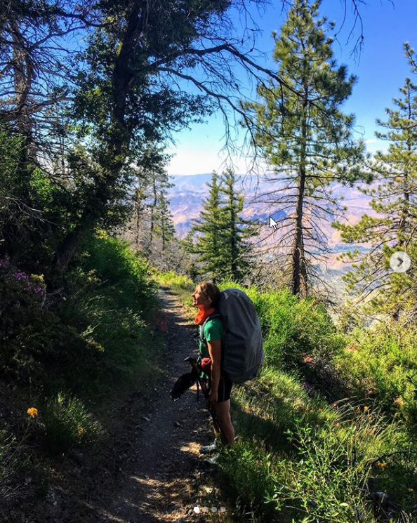
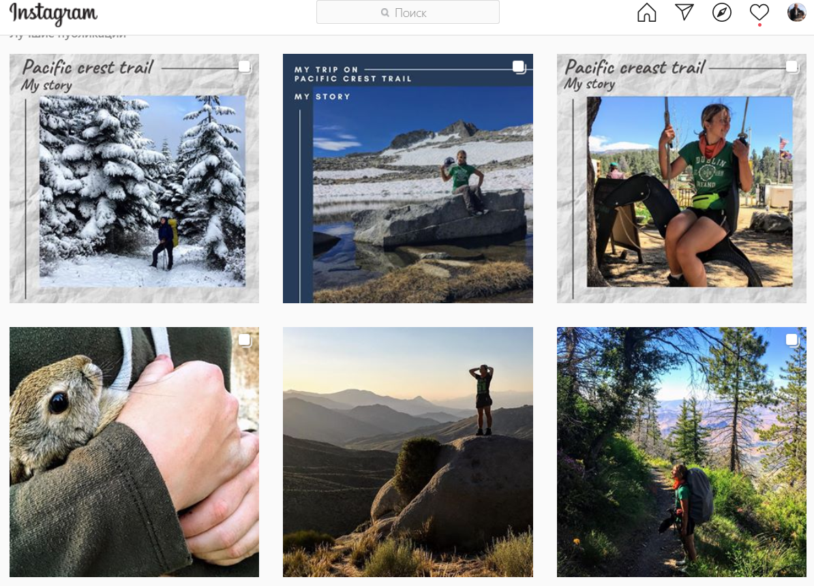

# История irina.to.stars - прохождение 4000 км Pacific Crest Trail (США)

## Предисловие

Разместив в топе нашего рейтинга описание фильма "Дикая", могли ли предполагать, что уже через несколько месяцев нам удастся познакомиться с российской девушкой, которая вполне могла бы являться прототипом главной героини фильма (конечно с той поправкой, что у фильма "Дикая" уже был реальный прототип в США)?

Знакомство произошло совершенно случайно на туристическом слете у общего костра, когда все поочередно стали рассказывать свои истории, одна девушка скромно сказала: "я прошла четыре тысячи километров[Pacific Crest Trail (PCT](https://en.wikipedia.org/wiki/Pacific_Crest_Trail))". Историю (пока что в виде дневниковых записей) можно прочитать в её инстаграме [https://www.instagram.com/irina.to.stars/](https://www.instagram.com/irina.to.stars/) Нас, конечно, в первую очередь интересовали начальные мотивации, какие были жизненные проблемы, толкнувшие человека на этот сложнейший путь? Ну и конечно, стало ли данное путешествие тем переломным жизненным моментом, который дал бы человеку силы для разрешения этих проблем? В инстаграме Ирины её жизненная история и философские размышления объединены соответствующими тегами [https://www.instagram.com/explore/tags/pctmystory/](https://www.instagram.com/explore/tags/pctmystory/) [https://www.instagram.com/explore/tags/pctmythinking/](https://www.instagram.com/explore/tags/pctmythinking/) .

Каждый читатель может сам сделать свои выводы на этот счет, а мы здесь поделимся с вами своими.

Увы, но современная индустриальная цивилизация зачастую загоняет людей в абсолютный жизненный тупик, начисто лишая их жизнь смысловой наполненности ("экзистенциальный вакуум" в терминах психолога и философа [В.Франкла](https://ru.wikipedia.org/wiki/Франкл,_Виктор)). Выйти из этого тупика (находиться в котором долгое время губительно для человека) можно двумя способами: шагнуть на ступень вниз или шагнуть на ступень вверх. Причем не столько в интеллектуальном, сколько в мировоззренческом плане.

В первом случае (шаг вниз), человек просто подавляет в себе желание разобраться в том, что я и кто я, и в дальнейшем живет по примитивной роботообразной схеме. Которую условно можно назвать "дом -- работа". Он не перестает при этом быть человеком и также вносит свой вклад в человеческую цивилизацию. Но вопрос - достаточно ли соответствует этот "вклад" его силам и возможностям? Не говоря уже о том, что таким образом человек ставит крест на своем внутреннем развитии.

Второй способ -- это, разумеется, шаг вверх по пути обогащения своей жизни тем смысловым наполнением, которое наилучшим образом соответствует данным нам природой силам и возможностям, а также знаниям, полученным в результате чтения книг и многочисленных часов, просиженных нами на школьных скамьях и в институтских аудиториях.

И вот для того, чтобы сделать этот самый "шаг вверх" многим (хотя и не всем) людям обязательно нужен какой-то "инструмент" прорыва замкнутого круга повседневности. Такой "инструмент" вполне можно найти, если посмотреть в сторону хайкинга, пешего и горного туризма, альпинизма и т.п. - то есть всех тех активностей, которые связаны с преодолением себя, преодолением внешних трудностей и закалкой собственного характера.

Этот иструмент может быть полезен для многих людей. Разница лишь в том, что кому-то необязательно надо пройти 4000 км пути, а может быть для встряски достаточно и 400 км, или даже и 40 км хватит. Хотя вот 4 км, пожалуй, маловато будет. Но впрочем и они полезны для дальнейшего поддержания тонуса.

Хайкинг (пеший туризм), ко всему прочему, дает неплохую возможность побыть наедине с собой, поразмышлять о жизни. Это если вы идете в одиночку. Либо пообщаться с людьми, возможно имеющими сходную с вами мотивацию. Это если вы идете в составе группы. Впрочем, обе эти возможности вполне можно и совместить. Примером чего являются дневниковые записи Ирины. Хотя она шла по PCT в одиночку (полгода!), но по мере прохождения маршрута постоянно пересекалась с разными людьми, часть жизненных историй который выложена в её инстаграме.

Далее мы приведем ряд моментов (цитат) из Ирининой истории, которые показались нам ключевыми для понимания её сути. Хотя , конечно, мы не претендуем , что полностью этого понимания достигли :).

## До РСТ. Биография

* Я выросла в обычной советской семье, с советскими установками и нехваткой денег... Родители мне дали самое лучшее образование - бесплатное математическое... В детстве я была забитой девчонкой и путь хоть к какой-то осознанности был очень долгим и тернистым... У меня есть уже взрослый ребенок - самая лучшая дочка на свете. Была офисная перспективная работа. Крыша над головой, семья и комфорт.
* Я уже 4,5 года работала в офисе... Именно о такой работе я долгое время мечтала, сидя в затянувшемся декретном отпуске... Тогда это была моя первая офисная работа... я выросла достаточно по карьерной лестнице, получала хорошую зарплату, интересные сложные проекты... Наверное, для многих - это мечта... но! Работа не приносила удовольствия именно мне... что-то не то... я не могла понять что, но осознавала, что что-то надо менять...
* Дома - отношения, длившиеся уже 14 лет... Это огромный срок, но чем дальше, тем больше я осознавала - мы совершенно разные во взглядах на жизнь, в целях, в желаниях, в мечтах... Для меня было тяжело решиться и уйти... для меня семья самое святое.
* Жизнь у нас одна и у меня наконец созрел безумный план: ухожу с работы - освободившиеся 8 часов заполняю тем, что будет приносить удовольствие, "своим" - снимаю квартиру и переезжаю с дочкой от мужа - возвращаюсь обратно в офис... На все про все 5 месяцев... Но что-то пошло не так... я уволилась, съехала в свою квартиру (пусть даже и съемную - но свою), а выйти на работу обратно в офис не смогла... не мое? задумалась... а что тогда мое???

## Какие задачи решала на РСТ:

* Умею доводить дело до конца (четко поставленная цель = результат)
* Понимаю ценность себя
* Учусь видеть, какие цели реальны в данный момент
* Строю свои границы и умею видеть и защищать себя от зависимости и манипуляций
* Меняю свое отношение к ситуациям: к зависимости, кто мое окружение и что оно для меня, как оно на меня влияет?
* Пробую писать книжку, чтобы получить обратную связь и ошибки не перенести в печатную версию
* Просто пишу - учусь структурировать свои мысли в слова. П{#\_GoBack}ередаю их окружающим и доношу до читателя в том виде, в котором они у меня живут в голове
* Собираю истории "почему идут по РСТ?"

## PCT

* Вчера опять без воды шла, вроде всего 9 км, но в самое пекло, без ветра и тени Начались глюки - в дереве увидела злое человеческое усмехающееся лицо, везде мерещились люди вместо кустов... последний километр - во рту пересохло, еле передвигала ноги... бормотала постоянно: "вода, вода..."
* мне понадобилось полтора месяца, чтобы понять как можно перемещаться по жаре привыкнуть к нагрузкам и начать проходить хотя бы 30 км каждый день... понять, что бродить по пустыни я больше не хочу или хотя бы не летом и недолго... Впереди мои любимые горы - думаю самый лучший участок пути для меня...
* Наблюдаю за hikers: кто-то идет и слушает музыку в наушниках, кто-то включает на полную громкость, кто-то напевает песенки сам... я же - люблю слушать природу...
* Сегодня вспомнила истинное отношение к тебе проявляется в трудностях... когда у тебя все хорошо - к тебе тянутся, хотят общаться, с тобой играют. А как только случается неприятность и тебе нужна помощь - где все эти "знакомые"? - забили, растворились и выкинули все воспоминания в мусорку... Игры! Ненавижу это...
* Наблюдая за другими, стала замечать свое такое же поведение... Говоришь одно, а на деле ведешь себя совершенно по-другому Начала понимать, почему люди относятся ко мне не так, как я бы хотела...
* Открытие: я научилась радоваться и принимать заботу от других И в этом заслуга trailangel. Раньше я была независимой женщиной - ни за что не брать у других, все сама. Ох ух это "все сама" Но когда ты видишь доброту от trailangel, искреннюю (когда обратно ничего не просят), то расплываешься в улыбке и принимаешь дар с радостью, также с открытым сердцем. Иногда я замечаю в других те же проблемы, что были во мне - когда вижу hiker проходящего мимо и не принимающего даром от trailangel... Не все trailangel искренние, есть и странные и ожидающие ответного от тебя (чаще денег). Наоборот, Bill - который каждый день угощает hikers фруктами и водой в неограниченном количестве. Разве это может быть фальшью? Или женщина, которая подвезла до города и не взяла за бензин. Вот это искренне, от чистого сердца забота. Все отношение чувствуется - этого достаточно...

## Что приобрела на РСТ? Итоги

* Способность видеть мир шире - возможностям нет предела.
* Все мы разные, но все мы можем научиться всему. У каждого свои способности и свой темп, но это не преграда, это всего лишь твои особенности. Все решает: труд, шаги, стремления, действия, везение, случайности и время.
* Время самый ценный ресурс, его не купить за деньги.
* Прошлое изменить нельзя, нельзя вычеркнуть то, что уже было. Это можно только принять, как в себе, так и в других. Осознать и двигаться дальше.
* Ни одна ситуация, ни один твой опыт не сможет спрогнозировать твое будущее. Все поступки, мысли, чувства - все это только в границах конкретного человека и они могут быть любые. Они могут не подчиняться здравому смыслу, логике, статистике. Они просто свои. Повлиять ты не можешь на другого человека. Остается только принять.
* Мы ни от чего в жизни не застрахованы. Нет 100% гарантии. Все что происходит сейчас уже происходит. А будущее мы формируем сами и тоже сейчас.
* Живи в моменте: здесь и сейчас!
* Ты свободен... свободен в своем выборе и только тебе решать, какой сделать выбор
* Наша природа - не опасна. Она дана нам в помощь. Ее красоты безграничны и только нам решать на сколько мы способны открыть глаза.
* Ничего просто так не бывает -- все дается нам для чего-то. Всему в жизни есть своя цена. Рассчитывать надо только на себя, брать ответственность за то, что происходит и идти дальше...

Я не идеальная, но я живая и вижу в этом ценность

## Кавказская тропа: пешком по неизведанному Дагестану

"Возвращаясь в 2019 году после своего пешего маршрута на 6000000 шагов по штатам, я задумалась: почему в России нет длинный пеших троп? Аналога пути Сантьяго, Pacific Crest Trail или Аппалачской тропы в штатах, Израильской тропы или хотя бы Ликийской... Поиск ответа познакомил меня с Димой Лемешевым (основателем Caucasus Explorer), у которого тоже была мечта - пешая тропа на Кавказе."

В конце 2020 года появился совместный проект по созданию длинной пешей тропы в России - около 2000 км пешком от Чёрного до Каспийского моря. Где-то это будут лёгкие прогулки с ночлегами в гостевых домах у горцев и знакомством с культурой Кавказа, а где-то практически безлюдные дикие высокогорья и заросшие буйной субальпийской растительностью ущелья.

О первой исследовательской разведке в рамках проекта по Дагестану: от Дербента до Кубачи пешком по неизведанным тропам, которых нет на картах.

- О гостеприимстве дагестанцев, или как экспедиция превратилась в гастротур.
- Что не все змеи опасны, а некоторые "хорошие" едят "опасных", или как мы забрели в змеиное логово.
- О шакалах, лисах, медведях, или рассказ о первой бессонной ночи.
- Что советские тропы действительно существуют, но труднопроходимы, или как мы постоянно пробирались через бесконечные заросли колючек.
- Как красота гор раскрывалась изо дня в день: смесь альпийских лугов и заброшенных горных сёл.
- Где можно остановиться на ночлег и набрать воды.
- Как и где питаться.
- Как не потеряться на маршруте, которого нет на картах.
- Что со связью на тропе.

Спикеры:  
Ирина Грушанина - по образованию математик, а в душе походник-фотограф-писатель, член Российского Географического Общества. Побывала в 50 странах: восхождения на горы Алтая, сплав по Амазонке, дикие животные Африки, северное сияние Исландии, красоты Камчатки. В 2019 году в одиночку прошла пеший маршрут по штатам - Pacific Crest Trail, 4270 км. Удостоена звания thru-hiker. В 2020 году взошла на вершину Эльбруса с севера.

Алексей Светлов - IT специалист. Акционер компании X5 Retail group "Пятёрочка", побывал во всех 14-ти магазинах "Пятёрочка" г. Москвы, района Ивановское. Каждый год в одиночку проходит маршрут до гипермаркета ИКЕА Тёплый Стан. Ежедневно восходит на 3-й этаж своей квартиры.
