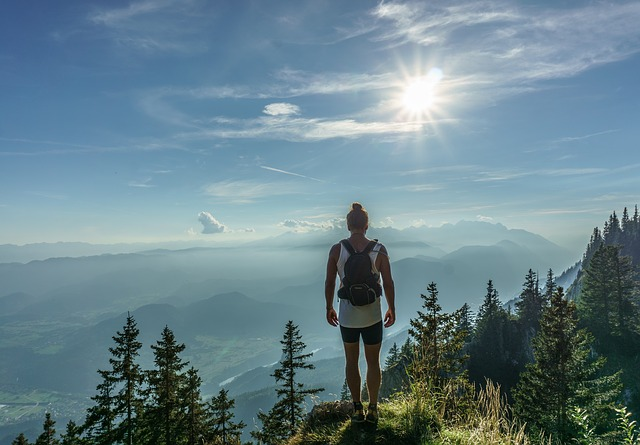

# Походная и горная терминология

**Пешеходный туризм** - это вид спортивного туризма, основной целью является пешее преодоление группой маршрута по слабопересечённой местности (Википедия).

Более детальная терминология (трекинг, хайкинг и т.д.) может иметь несколько разные оттенки значения в зависимости от местных особенностей. Тем не менее, возможно использовать следующие определения:

## Англоязычная терминология

**Хайкинг (hiking)** - это непродолжительное (как правило, однодневное) пешее путешествие налегке. Обычно употребляется в отношении горной или предгорной местности, хотя это необязательно (есть даже термин "городской хайкинг"). Хайкинг обычно осуществляется с использованием маркированных и хорошо подготовленных троп.

 [Image by Ales Krivec from Pixabay](https://pixabay.com/photos/hiker-standing-woman-top-journey-918473/)

Интересное определение хайкига от тревел-эксперта [Евгения Дяченко](https://club-miry.ru/tour-category/evgenij-djachenko/): Хайкиг - пешее путешествие по горной местности налегке с ночевками в отелях и ужинами в кафе и ресторанах.

**Трекинг или треккинг (trekking)** - это более сложное и продолжительное пешее путешествие. Обычно с ночевками, которые (как принято в Европе) осуществляются в кемпингах или горных приютах. В то же время, трекинг часто употребляется как обобщенный термин (включающий в себя и хайкинг) и обозначает пешие путешествия по спланированным маршрутам (трек -- маршрут).

**Бэкпекинг (backpacking)** - термин близкий к классическому пониманию слова "поход" в русскоязычной среде. Обозначает многодневные походы с собственным снаряжением для стоянок (backpack -- рюкзак).

Другое популярное значение этого термина. **Бэкпэкинг** - распространённый в последние десятилетия термин, обозначающий путешествия, совершаемые туристом за небольшие деньги, чаще всего принципиально отказываясь от услуг туроператоров.

 [Image by Danny Schreiner from Pixabay](https://pixabay.com/photos/cappadocia-tuff-rock-hiking-1602916/)

**Walking** - приемлемо для описания всех форм ходьбы, будь то прогулка в парке или пеший туризм в Альпах

**Rambling** (старомодный термин), hillwalking, fell walking -- в основном используется в Великобритании

**Bushwalking** (гуляющий по лесу) -- термин , использующийся в Австралии

**Tramping** - в Новой Зеландии так называют длинную, энергичную прогулку или поход

## Немецкоязычная терминология

**Wandern** - пешие походы и прогулки, в основном по специальным тропам с ночлегами в хижинах.

**Bergwandern** - горные походы, с прохождением перевалов и ночлегами в палатках.

## Русскоязычная терминология

**Горный туризм**- вид туризма, заключающийся в передвижении группы людей с помощью мускульной силы по определённому маршруту, проложенному в горной местности в условиях высокогорья. Существует две дисциплины по спортивному горному туризму: маршрут горный и дистанция горная. По данным видам дисциплин проводятся соревнования как на уровне туристических клубов, так и региональных федераций по спортивному туризму.

 [Image by skeeze from Pixabay](https://pixabay.com/photos/hiker-mountain-backpacking-hiking-1763517/)

**Альпинизм** - вид спорта и активного отдыха, целью которого является восхождение на вершины гор. Главное отличие альпинизма от горного туризма состоит в том, что целью альпиниста является подъём на вершину, а целью горного туриста - прохождение перевалов определенной категории сложности, в том числе и восхождения на вершины. В высших категориях сложности границы между этими видами спорта расплывчаты.

 [Image by Hans Braxmeier from Pixabay](https://pixabay.com/photos/climber-steep-descent-climb-59681/)

**Скалолазание** (англ. rock climbing) - вид спорта и вид активного отдыха, который заключается в лазании по естественному (скалы) или искусственному (скалодром) рельефу. Зародившись как разновидность альпинизма, скалолазание в настоящее время - самостоятельный вид спорта.

 [Image by joergweitz from Pixabay](https://pixabay.com/photos/climb-mountaineering-mountaineer-3590655/)

## Дополнительные определения

**Легкоходство** **(Lightweight (ultralight) backpacking)** -- направление в туризме, отличительной чертой которого является максимальное снижение веса снаряжения без угрозы безопасности. "Легкоходы -- кто это, куда они ходят и как им стать" [https://trekkingmania.ru/legkohodstvo\_eto/](https://trekkingmania.ru/legkohodstvo_eto/) Ссылки из статьи: [https://legkohod.com](https://legkohod.com) сайт с большим количеством легкоходной информации созданный Ричардом Делонгом на русском языке. [https://vk.com/lightpacker\_ru](https://vk.com/lightpacker_ru) - группа вконтакте в которой собралось множество единомышленников и производителей легкоходного снаряжения. Организаторы группы проводят ежегодный [https://trekkingmania.ru/slyot\_legkoxodov\_2018](https://trekkingmania.ru/slyot_legkoxodov_2018) слёт легкоходов В традиционном туризме снаряжение обычно весит более 14 кг. (без питания). Хотя чётких границ веса не существует, но условно легкоходов можно подразделить: легкоходы - облегчают снаряжение до 10 кг; ультралегкоходы (ультрасы) - имеют вес снаряжения около 5 кг; суперультралегкоходы - собирают экстремально лёгкие наборы снаряжения около 2.5 кг. [https://en.wikipedia.org/wiki/Ultralight\_backpacking](https://en.wikipedia.org/wiki/Ultralight_backpacking)

**Скрэмблинг**(англ. scramble - "карабкаться") - вид и способ техники передвижения в горах для которой достаточно использования одной руки, занимает промежуточное положение между ходьбой, где обе руки не используются и скалолазанием, где используются уже две руки.

**Альпийский скрэмблинг** - это внетрековый поход, часто по снегу или скалам, с "не техническим" восхождением в качестве конечной точки маршрута. Не техническим восхождением является восхождение, которое достигается без необходимости определенных видов альпинистского снаряжения (обвязок, верёвки, защитной экипировки и т.д.), и не связанное с путешествием по крутым склонам или ледникам. Тем не менее, термин включает в себя перевалы через скалы с небольшим углом наклона, трекинг по осыпям, пересечение водных потоков, продирание через заросли и хождение по заснеженным склонам.

**Скандинавская ходьба (Nordic Walking)** - ходьба с палками - вид физической активности, в котором используются определенная методика занятия и техника ходьбы при помощи специально разработанных палок. В конце 1990-х стала популярна во всём мире.

**Каньонинг** (англ. Canyoning или Canyoneering) - преодоление каньонов без помощи плавающих средств (лодки, плоты, каное, байдарки и др.) с использованием различной техники преодоления сложного водно-скального рельефа: скалолазание, спуск по веревке, прыжки в воду, плавание. [https://en.wikipedia.org/wiki/Canyoning](https://en.wikipedia.org/wiki/Canyoning)

**Хитч-хайкинг - автостоп.** Путешествие из одной точки (а часто и страны) в другую без билета и путевок при помощи остановки проезжающих в нужном направлении автомобилей с просьбой довезти как можно ближе к пункту назначения  
**Использованные материалы:**

* Википедия "Пешеходный туризм" [https://ru.wikipedia.org/wiki/Пешеходный\_туризм](https://ru.wikipedia.org/wiki/Пешеходный_туризм) [https://en.wikipedia.org/wiki/Hiking](https://en.wikipedia.org/wiki/Hiking) [https://en.wikipedia.org/wiki/Scrambling](https://en.wikipedia.org/wiki/Scrambling) и другие статьи
* Трекинг, хайкинг и бэкпекинг [https://www.marshrut-club.com/articles/7654](https://www.marshrut-club.com/articles/7654)
* Что такое трекинг, хайкинг и бэкпекинг? [https://trekkingmania.ru/chto\_takoe\_treking/](https://trekkingmania.ru/chto_takoe_treking/)
* Все для хайкинга, трекинга и бэкпекинга (статья о снаряжении) [https://turclub-pik.ru/blog/vse-dlya-hajkinga-trekinga-i-bekpekinga/](https://turclub-pik.ru/blog/vse-dlya-hajkinga-trekinga-i-bekpekinga/)
* [http://ski.ru/az/blogs/post/kratkii-slovarik-lyzhebordera-v-gorakh/](http://ski.ru/az/blogs/post/kratkii-slovarik-lyzhebordera-v-gorakh/) Краткий иллюстрированный горный словарь. Например: "Кулуа́р (от фр. couloir - проход, коридор) - корытообразная или V-образная ложбина на крутом склоне горы, направленная по линии стока воды. Широкая в верхней части, сужается внизу. Кулуары достигают ширины нескольких десятков метров, простираются часто на всю высоту склона и, в зависимости от времени года и ландшафтных условий, могут быть заполнены снегом, фирном и льдом. Кулуар - естественный путь схода камнепадов и лавин. Дно кулуара часто прорезано желобом и является наиболее опасным местом в кулуаре"
* [http://svastour.ru/termin.htm](http://svastour.ru/termin.htm) туристические термины
