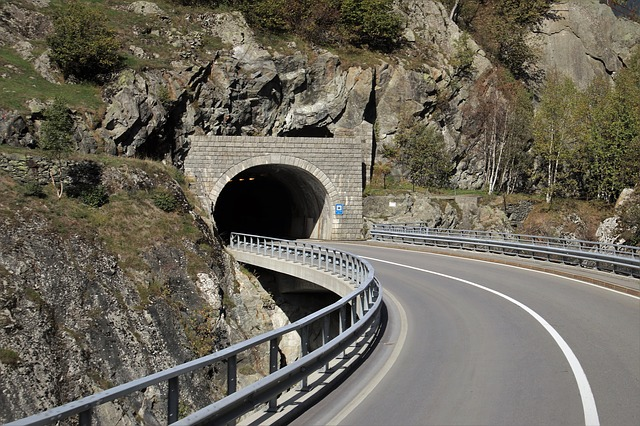
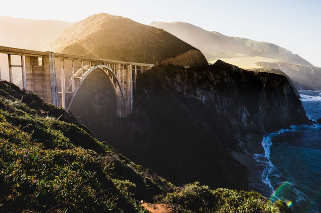

# Транспорт

Справочная информация для туристов по транспорту (Европа).

## Все виды транспорта

[https://www.rome2rio.com/](https://www.rome2rio.com/) Транспортный портал Rome2rio упрощает планирование поездок. Сайт предоставляет информацию о путешествиях и бронировании от двери до двери, помогая вам добраться из любой точки мира. Введите любой адрес, достопримечательность или город в качестве пункта назначения, и сайт мгновенно отобразит все ваши варианты проезда и бронирования, а также информацию о жилье и достопримечательностях в одном удобном месте.

## Авиационный транспорт

Сайты для поиска дешевых авиабилетов:

[https://www.skyscanner.com](https://www.skyscanner.com/)

### easyJet

[https://www.easyjet.com/en/holidays/destinations](https://www.easyjet.com/en/holidays/destinations) Этот справочник предоставит доступ к бронированию билетов на рейсы easyJet, туристическим предложениям и исчерпывающей информации о путешествиях.

## Железнодорожный транспорт

### Австрийские железные дороги

[http://www.oebb.at](https://www.oebb.at/) официальный сайт

### Eвронайт

EuroNight (сокращенно EN) - магистральные национальные и международные ночные поезда в рамках Европейской сети междугородних железных дорог

[https://www.nightjet.com/](https://www.nightjet.com/) официальный сайт

### Немецкие железные дороги

[http://www.bahn.de](http://www.bahn.de) официальный сайт

"По всей Германии на поездах за 15 евро" - статья о скидках на немецких железных дорогах [http://traveltu.ru/evropa/germaniya/na-poezdah-po-germanii-za-15-evro.html](http://traveltu.ru/evropa/germaniya/na-poezdah-po-germanii-za-15-evro.html)

### Швейцарские железные дороги

[http://www.sbb.ch/en/home.html](http://www.sbb.ch/en/home.html) официальный сайт

### Итальянские железные дороги

[http://www.trenitalia.com](http://www.trenitalia.com) официальный сайт

### Французские железные дороги

[http://www.tgv-europe.com](http://www.tgv-europe.com) официальный сайт TGV

[https://www.thalys.com](https://www.thalys.com)

[http://voyages-sncf.com](http://voyages-sncf.com)

### Польские железные дороги

[https://www.intercity.pl/en/](https://www.intercity.pl/en/) официальный сайт

Польские железные дороги: как приобрести билеты через интернет. Вокзалы Вроцлава и Кракова. [https://elenapuzatko.com/polskie-zheleznye-dorogi/](https://elenapuzatko.com/polskie-zheleznye-dorogi/)

### Венгерские железные дороги

[https://www.mavcsoport.hu/en](https://www.mavcsoport.hu/en) официальный сайт

### Российские железные дороги

[http://www.rzd.ru/](http://www.rzd.ru/) официальный сайт

[http://forum.railwayclub.info/](http://forum.railwayclub.info/) Форум пассажиров РЖД

### Украинские железные дороги

[http://booking.uz.gov.ua](http://booking.uz.gov.ua) официальный сайт

### Белорусские железные дороги

[http://rasp.rw.by/ru](http://rasp.rw.by/ru) официальный сайт

### Сербские железные дороги

[http://www.zeleznicesrbije.com](http://www.zeleznicesrbije.com) официальный сайт

### Ссылки по теме

[https://krisha0703.livejournal.com/154098.html](https://krisha0703.livejournal.com/154098.html) [https://krisha0703.livejournal.com/154214.html](https://krisha0703.livejournal.com/154214.html) Статья-отчет "Вокруг Балтики Поездом"

[https://heming-fromelko.livejournal.com/](https://heming-fromelko.livejournal.com/) Блог, в котором автор публикует рассказы о своих путешествиях на железных дорогах мира

## Автобусное сообщение

Австрийские автобусы [http://www.postbus.at](http://www.postbus.at)

Международные автобусные компании:

[https://www.flixbus.com](https://www.flixbus.com)

[https://meinfernbus.de/](https://meinfernbus.de/)

## Водный транспорт

Паром на остров Корсика [https://www.corsica-ferries.co.uk](https://www.corsica-ferries.co.uk)

Паромы Италия -Черногория [http://www.montenegrolines.com](http://www.montenegrolines.com)

## Автомобильный транспорт

Прокат автомобилей (сайты агрегаторы)

[https://www.rentalcars.com/](https://www.rentalcars.com/)

[https://www.global-rent-a-car.com](https://www.global-rent-a-car.com)

[https://www.viamichelin.com/](https://www.viamichelin.com/) Интерактивный сайт для планирования автомобильного маршрута, в том числе расчет стоимости проезда (бензин + платные дороги)

[https://autotraveler.ru/](https://autotraveler.ru/) Сайт об автомобильных дорогах Европы

[https://park4night.com/](https://park4night.com/) сайт и приложение для поиска ночных парковок

[http://forum.autoua.net/](http://forum.autoua.net/) Украинский автомобильный форум

 [Image by StockSnap from Pixabay](https://pixabay.com/photos/highland-cliff-rock-hill-travel-2576780/)

## Города -- транспортные узлы

### Вена

Как добираться из аэропорта до города [https://www.wien.info/ru/travel-info/to-and-around/airport-to-center](https://www.wien.info/ru/travel-info/to-and-around/airport-to-center) на том же сайте и про проездные на городской транспорт. Еще [http://europagid.com/kak-dobratsya-iz-aeroporta-veny-shvexat/](http://europagid.com/kak-dobratsya-iz-aeroporta-veny-shvexat/)

Карта метро и электричек Вены [http://empirically.net/austria/метро-вены/](http://empirically.net/austria/метро-вены/)

Как добраться из аэропорта Братиславы до Вены [https://inostranno.ru/transport/bratislava-airport-transfer/](https://inostranno.ru/transport/bratislava-airport-transfer/)

## Канатные дороги и фуникулеры

Работающие летом канатные дороги есть практически в каждом альпийском регионе. Разброс цен от 5 до 100 и выше евро за один подъем. Необходимо уточнять на сайтах канатных дорог период их работы. Некоторые канатные дороги после зимнего сезона закрываются на профилактику и открываются только к началу высокого летнего сезона (июль-август).

Пример: канатная дорога на плато горного массива Дахштайн (южная сторона) [https://www.derdachstein.at/en/tickets-infos/ascent-and-descent](https://www.derdachstein.at/en/tickets-infos/ascent-and-descent)

Статья "Вид сверху. Самые крутые канатные дороги Европы" [https://34travel.me/post/kanatka](https://34travel.me/post/kanatka)

 [Image by Erich Westendarp from Pixabay](https://pixabay.com/photos/funicular-railway-aussichtspinkt-1611996/)
